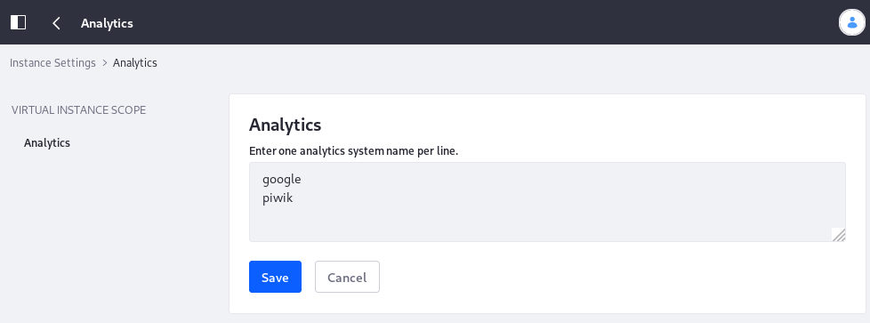

#  Analytics

The Analytics category defines the available analytics systems for the virtual instance. Enter an analytics system or remove one of the two pre-configured options (`google` and `piwik`). Activate these systems here, and configure them at the [site level](../../../site_building.html). 

To access Analytics configuration settings, open the Control Panel, navigate to *Configuration* &rarr; *Instance Settings*, and select the *Analytics* category under the *PLATFORM* section. 

