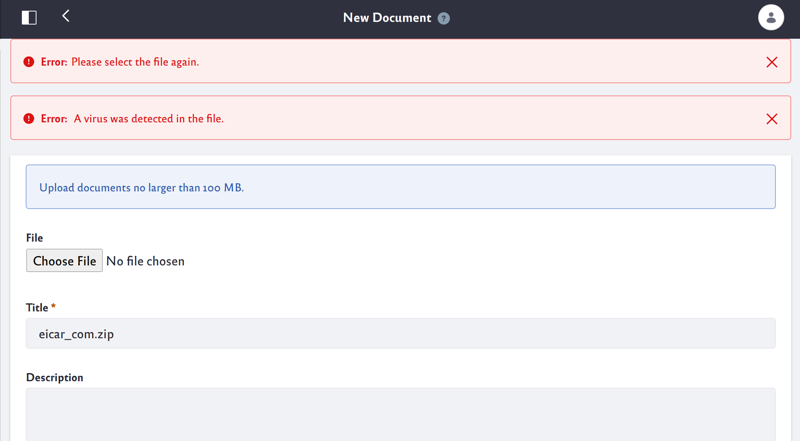
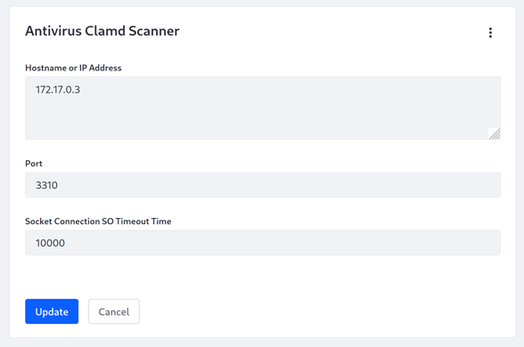
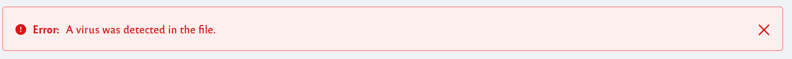

# Enabling Antivirus Scanning for Uploaded Files

> Available: DXP 7.3 SP 1+, Portal 7.3 GA7+, and DXP 7.2 FP 9+

```note::
   This feature is not currently available on Portal 7.2 and earlier versions.
```

<!-- TODO: LRDOCS-9341 - Antivirus can be enabled for older versions (7.2 and below) but requires use of portal properties and a local install of ClamAV server which we do not recommend. -->

You can automatically scan any file uploaded to Liferay for viruses. When you enable the antivirus scanner, it checks files on upload to Liferay applications, such as [Documents and Media](../../content-authoring-and-management/documents-and-media/sharing-documents-and-media.md), [Message Boards](../../collaboration-and-social/message-boards/user-guide/getting-started-with-message-boards.md), and more. If a virus is found, it's reported for users to reject.



Liferay integrates with the [ClamAV Daemon](https://www.clamav.net/documents/scanning#clamd) (Clamd). For best performance, run Clamd on a separate server.

Here's how to enable the antivirus scanning:

1. On a separate server, [configure and start Clamd](https://www.clamav.net/documents/scanning#clamd).

    ```important::
       Load your ClamAV database before starting Clamd.
    ```

1. Enable antivirus for your [File Store](../../../system-administration/file-storage/configuring-file-storage.md) (Document Library) by setting the following [portal property](../../../installation-and-upgrades/reference/portal-properties.md) or [Docker environment variable](../../../installation-and-upgrades/installing-liferay/using-liferay-docker-images/configuring-containers.md).

    Portal property:

    ```properties
    dl.store.antivirus.enabled=true
    ```

    Docker environment variable:

    ```properties
    -e LIFERAY_DL_PERIOD_STORE_PERIOD_ANTIVIRUS_PERIOD_ENABLED=true
    ```

1. Start your Liferay server.

1. Go to *Control Panel* &rarr; *System Settings* and select *Antivirus* in the Security category.

1. Select *Antivirus Clamd Scanner* in the menu.

    

1. Enter the Clamd server's hostname or IP address, port, and a connection timeout time (milliseconds).

1. Click *Save*.

Now files are scanned on upload to Liferay applications. If a virus is detected in a file you're uploading, the scanner reports the infected file, and you should decline saving the file.



```important::
   Never save a virus-infected file. Reject the file by canceling the current operation.
```

## Additional Information

* [Configuring File Storage](./configuring-file-storage.md)
* [Configuring Liferay](../configuring_liferay.html)
* [System Settings](../configuring-liferay/system-settings.md)
