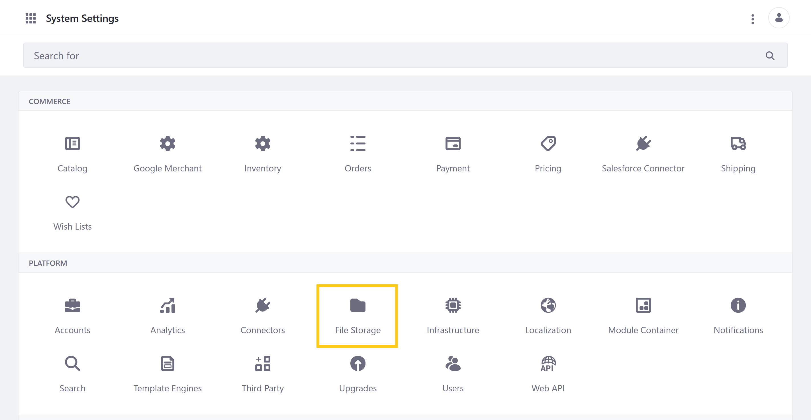
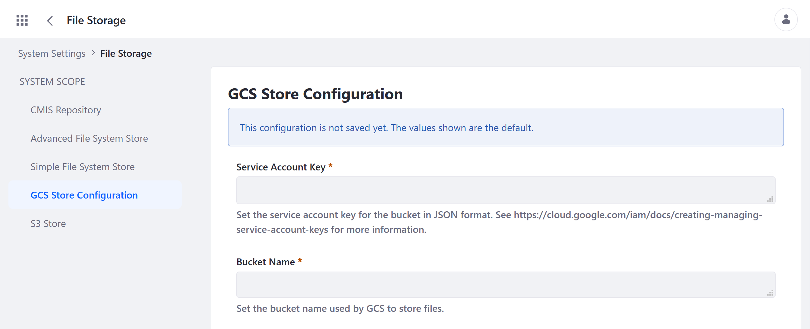
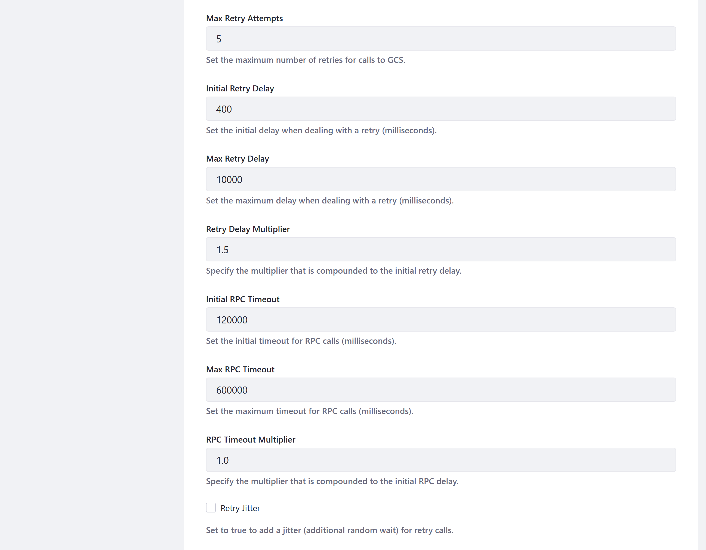

# Google Cloud Storage

Coming soon!

<!--
> Available for 7.4+ and 7.3 FP2+

Liferay DXP provides integration with Google's Cloud Storage (GCS) service. With GCS integration, you can seamlessly store and access your Liferay instance files in the cloud.

Before enabling this connection, you must first prepare your GCS account. When ready, configure the Liferay instance to use GCS via the Control Panel, and set the `dl.store.impl` portal property to use GCS as the default store.

```important::
   If a database transaction rollback occurs in a Document Library, the transaction’s file system changes are not reversed. Inconsistencies between Document Library files and those in the file system store can occur and may require manual synchronization. This is a limitation of all DXP stores besides DBStore.
```

## GCS Prerequisites

Enabling Liferay's GCS integration requires an active GCS account and project. This project must have a [storage bucket](https://cloud.google.com/storage/docs/creating-buckets) and a [service account](https://cloud.google.com/iam/docs/creating-managing-service-accounts) to enable server-to-server, app-level authentication. You must also create a JSON [security key](https://cloud.google.com/iam/docs/creating-managing-service-account-keys) for the service account. See official [Google Cloud Storage](https://cloud.google.com/storage/docs) documentation for more information.

```important::
   The service account's security key must use the JSON key type.
```

## Configuring the GCS Store in Liferay

Follow these steps to configure the GCS Store:

1. Open the *Global Menu* (), click on the *Control Panel* tab, and go to *Configuration* &rarr; *System Settings*.

1. Click on *File Storage*.

   

1. Click on *GCS Store Configuration*.

1. (Required) Enter the following information.

   * *Service Account Key*: the private JSON key used to securely access the GCS project's service account.

   * *Bucket Name*: the name of the GCS bucket used to store files.

   

1. (Optional) Configure Liferay call attempts to GCS.

   

1. (Optional) Enter an *AES-256 encryption Key* for an extra layer of security.

   

1. Click *Save* when finished.

Once you've configured the GCS Store, you can set GCS as your default file storage system.

## Setting GCS as Default Store

Follow these steps to use GCS as the default Store for the Liferay instance:

1. Add the following property to the instance's [`portal-ext.properties`](../../../installation-and-upgrades/reference/portal-properties.md) file:

   ```properties
   dl.store.impl=com.liferay.portal.store.gcs.GCSStore
   ```

   If a `portal-ext.properties` file doesn't exist, create a new one with the above value and add it to the instance's [`[LIFERAY_HOME]`](../../../installation-and-upgrades/reference/liferay-home.md) or `[USER_HOME]` folder.

   This overrides the default value for `dl.store.impl` in the `portal.properties` file.

1. Restart the Liferay server.

## Additional Information

* [Portal Properties](../../../installation-and-upgrades/reference/portal-properties.md)
* [Configuring File Storage](../configuring-file-storage.md) -->
