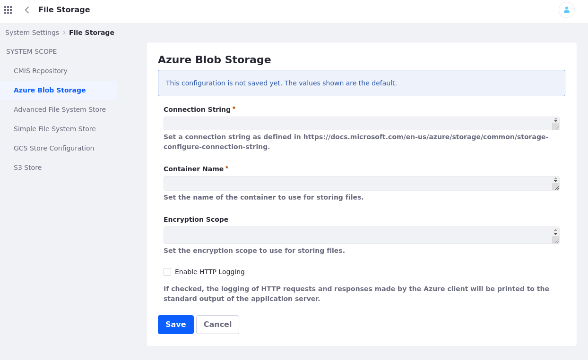

# Microsoft Azure Blob Storage Service

> Available for 7.4+ and 7.3 FP2+  

Microsoft Azure Blob Storage is a cloud-based storage solution that DXP’s Azure Blob Storage Store uses to seamlessly store files to the cloud. Under the hood, it uses the Microsoft’s Blob Storage API, optimized to handle huge amounts of unstructured data.

Before enabling this connection, you must have an active [Azure Blob Store account](https://docs.microsoft.com/en-us/azure/storage/common/storage-account-create?toc=%2Fazure%2Fstorage%2Fblobs%2Ftoc.json&tabs=azure-portal), a configured [Connection String](https://docs.microsoft.com/en-us/azure/storage/common/storage-configure-connection-string), and an [Azure Blob Container](https://docs.microsoft.com/en-us/azure/storage/blobs/storage-blob-container-create?tabs=dotnet).

Next, do the following to enable the connection to your Liferay instance,

* [Configure the File Store Method via the Control Panel](#configuring-the-store)
* Set the [`dl.store.impl` portal property to use Azure Blog Storage](#setting-azure-blog-storage-as-default-store) as the default storage method

```{warning}
If a database transaction rollback occurs in a Document Library, the transaction’s file system changes are not reversed. Inconsistencies between Document Library files and those in the file system store can occur and may require manual synchronization. All of the DXP stores except for DBStore are vulnerable to this limitation.
```

## Configuring the Store

Follow these steps to configure the store:

1. Open the *Global Menu* () &rarr; *Control Panel* &rarr; *System Settings* &rarr; *File Storage* &rarr; *Azure Blob Storage*.

   

1. Enter a [Connection String](https://docs.microsoft.com/en-us/azure/storage/common/storage-configure-connection-string) for your Azure Blob Storage Store.

1. Enter the name of the [Azure Blob Container](https://docs.microsoft.com/en-us/azure/storage/blobs/storage-blob-container-create?tabs=dotnet) you want to use for storing your files.

1. Optionally, enter an [Encryption Scope](https://docs.microsoft.com/en-us/azure/storage/blobs/encryption-scope-overview) for storing files.

1. Optionally, determine whether to enable HTTP Logging. When enabled, HTTP requests and responses made by the Azure client are printed in the server logs.

Once you’ve configured the Azure Blob Storage Store, you can set it as your default file storage system.

## Setting Azure Blog Storage as Default Store

Follow these steps to use Azure Blog Storage as the default Store for the Liferay instance:

1. Add the following property to the instance's [`portal-ext.properties`](../../../installation-and-upgrades/reference/portal-properties.md) file:

   ```properties
   dl.store.impl=com.liferay.portal.store.azure.AzureStore
   ```

   If a `portal-ext.properties` file doesn't exist, create a new one with the above value and add it to the instance's [`[LIFERAY_HOME]`](../../../installation-and-upgrades/reference/liferay-home.md) or `[USER_HOME]` folder.

   This overrides the default value for `dl.store.impl` in the `portal.properties` file.

1. Restart the Liferay server.

Once finished restarting, the configured Azure Blob Storage container is your instance's default store.

```{important}
If you're using Azure Blob Storage store in a clustered environment, the configuration on all nodes must be identical. In particular, make sure the `portal-ext.properties` file and the Azure Blob Storage store settings in System Settings are the same. 
```

## Additional Information

* [Azure Blob Storage Documentation](https://docs.microsoft.com/en-us/azure/storage/blobs/)
* [File Storage](../../file-storage.md)