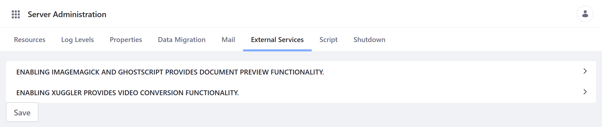
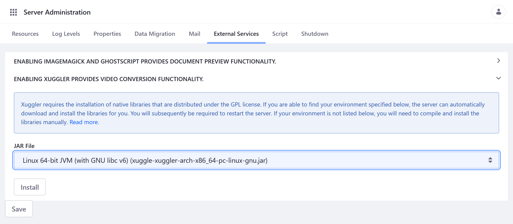

# Configuring External Services

Liferay provides integration with external services for converting files and generating file previews. Three of these services can be enabled in the Server Administration settings: [ImageMagick](https://www.imagemagick.org/script/index.php), [Ghostscript](https://www.ghostscript.com/), and [Xuggler](http://www.xuggle.com/xuggler/).

```{important}
As of Liferay 7.3.x, the Xuggler integration is deprecated. Users are advised to use Liferay's FFmpeg integration as an alternative. See [Enabling FFmpeg for Audio and Video Previews](../../content-authoring-and-management/documents-and-media/devops/enabling-ffmpeg-for-audio-and-video-previews.md) for more information.
```



Each external service must be installed on the server before it can be enabled for your Liferay instance. When installing the service, be sure to use the latest stable version for your operating system, as older versions may not run properly with Liferay DXP.

After installing these services, configure your Liferay instance to use them via the Control Panel's Server Administration page.

```{note}
As of Liferay 7.1, OpenOffice/LibreOffice is configured in OSGi Configuration Admin instead of Server Administration or portal properties. See [Enabling OpenOffice/LibreOffice Integration](../../content-authoring-and-management/documents-and-media/devops/enabling-openoffice-libreoffice-integration.md) for more information.
```

## Enabling ImageMagick and Ghostscript

By default, Documents and Media uses [PDFBox](https://pdfbox.apache.org/) to generate previews. [ImageMagick](https://www.imagemagick.org/script/index.php) and [Ghostscript](https://www.ghostscript.com/) provide faster and higher-quality previews and conversions and support more image file types. To work, both services must be installed and enabled together.

```{note}
Depending on your OS, these services may already be installed. If you're on Linux, both are likely already installed. However, they are not likely to be installed on Windows, while they may be on macOS.
```

Once both ImageMagick and Ghostscript are installed on the server, follow these steps to enable these services for your Liferay instance:

1. Open the *Global Menu* (), and go to *Control Panel* &rarr; *Configuration* &rarr; *Server Administration*.

1. Click on the *External Services* tab.

1. Check *Enabled* for ImageMagick and Ghostscript.

1. Verify the paths to the ImageMagick and Ghostscript executables are correct.

1. Configure resource limits.

1. Click *Save* when finished.

## Enabling Xuggler

By default, Documents and Media doesn't generate previews for audio and video files. Using Liferay's Xuggler integration, you can convert and generate previews for these files. If you don't already have Xuggler installed on your server, you can install it via External Services tab under Server Server Administration.

```{tip}
Xuggler requires glibc version 2.6 or later on Linux.
```

Follow these steps to install and enable Xuggler for your Liferay instance:

1. Open the *Global Menu* (), and go to *Control Panel* &rarr; *Configuration* &rarr; *Server Administration*.

1. Click on the *External Services* tab.

1. Check *Enabled* for Xuggler.

   If Xuggler is not already installed, you'll be prompted to install it. Select the correct JAR for the OS, and click *Install*. Then, restart the server to apply changes. Once installed, you can return to the *External Services* tab to enable Xuggler.

   

1. Click *Save*.

## Using a `portal-ext.properties` File to Enable External Services

In addition to the Control Panel, you can enable these external services using a `portal-ext.properties` file.

### Enabling ImageMagick and Ghostscript

To enable ImageMagick and Ghostscript using a `portal-ext.properties`, add the `imagemagick.enabled` and `imagemagick.global.search.path` properties to your file. Ensure the search path points to the directories containing the ImageMagick and Ghostscript executables. You may also need to configure the path for fonts used by Ghostscript when in macOS or Unix environments.

```properties
imagemagick.enabled=true
imagemagick.global.search.path[apple]=/opt/local/bin:/opt/local/share/ghostscript/fonts:/opt/local/share/fonts/urw-fonts
imagemagick.global.search.path[unix]=/usr/local/bin:/usr/local/share/ghostscript/fonts:/usr/local/share/fonts/urw-fonts
imagemagick.global.search.path[windows]=C:\\Program Files\\ImageMagick
```

### Enabling Xuggler

To enable Xuggler using a `portal-ext.properties` file, add the following code to the file.

```properties
xuggler.enabled=true
```

Restart the application server to finish enabling Xuggler.

## Additional Information

* [Configuring Documents and Media Previews](../../content-authoring-and-management/documents-and-media/devops/configuring-documents-and-media-previews.md)
* [Enabling FFmpeg for Audio and Video Previews](../../content-authoring-and-management/documents-and-media/devops/enabling-ffmpeg-for-audio-and-video-previews.md)
