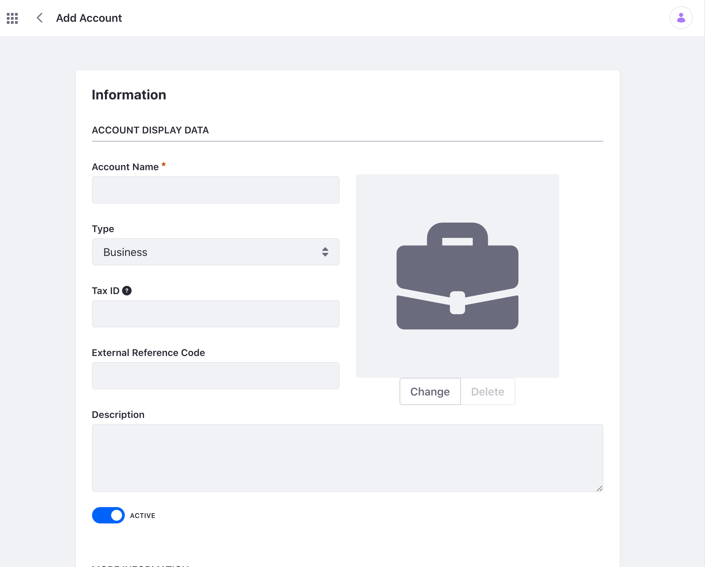
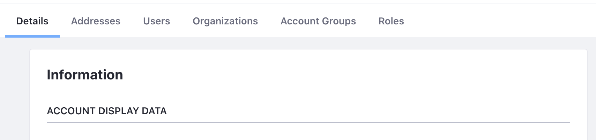
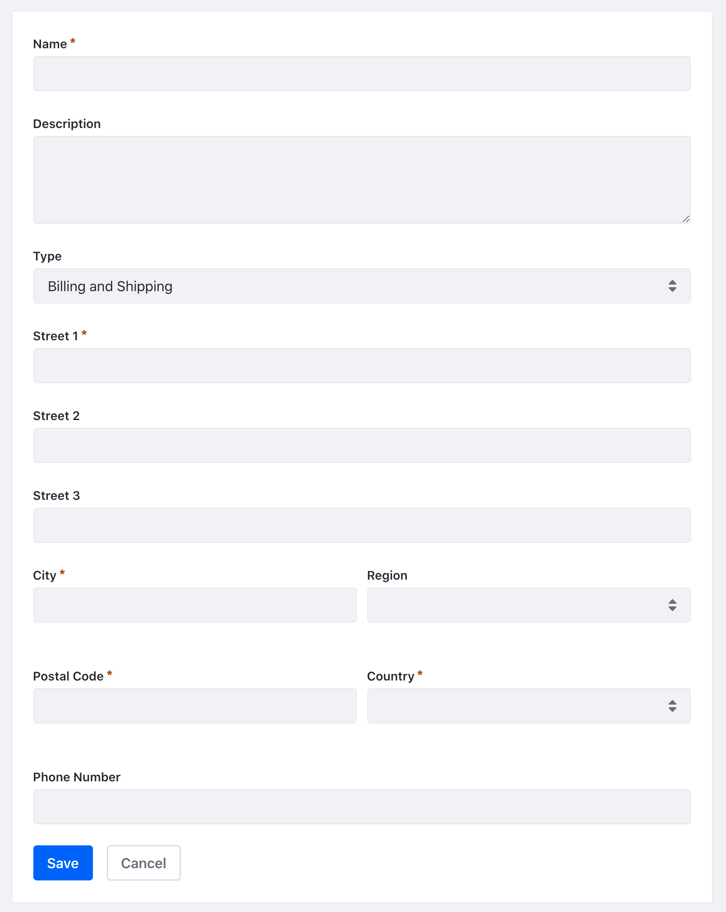

# Accounts

```{toctree}
:maxdepth: 3

accounts/account-users.md
accounts/account-groups.md
accounts/account-roles.md
accounts/account-management-widget.md
```

Accounts provide administrators with a way to organize and manage users for various commerce or business needs. Unlike [organizations](./organizations.html) or [user groups](./user_groups.html), accounts help facilitate interactions that might take place in business situations such as the purchasing of goods and services or managing existing customers.

```{note}
Accounts is a feature that is available in Liferay DXP 7.4 and above.
```

## Creating an Account

To create an Account,

1. Open the Global Menu (). Navigate to *Applications* &rarr; *Accounts*.

1. Click the Add icon () to create a new account. 

1. Give your account a name and select the type. 

    

    Account type can be Business, Person or Guest. You can associate multiple Users for a Business type account whereas the Person type account is for an individual user. The Guest type account provides a way for a user to interact with your business or Site as an unregistered user. Note that once an Account is created the type cannot be changed.

## Making Changes to an Account

To make changes to your account,

1. Click on the Options icon () of the account you want to edit.

1. Make one of the following selections:

    

    * Edit - See and edit the account information.
    * Manage Users - Add or remove Account Users.
    * Manage Organizations - Add or remove associated Organizations.
    * Deactivate - Deactivate an Account.
    * Delete - Delete an Account.

    Note that for Person Account type there is no Manage Users functionality. Also note that the Guest type Account is hidden from the list. Click on *"*Filter and Order* and select *Guest* to see the Guest type Accounts. 

1. Selecting the Edit option brings you to a new page with more options:

    

    * Details tab - Modify or add additional information for the Account.
    * Addresses tab - Add or manage billing and shipping addresses.
    * Users tab - Add or remove Account Users. See [Account Users](./accounts/account-users.md) for more information.
    * Organizations tab - Add or remove associated organizations.
    * Account Groups tab - View the Account Groups the Account is a part of. See [Account Groups](./accounts/account-groups.md) for more information.
    * Roles tab - Add or manage the different roles for the Account. See [Account Roles](./accounts/account-roles.md) for more information.

## Learn More

- [Account Users](./accounts/account-users.md)
- [Account Groups](./accounts/account-groups.md)
- [Account Roles](./accounts/account-roles.md)
- [Account Management Widget](./accounts/account-management-widget.md)