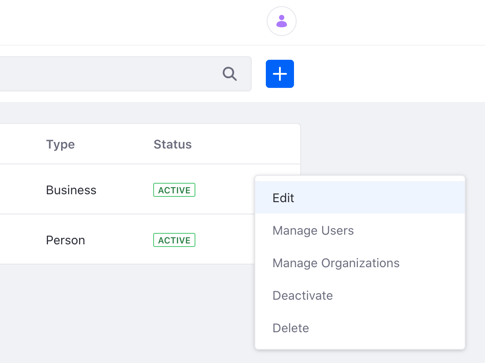

# Accounts

```{toctree}
:maxdepth: 3

accounts/account-users.md
accounts/account-groups.md
accounts/account-roles.md
accounts/account-management-widget.md
```

Accounts provide administrators with a way to organize and manage users for various commerce or business needs. Unlike [organizations](./organizations.html) or [user groups](./user_groups.html), accounts help facilitate interactions that might take place in business situations such as the purchasing of goods and services or managing existing customers.

```{note}
Accounts is a feature, originally found in [Liferay Commerce](../../../../latest/en/users-and-accounts/account-management.md), that is now a part of Liferay DXP 7.4 and above.
```

## Creating an Account

To create an Account,

1. Open the Global Menu (). Navigate to *Applications* &rarr; *Accounts*.

1. Click the Add icon () to create a new account. 

1. Give your account a name and select the type. 

    

    Account type can be Business, Person or Guest. You can associate multiple Users for a Business type account whereas the Person type account is for an individual user. The Guest type account provides a way for a user to interact with your business or Site as an unregistered user. Note that once an Account is created the type cannot be changed.

1. Add additional information for your account such as Tax ID or description. Click *Save* to create the new account.

1. After creating an account, tabs appear at the top of the page. 

    

### Details Tab

The details tab displays the main information about the account such as the account name and type. A default billing address and shipping address can also be set in this tab. [Categories](../content-authoring-and-management/tags-and-categories/defining-categories-and-vocabularies-for-content.md) or [Custom Fields](../system-administration/configuring-liferay/adding-custom-fields.mdß) can also be added for further customization of the account. 

### Addresses Tab

The addresses tab displays the different addresses associated with the account. To add a new address click the Add icon (). Fill out the address information and click the *Save* button.


### Users Tab

The users tab displays the different users associated with the account. Note, this tab does not exist for Person type accounts or Guest type accounts. To associate a user to the account,

1. Click the Add icon (). A window will pop up to show a list of account users available to select.

1. Select users by adding a checkmark next to a user's name and click the *Assign* button.

1. A new user can also be created from this view. Click the Add icon () and see an add new user page.

1. Fill in the information for the new user and click the *Save* button.

1. Any new user that was create or associated with the account will now be displayed in the users tab. See [Account Users](./accounts/account-users.md) to learn more.

### Organizations Tab

The organizations tab displays the different organizations the account is associated with. To associate an organization, click the Add icon (). Select the organization to associate and click the *Assign* button.

### Account Groups Tab

The account groups tab displays the different groups the account is a part of. To learn more about creating or managing these groups, see [Account Groups](./accounts/account-groups.md).

### Roles Tab

The roles tab displays the different roles that are available for the account. Note, this tab does not exist for Guest type accounts. To create an Account Role, 

1. Click the Add icon (). 

1. In the following page, give the role a title and description. Click *Save*.

1. Once the role is created, you can define permissions and assign users. Click the *Define Permissions* tab and choose the permissions for the role. 

1. Click the *Assignees* tab to assign a user to the role. Click the Add icon () and a new window will pop up. Select a user and click the *Assign* button.

See [Account Roles](./accounts/account-roles.md) to learn more.

## Making Changes to an Account

To make changes to your account,

1. Click on the Options icon () of the account you want to edit.

1. Make one of the following selections:

    

    * Edit - See and edit the account information.
    * Manage Users - Add or remove Account Users.
    * Manage Organizations - Add or remove Organization associations.
    * Deactivate - Deactivate an Account.
    * Delete - Delete an Account.

    Note that for Person Account type, there is no Manage Users functionality. 

2. Selecting the Edit option brings you to a new page with more options:

    

    * Details tab - Modify or add additional information for the Account.
    * Addresses tab - Add or manage billing and shipping addresses.
    * Users tab - Add or remove Account Users. See [Account Users](./accounts/account-users.md) for more information.
    * Organizations tab - Add or remove Organization associations.
    * Account Groups tab - View the Account Groups the Account is a part of. See [Account Groups](./accounts/account-groups.md) for more information.
    * Roles tab - Add or manage the different roles for the Account. See [Account Roles](./accounts/account-roles.md) for more information.

## Learn More

- [Account Users](./accounts/account-users.md)
- [Account Groups](./accounts/account-groups.md)
- [Account Roles](./accounts/account-roles.md)
- [Account Management Widget](./accounts/account-management-widget.md)