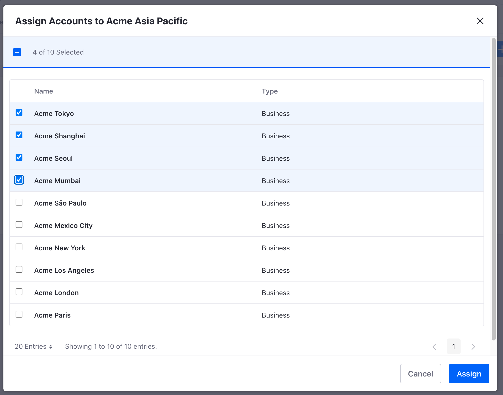

# Account Groups

Use Account Groups to group Accounts together based on your business or professional needs. For example, group accounts by geography (Americas, Asia Pacific, Europe, etc.). 

## Creating an Account Group

To create an account group,

1. Open the Global Menu (). Navigate to *Applications* &rarr; *Account Groups*.

1. Click the Add icon () to create a new account group. 

1. On the next page, give your Account Group a name and optional description. Click *Save*.

1. Click the *Accounts* tab at the top of the page. Click the Add icon () to assign accounts to the group.

    

    Place a checkmark next to the accounts you want to include. Use the search bar to find specific accounts. Click *Assign* to save the changes. 

## Editing an Account Group

To view and edit an existing Account Group,

1. In Account Groups, click on the Options icon () of the account group you want to edit.

1. Click *Edit* to see the details page. View or make changes to the name or description.

1. Click the *Accounts* tab to view or make changes to the group. Click the Add icon () if you want to assign more accounts to the group. Click the Remove icon () of a specific account if you want to remove it from the group. Click *OK* to confirm removing the account.