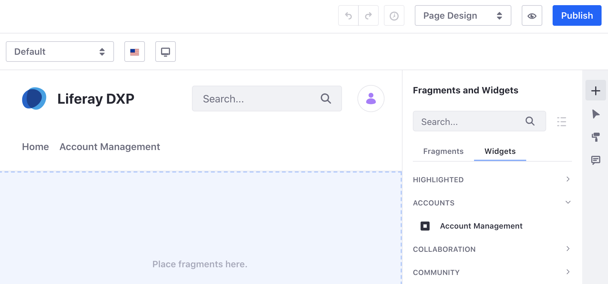
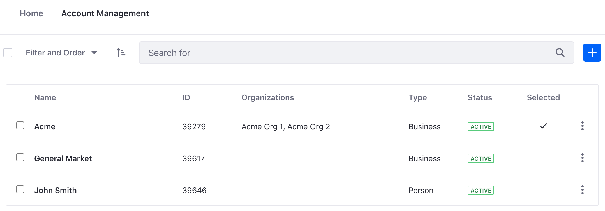

# Account Management Widget

The Account Management widget makes it easy to manage and access account information. Deploy the widget to any Page. This is a useful way to provide access for those without permission to view the Applications Menu.

## Adding the Account Management Widget to a Page

To add the Account Management widget to a page,

1. Navigate to a Site page where the app is desired.

1. Click the Edit icon () at the top right of the page.

1. Locate the widget under the Accounts section of widgets. Drag the widget to the page.

   

1. A list of Accounts should now be displayed by the widget.

## Using the Account Management Widget

The Account management widget displays a list of different Accounts. Note that what is shown is dependent on the Accounts the current User can access. Click *Filter and Order* and filter the list or use the search bar to quickly locate a specific account.

The widget displays the following information:

**Name:** The name of the Account

**ID:** The ID number of the Account

**Organizations:** Any organizations the Account is assigned to

**Type:** The type of Account (i.e. Business, Guest, Person)

**Status:** Whether the Account is active or inactive

**Selected:** The checkmark indicates the Account selected for the current Site

Note, when an Account User has access to multiple Accounts, the Selected checkmark indicates which Account the user is currently viewing or managing on the Site. This gives the ability to manage different settings for each Account such as price or order information.

Click on the Options icon () of the account you want to edit or manage. The following choices are available:

**Edit:** Make changes to the Account

**Manage Users:** Manage the Account Users

**Manage Organizations:** Manage the organizations the Account is assigned to

**Deactivate:** Deactivate the Account

**Delete:** Delete the Account
