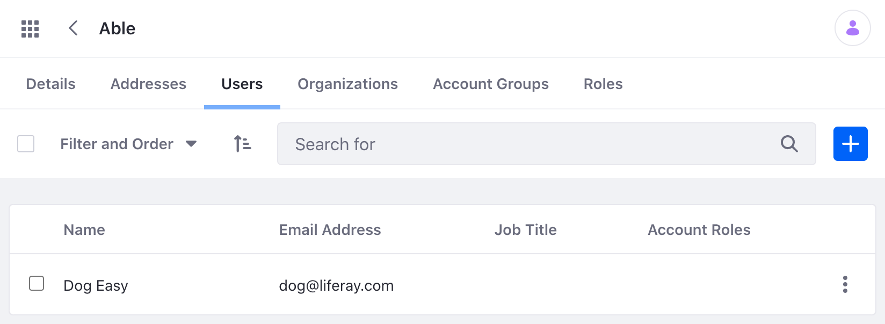

# Account Users and Roles APIs

You can manage [Account Users](../accounts/account-users.md) and [Account Roles](../accounts/account-roles.md) from the Applications menu, but you can also use Liferay's REST APIs. Call these services to create and manage Account Users and Roles.

## Adding an Account User

1. Start Liferay DXP. If you don't already have a docker container, use

   ```bash
   docker run -it -m 8g -p 8080:8080 [$LIFERAY_LEARN_DXP_DOCKER_IMAGE$]
   ```

1. Download and unzip [Accounts API Basics](./liferay-t5p9.zip).

   ```bash
   curl https://learn.liferay.com/dxp/latest/en/users-and-permissions/developer-guide/liferay-t5p9.zip -O
   ```

   ```bash
   unzip liferay-t5p9.zip
   ```

1. Use the [Accounts_GET_FromInstance](./accounts-api-basics.html#get-an-account) resource to get a list of account IDs. Make note of the account ID you wish to add a user for.

1. Use the cURL script to add a new account user to the account. On the command line, navigate to the `curl` folder. Execute the `AccountUser_POST_ToAccount.sh` script with the account ID as a parameter.

   ```bash
   ./AccountUser_POST_ToAccount.sh 1234
   ```

   The JSON response shows a new account has been added:

   ```bash
        {
        "accountBriefs" : [ {
            "id" : 38935,
            "name" : "Able",
            "roleBriefs" : [ ]
        } ],
        "additionalName" : "",
        "alternateName" : "dog",
        "birthDate" : "1977-01-01T00:00:00Z",
        "customFields" : [ ],
        "dashboardURL" : "",
        "dateCreated" : "2021-10-12T21:00:59Z",
        "dateModified" : "2021-10-12T21:01:01Z",
        "emailAddress" : "dog@liferay.com",
        "externalReferenceCode" : "",
        "familyName" : "Easy",
        "givenName" : "Dog",
        "id" : 39005,
        "jobTitle" : "",
        "keywords" : [ ],
        "name" : "Dog Easy",
        "organizationBriefs" : [ ],
        "profileURL" : "",
        "roleBriefs" : [ {
            "id" : 20111,
            "name" : "User"
        } ],
        "siteBriefs" : [ {
            "id" : 20125,
            "name" : "Global"
        }, {
            "id" : 20123,
            "name" : "Guest"
        } ],
        "userAccountContactInformation" : {
            "emailAddresses" : [ ],
            "facebook" : "",
            "jabber" : "",
            "postalAddresses" : [ ],
            "skype" : "",
            "sms" : "",
            "telephones" : [ ],
            "twitter" : "",
            "webUrls" : [ ]
        }
        }     
    ```

1. Navigate to *Global Menu* &rarr; *Applications* &rarr; *Accounts*. Click the account you created a User for. Click the *Users* tab and see the new User that was created.

  

1. The REST service can also be called using the Java client. Navigate out of the `curl` folder and into the `java` folder. Compile the source files with the following command:

    ```bash
    javac -classpath .:* *.java
    ```

2. Run the `AccountUser_POST_ToAccount.java` class with the following command. Replace `1234` with the account's ID.

   ```bash
   java -classpath .:* -DaccountId=1234 AccountUser_POST_ToAccount
   ```

## Examine the cURL Command

The `AccountUser_POST_ToAccount.sh` script calls the REST service with a cURL command.

```{literalinclude} ./accounts-api-basics/resources/liferay-t5p9.zip/curl/AccountUser_POST_ToAccount.sh
    :language: bash
```

Here are the command's arguments:

| Arguments | Description |
| --------- | ----------- |
| `-H "Content-Type: application/json"` | Indicates that the request body format is JSON. |
| `-X POST` | The HTTP method to invoke at the specified endpoint |
| `"http://localhost:8080/o/headless-admin-user/v1.0/accounts/${1}/user-accounts"` | The REST service endpoint |
| `-d "{\"alternateName\": \"Dog\", \"emailAddress\": \"dog@liferay.com\", \"familyName\": \"Easy\", \"givenName\": \"Dog\"}"` | The data you are requesting to post |
| `-u "test@liferay.com:test"` | Basic authentication credentials |

```{note}
Basic authentication is used here for demonstration purposes. For production, you should authorize users via [OAuth2](../../../installation-and-upgrades/securing-liferay/configuring-sso/using-oauth2/introduction-to-using-oauth2.md).
```

The other cURL commands use similar JSON arguments.

## Examine the Java Class

The `Account_POST_ToInstance.java` class adds an Account User by calling the related service.

```{literalinclude} ./accounts-api-basics/resources/liferay-t5p9.zip/java/Account_POST_ToInstance.java
   :dedent: 1
   :language: java
   :lines: 9-25
```

This class invokes the REST service using only three lines of code:

| Line (abbreviated) | Description |
| :----------------- | :---------- |
| `UserAccountResource.Builder builder = ...` | Gets a `Builder` for generating a `UserAccountResource` service instance. |
| `UserAccountResource userAccountResource = builder.authentication(...).build();` | Specifies basic authentication and generates a `UserAccountResource` service instance. |
| `UserAccount userAccount = userAccountResource.postAccountUserAccount(...);` | Calls the `userAccountResource.postAccountUserAccount` method and passes the data to post. |

```{note}
The `main` method's comment demonstrates running the class.
```

The other example Java classes are similar to this one, but call different methods.

```{important}
See [AccountResource](https://github.com/liferay/liferay-portal/blob/[$LIFERAY_LEARN_PORTAL_GIT_TAG$]/modules/apps/headless/headless-admin-user/headless-admin-user-client/src/main/java/com/liferay/headless/admin/user/client/resource/v1_0/AccountResource.java) for service details.
```

Below are examples of calling other related REST services using cURL and Java.

## Get Account Users from Account

You can list an account's users by executing the following cURL or Java command. As above, replace `1234` with your account's ID.

### AccountUsers_GET_FromAccount.sh

Command:

```bash
./AccountUsers_GET_FromAccount 1234
```

Code:

```{literalinclude} ./accounts-api-basics/resources/liferay-t5p9.zip/curl/AccountUsers_GET_FromAccount.sh
   :language: bash
```

### AccountUsers_GET_FromAccount.java

Command:

```bash
java -classpath .:* -DaccountId=1234 AccountUsers_GET_FromAccount
```

Code:

```{literalinclude} ./accounts-api-basics/resources/liferay-t5p9.zip/java/AccountUsers_GET_FromAccount.java
   :dedent: 1
   :language: java
   :lines: 11-23
```

The Account's `UserAccount` objects appear in JSON.

## Post an Account Role

Create a new Account Role for a specific account. Note, replace `1234` with your account's ID.

### AccountRole_POST_ToAccount.sh

Command:

```bash
./AccountRole_POST_ToAccount.sh 1234
```

Code:

```{literalinclude} ./accounts-api-basics/resources/liferay-t5p9.zip/curl/AccountRole_POST_ToAccount.sh
   :language: bash
```

### AccountRole_POST_ToAccount.java

Command:

```bash
java -classpath .:* -DaccountId=1234 AccountRole_POST_ToAccount
```

Code:

```{literalinclude} ./accounts-api-basics/resources/liferay-t5p9.zip/java/AccountRole_POST_ToAccount.java
   :dedent: 1
   :language: java
   :lines: 9-25
```

## Associate a User to an Account Role

You can associate a User with a specific Account Role. Replace `1234` with your Account's ID. Replace `5678` with your Account Role's ID. Replace `9012` with your Account User's ID.

### AccountRole_POST_UserAssociation.sh

Command:

```bash
./AccountRole_POST_UserAssociation.sh 1234 5678 9012
```

Code:

```{literalinclude} ./accounts-api-basics/resources/liferay-t5p9.zip/curl/AccountRole_POST_UserAssociation.sh
   :language: bash
```

### AccountRole_POST_UserAssociation.java

Command:

```bash
java -classpath .:* -DaccountId=1234 -DaccountRoleId=5678 -DuserAccountId=9012 AccountRole_POST_UserAssociation
```

Code:

```{literalinclude} ./accounts-api-basics/resources/liferay-t5p9.zip/java/AccountRole_POST_UserAssociation.java
   :dedent: 1
   :language: java
   :lines: 9-19
```

## Get Account Roles from an Account

You can list an Account's Account Roles by executing the following cURL or Java command. Replace `1234` with your Account's ID.

### AccountRoles_GET_FromAccount.sh

Command:

```bash
./AccountRoles_GET_FromAccount.sh 1234
```

Code:

```{literalinclude} ./accounts-api-basics/resources/liferay-t5p9.zip/curl/AccountRoles_GET_FromAccount.sh
   :language: bash
```

### AccountRoles_GET_FromAccount.java

Command:

```bash
java -classpath .:* -DaccountId=1234 AccountRoles_GET_FromAccount
```

Code:

```{literalinclude} ./accounts-api-basics/resources/liferay-t5p9.zip/java/AccountRoles_GET_FromAccount.java
   :dedent: 1
   :language: java
   :lines: 11-23
```

The Account's `AccountRole` objects appear in JSON.

## Remove Account Role User Association

Remove an Account Role association from a specific Account User. Replace `1234` with your Account's ID. Replace `5678` with your Account Role's ID. Replace `9012` with your Account User's ID.

### AccountRole_DELETE_UserAssociation.sh

Command:

```bash
./AccountRole_DELETE_UserAssociation.sh 1234 5678 9012
```

Code:

```{literalinclude} ./accounts-api-basics/resources/liferay-t5p9.zip/curl/AccountRole_DELETE_UserAssociation.sh
   :language: bash
```

### AccountRole_DELETE_UserAssociation.java

Command

```bash
java -classpath .:* -DaccountId=1234 -DaccountRoleId=5678 -DuserAccountId=9012 AccountRole_DELETE_UserAssociation
```

Code:

```{literalinclude} ./accounts-api-basics/resources/liferay-t5p9.zip/java/AccountRole_DELETE_UserAssociation.java
   :dedent: 1
   :language: java
   :lines: 8-19
```

The [API Explorer](../../../headless-delivery/consuming-apis/consuming-rest-services.md) shows all of the `Account` services and schemas and has an interface to try out each service.
