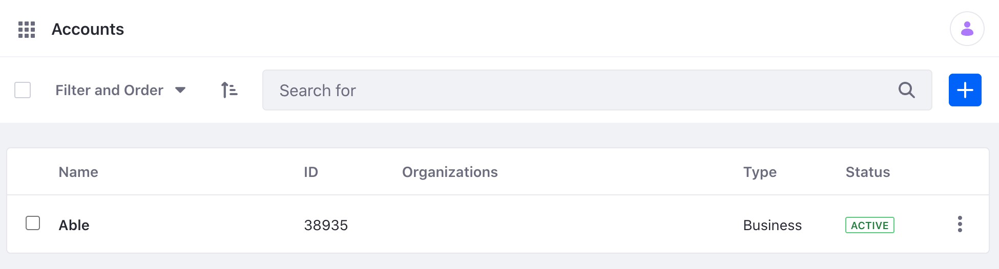

# Accounts API Basics

You can manage [Accounts](../accounts.md) from the Applications menu, but you can also use Liferay's REST APIs. Call these services to create and manage accounts.

## Adding an Account

1. Start Liferay DXP. If you don't already have a docker container, use

   ```bash
   docker run -it -m 8g -p 8080:8080 [$LIFERAY_LEARN_DXP_DOCKER_IMAGE$]
   ```

1. Download and unzip [Accounts API Basics](./liferay-t5p9.zip).

   ```bash
   curl https://learn.liferay.com/dxp/latest/en/users-and-permissions/developer-guide/liferay-t5p9.zip -O
   ```

   ```bash
   unzip liferay-t5p9.zip
   ```

2. Use the cURL script to add a new Account to your instance. On the command line, navigate to the `curl` folder. Execute the `Account_POST_ToInstance.sh` script.

    ```bash
    ./Account_POST_ToInstance.sh
    ```

    The JSON response shows a new Account has been added:

    ```bash
    "description" : "Foo",
    "domains" : [ ],
    "externalReferenceCode" : "",
    "id" : 39302,
    "name" : "Able",
    "numberOfUsers" : 0,
    "organizationIds" : [ ],
    "parentAccountId" : 0,
    "status" : 0,
    "type" : "business"

    ```

3. Navigate to *Global Menu* &rarr; *Applications* &rarr; *Accounts*. See that a new Account has been added.

   

4. The REST service can also be called using the Java client. Navigate out of the `curl` folder and into the `java` folder. Compile the source files with the following command:

    ```bash
    javac -classpath .:* *.java
    ```

5. Run the `Account_POST_ToInstance.java` class with the following command.

    ```bash
    java -classpath .:* Account_POST_ToInstance
    ```

## Examine the cURL Command

The `Account_POST_ToInstance.sh` script calls the REST service with a cURL command.

```{literalinclude} ./accounts-api-basics/resources/liferay-t5p9.zip/curl/Account_POST_ToInstance.sh
    :language: bash
```

Here are the command's arguments:

| Arguments | Description |
| --------- | ----------- |
| `-H "Content-Type: application/json"` | Indicates that the request body format is JSON. |
| `-X POST` | The HTTP method to invoke at the specified endpoint |
| `"http://localhost:8080/o/headless-admin-user/v1.0/accounts"` | The REST service endpoint |
| `-d "{\"description\": \"Foo\", \"name\": \"Able\"}"` | The data you are requesting to post |
| `-u "test@liferay.com:test"` | Basic authentication credentials |

```{note}
Basic authentication is used here for demonstration purposes. For production, you should authorize users via [OAuth2](../../../installation-and-upgrades/securing-liferay/configuring-sso/using-oauth2/introduction-to-using-oauth2.md).
```

The other cURL commands use similar JSON arguments.

## Examine the Java Class

The `Account_POST_ToInstance.java` class adds an account by calling the Account-related service.

```{literalinclude} ./accounts-api-basics/resources/liferay-t5p9.zip/java/Account_POST_ToInstance.java
   :dedent: 1
   :language: java
   :lines: 9-25
```

This class invokes the REST service using only three lines of code:

| Line (abbreviated) | Description |
| :----------------- | :---------- |
| `AccountResource.Builder builder = ...` | Gets a `Builder` for generating an `AccountResource` service instance. |
| `AccountResource accountResource = builder.authentication(...).build();` | Specifies basic authentication and generates a `AccountResource` service instance. |
| `Account account = accountResource.postAccount(...);` | Calls the `accountResource.postAccount` method and passes the data to post. |

```{note}
The `main` method's comment demonstrates running the class.
```

The other example Java classes are similar to this one, but call different `AccountResource` methods.

```{important}
See [AccountResource](https://github.com/liferay/liferay-portal/blob/[$LIFERAY_LEARN_PORTAL_GIT_TAG$]/modules/apps/headless/headless-admin-user/headless-admin-user-client/src/main/java/com/liferay/headless/admin/user/client/resource/v1_0/AccountResource.java) for service details.
```

Below are examples of calling other `Account` REST services using cURL and Java.

## Get Accounts from Instance

You can list Accounts by executing the following cURL or Java command.

### Accounts_GET_FromInstance.sh

Command:

```bash
./Accounts_GET_FromInstance.sh
```

Code:

```{literalinclude} ./accounts-api-basics/resources/liferay-t5p9.zip/curl/Accounts_GET_FromInstance.sh
   :language: bash
```

### Accounts_GET_FromInstance.java

Command:

```bash
java -classpath .:* Accounts_GET_FromInstance
```

Code:

```{literalinclude} ./accounts-api-basics/resources/liferay-t5p9.zip/java/Accounts_GET_FromInstance.java
   :dedent: 1
   :language: java
   :lines: 11-22
```

The Instance's `Account` objects appear in JSON.

## Get an Account

Get a specific Account with the following cURL or Java command.

```{tip}
Use ``Accounts_GET_FromInstance.[java|sh]`` to get instance ``Account`` IDs.
```

### Account_GET_ById.sh

Command:

```bash
./Account_GET_ById.sh 1234
```

Code:

```{literalinclude} ./accounts-api-basics/resources/liferay-t5p9.zip/curl/Account_GET_ById.sh
   :language: bash
```

### Account_GET_ById.java

Command:

```bash
java -classpath .:* -DaccountId=1234 Account_GET_ById
```

Code:

```{literalinclude} ./accounts-api-basics/resources/liferay-t5p9.zip/java/Account_GET_ById.java
   :dedent: 1
   :language: java
   :lines: 9-20
```

The `Account` fields appear in JSON.

## Patch an Account

Do a partial edit of an existing Account with the following cURL and Java commands. Note, replace `1234` with your Account's ID.

### Account_PATCH_ById.sh

Command:

```bash
./Account_PATCH_ById.sh 1234
```

Code:

```{literalinclude} ./accounts-api-basics/resources/liferay-t5p9.zip/curl/Account_PATCH_ById.sh
   :language: bash
```

### Account_PATCH_ById.java

Command:

```bash
java -classpath .:* -DaccountId=1234 Account_PATCH_ById
```

Code:

```{literalinclude} ./accounts-api-basics/resources/liferay-t5p9.zip/java/Account_PATCH_ById.java
   :dedent: 1
   :language: java
   :lines: 9-25
```

## Put an Account

Completely overwrite an existing Account with the following cURL and Java commands. Note, replace `1234` with your Account's ID.

### Account_PUT_ById.sh

Command:

```bash
./Account_PUT_ById.sh 1234
```

Code:

```{literalinclude} ./accounts-api-basics/resources/liferay-t5p9.zip/curl/Account_PUT_ById.sh
   :language: bash
```

### Account_PUT_ById.java

Command:

```bash
java -classpath .:* -DaccountId=1234 Account_PUT_ById
```

Code:

```{literalinclude} ./accounts-api-basics/resources/liferay-t5p9.zip/java/Account_PUT_ById.java
   :dedent: 1
   :language: java
   :lines: 9-25
```

## Delete an Account

Delete an existing Account with the following cURL and Java commands. Note, replace `1234` with your Account's ID.

### Account_DELETE_ById.sh

Command:

```bash
./Account_DELETE_ById.sh 1234
```

Code:

```{literalinclude} ./accounts-api-basics/resources/liferay-t5p9.zip/curl/Account_DELETE_ById.sh
   :language: bash
```

### Account_DELETE_ById.java

Command

```bash
java -classpath .:* -DaccountId=1234 Account_DELETE_ById
```

Code:

```{literalinclude} ./accounts-api-basics/resources/liferay-t5p9.zip/java/Account_DELETE_ById.java
   :dedent: 1
   :language: java
   :lines: 8-17
```

The [API Explorer](../../../headless-delivery/consuming-apis/consuming-rest-services.md) shows all of the `Account` services and schemas and has an interface to try out each service.
