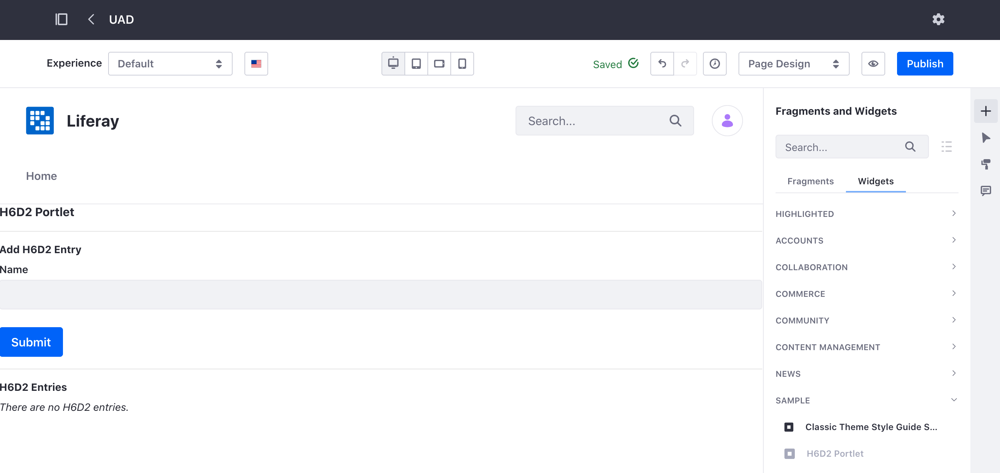
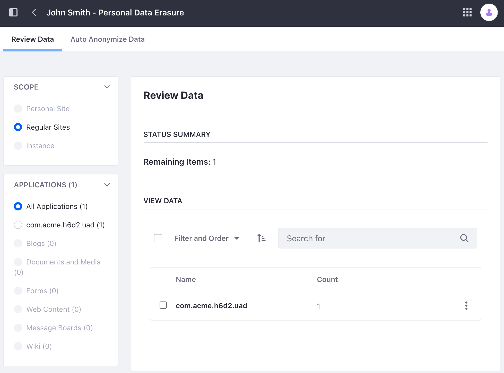

# Adding the UAD Framework

You can [manage and delete user data](../managing-user-data.md) with Liferay's User Associated Data (UAD) management tool. The tool is available out-of-the-box for many of Liferay's applications (e.g. Blogs, Documents and Media, Message Boards, etc.). This framework can also be applied to your custom application.

This task is made easier with the use of [Service Builder](../../building-applications/data-frameworks/service-builder.md). See the example below to learn how Service Builder automatically generates the necessary code to enable UAD for your application.

## Download the Example Code

1. Start Liferay DXP. If you don't already have a docker container, use

    ```bash
    docker run -it -m 8g -p 8080:8080 [$LIFERAY_LEARN_DXP_DOCKER_IMAGE$]
    ```

    If you're running a different Liferay Portal version or Liferay DXP, adjust the above command accordingly. 

1. Download and unzip [UAD Framework](./liferay-h6d2.zip).

    ```bash
    curl https://learn.liferay.com/dxp/latest/en/users-and-permissions/developer-guide/liferay-h6d2.zip -O
    ```

    ```bash
    unzip liferay-h6d2.zip
    ```

1. From the module root, build and deploy.

    ```bash
    ./gradlew deploy -Ddeploy.docker.container.id=$(docker ps -lq)
    ```

    ```note::
       This command is the same as copying the deployed jars to /opt/liferay/osgi/modules on the Docker container.
    ```

1. Confirm the deployment in the Liferay Docker container console.

    ```bash
    STARTED com.acme.h6d2.api_1.0.0 [1433]
    STARTED com.acme.h6d2.service_1.0.0 [1434]
    STARTED com.acme.h6d2.uad_1.0.0 [1435]
    STARTED com.acme.h6d2.web_1.0.0 [1436]
    ```

1. Open your browser to `https://localhost:8080`.

1. Add the H6D2 Portlet to a page. You can find the example portlet under Sample Widgets.

   

1. [Create a new user](../users/adding-and-managing-users.md) for testing.

1. Log in as the new user and add some content on the H6D2 Portlet.

1. Log back in as the administrator and navigate to *Control Panel* &rarr; *Users* &rarr; *Users and Organizations*. 

1. Click the new user's *Actions* icon () &rarr; *Delete Personal Data*. Click *OK* to confirm deactivation of the user.

1. The UAD management tool appears. You can view, anonymize, or delete the data the new user added in the H6D2 Portlet.

   

## Modify the Service Model Definition

This tutorial assumes that you have a working application that you created using Service Builder. To enable UAD, first make the following changes to your entity:

1. Open your `service.xml` file in the `-service` folder.

1. There are two `entity` parameters to enable UAD:

   | `entity` attributes | Description |
   | :------------------ | :---------- |
   | `uad-application-name` | Specifies the name of the application the entity type belongs to. |
   | `uad-package-path` | Specifies the package path for the generated UAD classes. |

   ```{literalinclude} ./adding-the-uad-framework/resources/liferay-h6d2.zip/h6d2-service/service.xml
   :language: xml
   :lines: 6
   ```

1. Add the following data fields if you don't already have them defined:

   ```xml
   <!-- Group instance -->

   <column name="groupId" type="long" />

   <!-- Audit fields -->

   <column name="companyId" type="long" />
   <column name="userId" type="long" />
   <column name="userName" type="String" />
   <column name="createDate" type="Date" />
   <column name="modifiedDate" type="Date" />
   ```

   The UAD Framework requires these fields to track and anonymize user data.

1. Next, specify the data fields to anonymize. This is done with the use of two attributes:

   * The `uad-anonymize-field-name=[fieldName]` attribute indicates a field whose value is replaced by that of the anonymous user in the UAD auto-anonymization process. For example, setting `uad-anonymize-field-name=fullName` would replace the value of that field with the full name of the anonymous user. See [Configuring the Anonymous User](../managing-user-data/configuring-the-anonymous-user.md) to learn more about the anonymous user.

   * The `uad-nonanonymizable="true"` attribute indicates data that is not automatically anonymized but must be reviewed by an administrator.

   ```{literalinclude} ./adding-the-uad-framework/resources/liferay-h6d2.zip/h6d2-service/service.xml
   :language: xml
   :lines: 20
   ```
## Generate the UAD module

1. Navigate out of the `-service` folder and create a new `-uad` folder.

1. Create a `bnd.bnd` file for the module.

    ```{literalinclude} ./adding-the-uad-framework/resources/liferay-h6d2.zip/h6d2-uad/bnd.bnd
    ```

   Make sure to include the `-dsannotations-options: inherit` annotation. OSGi service component classes inherit [OSGi declarative services](../../liferay-internals/fundamentals/module-projects.md) annotations from their class hierarchy.

1. Create a `build.gradle` file for the module.

    ```{literalinclude} ./adding-the-uad-framework/resources/liferay-h6d2.zip/h6d2-uad/build.gradle
    ```

   Make sure to add any dependencies you need, including any `-api` module of your project.

2. Navigate back to the module's `-service` folder and run Service Builder to generate the UAD module.

    ```bash
    ../gradlew buildService
    ```

    Output:

    ```
    > Task :h6d2-service:buildService
    Building H6D2Entry
    Writing ../h6d2-uad/src/main/java/com/acme/h6d2/uad/anonymizer/BaseH6D2EntryUADAnonymizer.java
    Writing ../h6d2-uad/src/main/java/com/acme/h6d2/uad/exporter/BaseH6D2EntryUADExporter.java
    Writing ../h6d2-uad/src/main/java/com/acme/h6d2/uad/anonymizer/H6D2EntryUADAnonymizer.java
    Writing ../h6d2-uad/src/main/java/com/acme/h6d2/uad/exporter/H6D2EntryUADExporter.java
    Writing ../h6d2-uad/src/main/java/com/acme/h6d2/uad/display/BaseH6D2EntryUADDisplay.java
    Writing ../h6d2-uad/src/main/java/com/acme/h6d2/uad/display/H6D2EntryUADDisplay.java
    Writing src/main/resources/service.properties
    Writing ../h6d2-uad/src/main/java/com/acme/h6d2/uad/constants/H6D2UADConstants.java
    ```

## Modify the Portlet

When you pass the data fields specific to your application from the form, you must also pass the user-related data fields you added in the `service.xml` file.

```{literalinclude} ./adding-the-uad-framework/resources/liferay-h6d2.zip/h6d2-web/src/main/java/com/acme/h6d2/web/internal/portlet/H6D2Portlet.java
:language: java
:lines: 30-66
```

The `H6D2 Portlet` has an `H6D2EntryLocalService` field called `_h6d2EntryLocalService` and an action-handling method called `addH6D2Entry`. The `addH6D2Entry` method calls `H6D2EntryLocalService`'s `addH6D2Entry` method, passing the data fields received from the `ActionRequest`. 

The portlet's `view.jsp` contains a form users can submit in an `ActionRequest` to `H6D2 Portlet`.

```{literalinclude} ./adding-the-uad-framework/resources/liferay-h6d2.zip/h6d2-web/src/main/resources/META-INF/resources/view.jsp
:language: jsp
:lines: 18-26
```

Submitting the `ActionRequest` with the `actionURL` invokes the portlet's `addH6D2Entry` method. 

## Additional Information

* [Managing User Data](../managing-user-data.md)
* [Service Builder](../../building-applications/data-frameworks/service-builder.md)
* [Using MVC](../../building-applications/developing-a-java-web-application/using-mvc.md)
