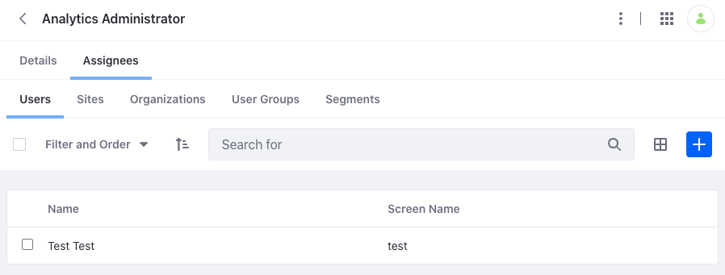

# Roles API Basics

You can [Create and Manage Roles](../roles-and-permissions/creating-and-managing-roles.md) from the Application menu, but you can also use Liferay's REST APIs. Call these services to manage roles.

## Associating a User to a Regular Role

```{include} /_snippets/run-liferay-dxp.md
```

Then, follow these steps:

1. Download and unzip [Roles API Basics](./liferay-z3v5.zip).

   ```bash
   curl https://learn.liferay.com/dxp/latest/en/users-and-permissions/developer-guide/liferay-z3v5.zip -O
   ```

   ```bash
   unzip liferay-z3v5.zip
   ```

1. Use the [Users_GET_FromInstance](./user-account-api-basics.md#get-instance-users) to get a list of user IDs. Make note of the User ID you wish to associate with an Regular Role.

1. Use the [Roles_GET_FromInstance](#get-instance-roles) to get a list of all role IDs. Make note of the role ID you wish to associate that is `roleType: regular`. For example, the Analytics Administrator Regular Role type.

1. Use the cURL script to associate a User to a Regular Role. On the command line, navigate to the `curl` folder. Execute the `RoleUserAssociation_POST_ToInstance.sh` script. Replace `1234` with a Regular Role's ID. Replace `5678` with a User's ID.

   ```bash
   ./Organization_POST_ToInstance.sh 1234 5678
   ```

1. Navigate to *Global Menu* &rarr; *Control Panel* &rarr; *Roles*. Under the Regular Roles tab, click the specific role you used to a associate a User. Click the *Assignees* tab. See that the User has been associated with the Role.

   

2. The REST service can also be called using the Java client. Navigate out of the `curl` folder and into the `java` folder. Compile the source files with the following command:

   ```bash
   javac -classpath .:* *.java
   ```

3. Run the `RoleUserAssociation_POST_ToInstance.java` class with the following command.

   ```bash
   java -classpath .:* -DroleId=1234 -DuserAccountId=5678 RoleUserAssociation_POST_ToInstance
   ```

## Examine the cURL Command

## Examine the Java Class

## Get Instance Roles

