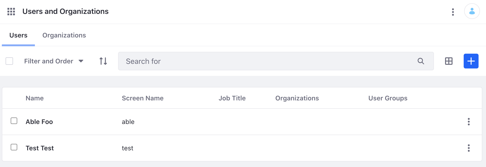
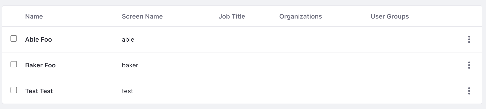
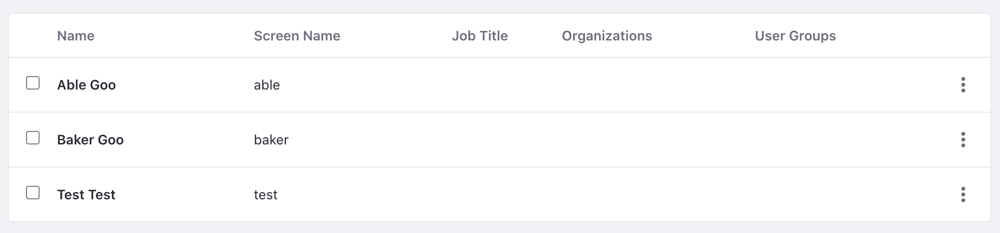

# User Account API Basics

You can [Add and manage Users](../users/adding-and-managing-users.md) from the Control Panel, but you can also use Liferay's REST APIs. You can call these services to add, edit, delete Users.

Start with adding a new User.

## Adding Users

1. Start Liferay DXP. If you don't already have a docker container, use

   ```bash
   docker run -it -m 8g -p 8080:8080 [$LIFERAY_LEARN_PORTAL_DOCKER_IMAGE$]
   ```

1. Download and unzip [User Account API Basics](./liferay-y6q4.zip).

   ```bash
   curl https://learn.liferay.com/dxp/latest/en/users-and-permissions/developer-guide/liferay-y6q4.zip -O
   ```

   ```bash
   unzip liferay-y6q4.zip
   ```

1. Use the cURL script to add a new User to your Liferay instance. On the command line, navigate to the `curl` folder. Execute the `User_POST_ToInstance.sh` script.

    ```bash
    ./User_POST_ToInstance.sh
    ```

    The JSON response shows a new User has been added:

    ```bash
    {
        "additionalName" : "",
        "alternateName" : "able",
        "birthDate" : "1977-01-01T00:00:00Z",
        "customFields" : [ ],
        "dashboardURL" : "",
        "dateCreated" : "2021-05-19T16:04:46Z",
        "dateModified" : "2021-05-19T16:04:46Z",
        "emailAddress" : "able@liferay.com",
        "familyName" : "Foo",
        "givenName" : "Able",
        "id" : 39321,
        "jobTitle" : "",
        "keywords" : [ ],
        "name" : "Able Foo",
        "organizationBriefs" : [ ],
        "profileURL" : "",
        "roleBriefs" : [ {
            "id" : 20113,
            "name" : "User"
        } ],
        "siteBriefs" : [ {
            "id" : 20127,
            "name" : "Global"
        }, {
            "id" : 20125,
            "name" : "Guest"
        } ],
        "userAccountContactInformation" : {
            "emailAddresses" : [ ],
            "facebook" : "",
            "jabber" : "",
            "postalAddresses" : [ ],
            "skype" : "",
            "sms" : "",
            "telephones" : [ ],
            "twitter" : "",
            "webUrls" : [ ]
        }
    }%   
    ```

    In Control Panel, verify the newly added User. Note the User's `id` number for later commands.

    

1. The REST service can also be called with a Java class. Navigate out of the `curl` folder and into the `java` folder. Compile the source files with the following command:

    ```bash
    javac -classpath .:* *.java
    ```

1. Run the `User_POST_ToInstance` class with the following command:

    ```bash
    java -classpath .:* User_POST_ToInstance
    ```

    Verify in Control Panel that another User has been added.

    

Read on to see how the cURL command and Java class work. 

## Examine the cURL Command

The `User_POST_ToInstance.sh` script calls the REST service with a cURL command. 

```{literalinclude} ./user-account-api-basics/resources/liferay-y6q4.zip/curl/User_POST_ToInstance.sh
    :language: bash
```

Here are the command's arguments:

| Arguments | Description |
| --------- | ----------- |
| `-H "Content-Type: application/json"` | Indicates that the request body format is JSON. |
| `-X POST` | The HTTP method to invoke at the specified endpoint |
| `"http://localhost:8080/o/headless-admin-user/v1.0/user-accounts"` | The REST service endpoint |
| `-d "{\"alternateName\": \"Able\", \"emailAddress\": \"able@liferay.com\", \"familyName\": \"Foo\", \"givenName\": \"Able\"}"` | The data you are requesting to post |
| `-u "test@liferay.com:test"` | Basic authentication credentials |

```note::
   Basic authentication is used here for demonstration purposes. For production, you should authorize users via `OAuth2 <../../headless-delivery/using-oauth2/using-oauth2.md>`_.
```

The other cURL commands use similar JSON arguments.

## Examine the Java Class

The `User_POST_ToInstance.java` class adds a User by calling the user related service.

```{literalinclude} ./user-account-api-basics/resources/liferay-y6q4.zip/java/User_POST_ToInstance.java
   :dedent: 1
   :language: java
   :lines: 9-27
```

The class calls the REST service with only three lines of code:

| Line (abbreviated) | Description |
| ------------------ | ----------- |
| `UserAccountResource.Builder builder = ...` | Gets a `Builder` for generating a `UserAccountResource` service instance. |
| `UserAccountResource userAccountResource = builder.authentication(...).build()` | Specifies basic authentication and generates a `UserAccountResources` service instance. |
| `UserAccount userAccount = userAccountResource.postUserAccount(...)` | Calls the `userAccountResource.postUserAccount` method and passes the data to post. |

```note::
   The ``main`` method's comment demonstrates running the class.
```

The other example Java classes are similar to this one but call different `UserAccountResource` methods.

```important::
   See `UserAccountResource <https://github.com/liferay/liferay-portal/blob/[$LIFERAY_LEARN_PORTAL_GIT_TAG$]/modules/apps/headless/headless-admin-user/headless-admin-user-client/src/main/java/com/liferay/headless/admin/user/client/resource/v1_0/UserAccountResource.java>`_ for service details.
```

Below are examples of calling the other User REST services using cURL and Java.

## Get Instance Users

Get a list of all Users with the following cURL and Java commands.

### Users_GET_FromInstance.sh

Command:

```bash
./Users_GET_FromInstance.sh
```

Code:

```{literalinclude} ./user-account-api-basics/resources/liferay-y6q4.zip/curl/Users_GET_FromInstance.sh
   :language: bash
```

### Users_GET_FromInstance.java

Command:

```bash 
java -classpath .:* Users_GET_FromInstance
```

Code:

```{literalinclude} ./user-account-api-basics/resources/liferay-y6q4.zip/java/Users_GET_FromInstance.java
   :dedent: 1
   :language: java
   :lines: 11-22
```

All the Users of the instance are listed in the JSON response.

## Get a User

Get a specific User with the following cURL and Java commands. Note, replace `1234` with your User's ID.

### User_GET_ById.sh

Command:

```bash
./User_GET_ById.sh 1234
```

Code:

```{literalinclude} ./user-account-api-basics/resources/liferay-y6q4.zip/curl/User_GET_ById.sh
   :language: bash
```

### User_GET_ById.java

Command:

```bash 
java -classpath .:* -DuserId=1234 User_GET_ById
```

Code:

```{literalinclude} ./user-account-api-basics/resources/liferay-y6q4.zip/java/User_GET_ById.java
   :dedent: 1
   :language: java
   :lines: 9-20
```

The User is returned in the JSON response.

## Patch a User

Do a partial edit of an existing User with the following cURL and Java commands. Note, replace `1234` with your User's ID.

### User_PATCH_ById.sh

Command:

```bash
./User_PATCH_ById.sh 1234
```

Code:

```{literalinclude} ./user-account-api-basics/resources/liferay-y6q4.zip/curl/User_PATCH_ById.sh
   :language: bash
```

### User_PATCH_ById.java

Command:

```bash 
java -classpath .:* -DuserId=1234 User_PATCH_ById
```

Code:

```{literalinclude} ./user-account-api-basics/resources/liferay-y6q4.zip/java/User_PATCH_ById.java
   :dedent: 1
   :language: java
   :lines: 9-25
```

Note that in the example Able and Baker's last name has now changed from Foo to Bar.

## Put a User

Do a complete overwrite of an existing User with the following cURL and Java commands. Note, replace `1234` with your User's ID.

### User_PUT_ById.sh

Command:

```bash
./User_PUT_ById.sh 1234
```

Code:

```{literalinclude} ./user-account-api-basics/resources/liferay-y6q4.zip/curl/User_PUT_ById.sh
   :language: bash
```

### User_PUT_ById.java

Command:

```bash 
java -classpath .:* -DuserId=1234 User_PUT_ById
```

Code:

```{literalinclude} ./user-account-api-basics/resources/liferay-y6q4.zip/java/User_PUT_ById.java
   :dedent: 1
   :language: java
   :lines: 9-28
```

Note that in the example the previous data has now been replaced with Able Goo and Baker Goo.



## Delete a User

Delete an existing User with the following cURL and Java commands. Note, replace `1234` with your User's ID.

### User_DELETE_ById.sh

Command:

```bash
./User_DELETE_ById.sh 1234
```

Code:

```{literalinclude} ./user-account-api-basics/resources/liferay-y6q4.zip/curl/User_DELETE_ById.sh
   :language: bash
```

### User_DELETE_ById.java

Command:

```bash 
java -classpath .:* -DuserId=1234 User_DELETE_ById
```

Code:

```{literalinclude} ./user-account-api-basics/resources/liferay-y6q4.zip/java/User_DELETE_ById.java
   :dedent: 1
   :language: java
   :lines: 8-17
```

The Users Able Goo and Baker Goo have now been deleted.

## Additional Information

Check out the [API Explorer](../../headless-delivery/consuming-apis/consuming-rest-services.md) to see the list of all User related REST services.
