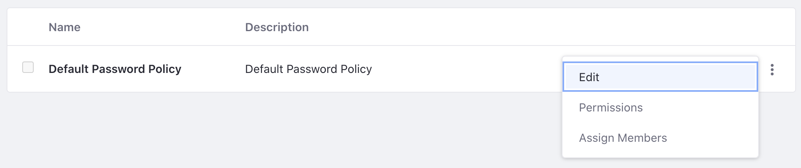

# Configuring a Password Policy

Password policies enhance the security of your installation. You can use the default policy that ships with Liferay (modified or as is), or you can create your own policies. Policies can be assigned to Users or Organizations. 

Note: New users are assigned to the Default Password Policy by default. If you wish to associate a user with a custom password policy they must be assigned as members of that policy. See below.

## Overview

1. [Modifying the Default Password Policy](#modifying-the-default-password-policy)
1. [Creating a Custom Password Policy](#Creating-a-custom-password-policy)
1. [Assigning Members to a Password Policy](#assigning-members-to-a-password-policy)
1. [Utilizing the Properties File](#utilizing-the-properties-file)
1. [Password Properties Reference](#password-properties-reference)

## Modifying the Default Password Policy

1. Navigate to *Control Panel* &rarr; *Security* &rarr; *Password Policies*.

1. Click the Actions button () next to the Default Password Policy and click *Edit*.

   

1. Make your desired changes in the configuration window.

   

   **Password Changes:** Allow or prevent password changes, and set a time limit on the validity of password reset links.

   **Password Syntax Checking:** Require a certain syntax when choosing a password. You can disallow dictionary words, set a minimum length, and more in this section.

   **Password History:** Decide how many passwords to keep in the history, preventing old passwords to be reused.

   **Password Expiration:** If passwords expire, specify how long passwords are valid, when and whether a warning is sent, and a *Grace Limit*: how many logins are allowed after the password is expired before forcing a password change. 

   **Lockout:** Set a maximum number of failed authentication attempts before the account is locked, how long the number of attempts is stored, and how long the lockout lasts.

1. When finished, click *Save*. 

## Creating a Custom Password Policy

There are some scenarios where utilizing a custom password policy would be useful. For example, if you needed to require certain users or user groups of your Site to have stricter password rules. 

1. Navigate to *Control Panel* &rarr; *Security* &rarr; *Password Policies*.

1.  Click the *Add* icon () to add a new policy.

1. In the configuration window, provide a Name and Description for your password policy. 

1. Set the parameters for the policy (see above). When finished, click *Save*. 

## Assigning Members to a Password Policy

Once you have created a new password policy, you need to assign members to it,

1. Click the Actions button () next to the password policy. Click *Assign Members*.

   

1. You can add individual Users or Organizations to the password policy. Click the _add_ icon (). 

1. Make your selection (of Users or Organizations). When finished, click *Add*. 

   

   Your Users or Organizations are now associated with your password policy.

## Utilizing the Properties File

The Default Password Policy is set as the default and configured in Liferay's [portal.properties](@platform-ref@/7.3-latest/propertiesdoc/portal.properties.html#Passwords)
file. Find the properties that start with `passwords.default.policy`. To make changes, including changing the default policy, add whichever properties and values you choose to modify in your `portal-ext.properties` file, as usual.
Restart the application server and your changes take effect.

```properties
#
# Set the properties of the default password policy.
#

...
passwords.default.policy.name=Default Password Policy
...
```

## Password Properties Reference

| Property | Default Value | Description |
| --- | --- | --- |
| `passwords.default.policy.allow.dictionary.words` | true | Common dictionary words are allowed as the user's passwords |
| `passwords.default.policy.changeable` | true | The user can change their password |
| `passwords.default.policy.change.required` | true | The user is required to change their password when they first log in |
| `passwords.default.policy.check.syntax` | false | The password is checked for certain words, certain length, certain characters, etc. |
| `passwords.default.policy.expireable` | false | Expire passwords after a set amount of time |
| `passwords.default.policy.grace.limit` | 0 | The number of times a user can log in after their password has expired, before they are required to enter a new password |
| `passwords.default.policy.history` | false | Keep a history of the user's passwords and prevent them from reusing a previous password |
| `passwords.default.policy.history.count` | 6 | Determines the number of previous passwords to keep in the history |
| `passwords.default.policy.lockout` | false | A user can attempt to log in a certain number of times before their account is locked |
| `passwords.default.policy.lockout.duration` | 0 | The amount of time that a user's account is locked. 0 if password can only be unlocked by administrator. Time is in seconds |
| `passwords.default.policy.max.age` | 8640000 | Determines how long a password is good for before it needs to be changed. Time is in seconds |
| `passwords.default.policy.max.failure` | 3 | The maximum number of times that a user can attempt to log in with the wrong password |
| `passwords.default.policy.min.age` | 0 | Determines how long a user must wait before changing their password again. Time is in seconds |
| `passwords.default.policy.min.alphanumeric` | 0 | The minimum number of alpha numeric letters required in the user's password |
| `passwords.default.policy.min.length` | 6 | The minimum length required of the user's password |
| `passwords.default.policy.min.lowercase` | 0 | The minimum number of lower case letters required in the user's password |
| `passwords.default.policy.min.numbers` | 1 | The minimum number of numbers required in the user's password |
| `passwords.default.policy.min.symbols` | 0 | The minimum number of symbols required in the user's password |
| `passwords.default.policy.min.uppercase` | 1 | The minimum number of upper case letters required in the user's password |
| `passwords.default.policy.name` | Default Password Policy | Name of your password policy |
| `passwords.default.policy.regex` | (?=.{4})(?:[a-zA-Z0-9]*) | If using the RegExpToolkit to generate passwords, set the regular expression pattern to be used to generate and validate passwords |
| `passwords.default.policy.reset.failure.count` | 600 | The amount of time that a record of failed logins is kept for the user. Time is in seconds |
| `passwords.default.policy.reset.ticket.max.age `| 86400 | How long a password reset link is valid for. Time is in seconds |
| `passwords.default.policy.warning.time` | 86400 | How long before a password expires that the user will be notified. Time is in seconds |

## Additional Information

* [Authentication Basics](../../installation-and-upgrades/securing-liferay/authentication-basics.md)
