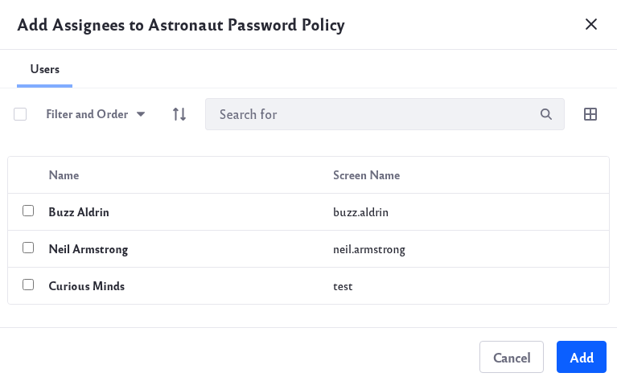

# Configuring a Password Policy

Password policies enhance the security of your installation. You can use the default policy that ships with Liferay (modified or as is), or you can create your own policies. Policies can be assigned to Users or Organizations.

## Adding and Configuring Password Policies

1. Navigate to *Control Panel* &rarr; *Security* &rarr; *Password Policies*.

1. Click the Actions button () next to an existing policy and click *Edit*. Or click the *Add* icon () to add a new policy.

1. In the configuration window, provide a Name and Description for your password policy. 

   

1. Set the parameters for the policy (see below). When finished, click _Save_. 

**Password Changes:** Allow or prevent password changes, and set a time limit on the validity of password reset links.

**Password Syntax Checking:** Require a certain syntax when choosing a password. You can disallow dictionary words, set a minimum length, and more in this section.

**Password History:** Decide how many passwords to keep in the history, preventing old password use.

**Password Expiration:** If passwords expire, specify how long passwords are valid, when and whether a warning is sent, and a _Grace Limit_: how many logins are allowed after the password is expired before forcing a password change. 

**Lockout:** Set a maximum number of failed authentication attempts before the account is locked, how long the number of attempts is stored, and how long the lockout lasts.

## Assigning Members to a Password Policy

Once you have created a new password policy, you need to assign members to it,

1. Click the Actions button () next to the password policy. Click *Assign Members*.

   

1. You can add individual Users or Organizations to the password policy. Click the _add_ icon (). 

1. Make your selection (of Users or Organizations). When finished, click *Add*. 

   

   Your Users or Organizations are now associated with your password policy.

## Default Policy Properties

The Default Password Policy is set as the default and configured in Liferay's [portal.properties](@platform-ref@/7.3-latest/propertiesdoc/portal.properties.html#Passwords)
file. Find the properties that start with `passwords.default.policy`. To make changes, including changing the default policy, add whichever properties and values you choose to modify in your `portal-ext.properties` file, as usual.
Restart the application server and your changes take effect.

```properties
#
# Set the properties of the default password policy.
#

...
passwords.default.policy.name=Default Password Policy
...
```

## Additional Information

* [Authentication Basics](../../installation-and-upgrades/securing-liferay/authentication-basics.md)
