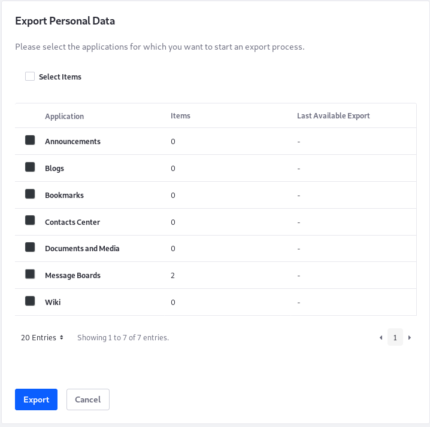
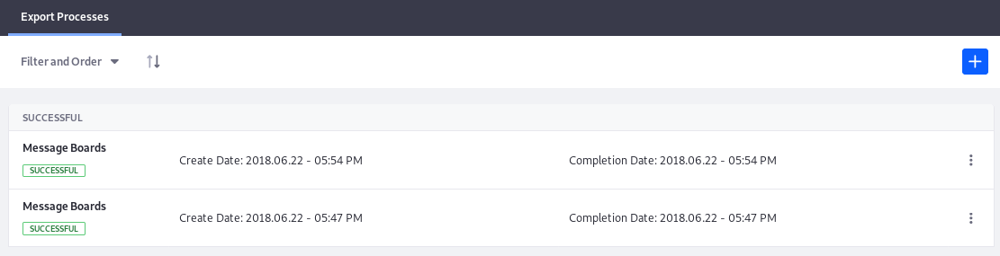

# Exporting User Data

One of the General Data Protection Regulation's (GDPR) tenets is that Users have a right to _data portability_.

Data portability means that users have the right to receive their personal data in a machine-readable format.

The Control Panel's User Management system natively supports the export of a User's personal data to a ZIP file for download. The format is in XML format.

## Exporting and Downloading

To export user data,

1. Open the Global Menu ().

1. Go to *Control Panel* &rarr; *Users* &rarr; *Users and Organizations*.

1. Find the User and click the Actions button (), then click *Export Personal Data*.

   This opens the User's Export Personal Data screen.

1. If there are no existing export processes shown, click the *Add* button (). The tool for exporting the User's data appears.

   

1. Most of the time you want to export all the available data. Click *Select Items*, and all applications containing User data are selected in the UI.

1. Click *Export*. You're taken back to the User's Export Personal Data screen, but now there's an export process in the list.

   

1. Download the data. Click the Actions button () for the process and select *Download*.

## Examining Exported Data

The exported data looks like this: 

```xml
<?xml version="1.0"?>

<model>
    <model-name>com.liferay.message.boards.model.MBMessage</model-name>
    <column>
        <column-name>messageId</column-name>
        <column-value><![CDATA[38099]]></column-value>
    </column>
    <column>
        <column-name>statusByUserId</column-name>
        <column-value><![CDATA[38045]]></column-value>
    </column>
    <column>
        <column-name>statusByUserName</column-name>
        <column-value><![CDATA[Jane Slaughter]]></column-value>
    </column>
    <column>
        <column-name>userId</column-name>
        <column-value><![CDATA[38045]]></column-value>
    </column>
    <column>
        <column-name>userName</column-name>
        <column-value><![CDATA[Jane Slaughter]]></column-value>
    </column>
    <column>
        <column-name>subject</column-name>
        <column-value><![CDATA[Great list. I was thinking of bringing the family,...]]></column-value>
    </column>
    <column>
        <column-name>body</column-name>
        <column-value><![CDATA[<p>Great list. I was thinking of bringing the family, but I don&#39;t
  actually believe humans have ever been to the moon, so I guess it
  would be silly to book a trip! LOL!</p>]]></column-value>
    </column>
</model>
```

In this example, User Jane Slaughter made a Message Boards Message post, and her User information was recorded in the `MBMessage` model's database table.

This actually corresponds with a comment on a Blogs Entry:


Exporting User data informs Site Owners and Users about how much personal data the Site contains.
