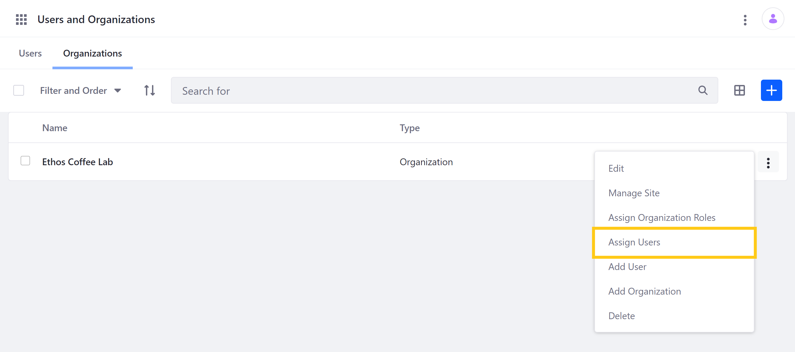
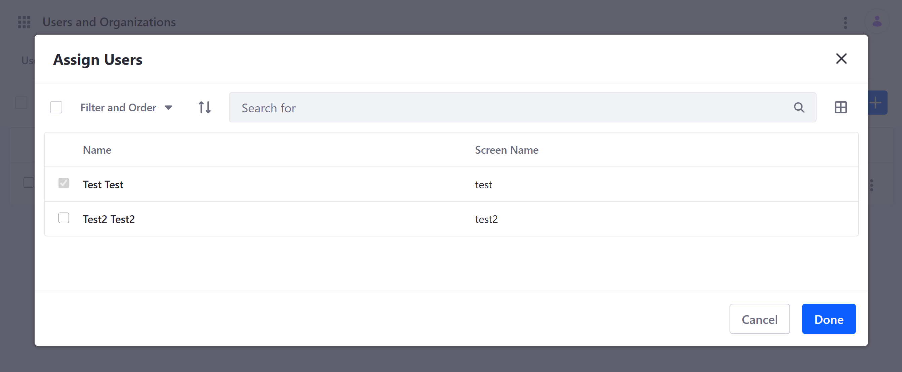
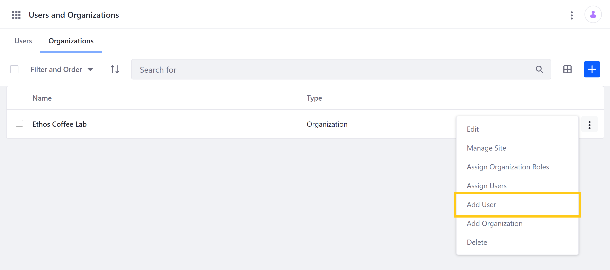

# Adding Users to Organizations

With Liferay [Organizations](./understanding-organizations.md), you can manage Users and permissions to model your real-life organizational hierarchy, which can then be quickly implemented in [Organization Sites](./organization-sites.md). You can either assign existing portal Users to an Organization, or create new Users with a specific Organization affiliation.

```note::
   Portal Administrators can assign any existing Users to any Organization, or create new Users with any Organization affiliation. By contrast, Organization Owners and Administrators can can only assign existing portal Users to child Organizations if the User is already affiliated with their parent Organization. They can also only create new portal Users within their own Organization, or a child Organization.
```

## Assigning Existing Portal Users to an Organization

Follow these steps to assign existing Users to an Organization:

1. Open the *Global Menu*, and go to *Control Panel* &rarr; *Users* &rarr; *Users and Organizations*. Then, click on the *Organizations* tab.

    ```note::
       To access these options, Organization Administrators and Owners without portal administration privileges can go to *My Organizations* in the *Personal Menu*.
    ```

1. Click on the *Actions* button () for an existing Organization, and select *Assign Users*.

    

1. Use the *checkboxes* to select the Users you want to assign to the Organization.

1. Click on *Done* when finished. This automatically redirects you to the selected Organization's page, where you can view all active Organization Users and existing sub-Organizations.

    

When added to an Organization, the User is implicitly assigned the basic Organization User role, though you can assign additional Organization-scoped roles if desired. See [Organization Roles](./organization-roles.md) to learn more.

## Adding New Portal Users to an Organization

Follow these steps to add a new portal User to an Organization:

1. Open the *Global Menu*, and go to *Control Panel* &rarr; *Users* &rarr; *Users and Organizations*. Then, click on the *Organizations* tab.

    ```note::
       To access these options, Organization Administrators and Owners without portal administration privileges can go to *My Organizations* in the *Personal Menu*.
    ```

1. Click on the *Actions* button () for an existing Organization, and select *Add User*.

    

1. Enter *information* for the new User, and click on *Save* when finished.

This creates a new portal User already assigned to the selected Organization and implicitly given the basic Organization User role. You can assign additional Organization-scoped roles if desired. See [Organization Roles](./organization-roles.md) to learn more.

## Additional Information

* [Understanding Organizations](./understanding-organizations.md)
* [Creating and Managing Organizations](./creating-and-managing-organizations.md)
* [Organization Roles](./organization-roles.md)
* [Organization Sites](organization-sites.md)
