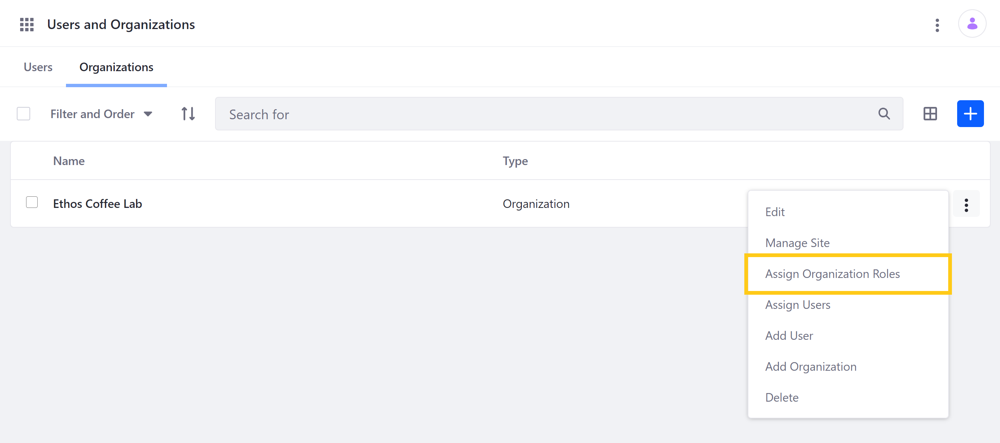
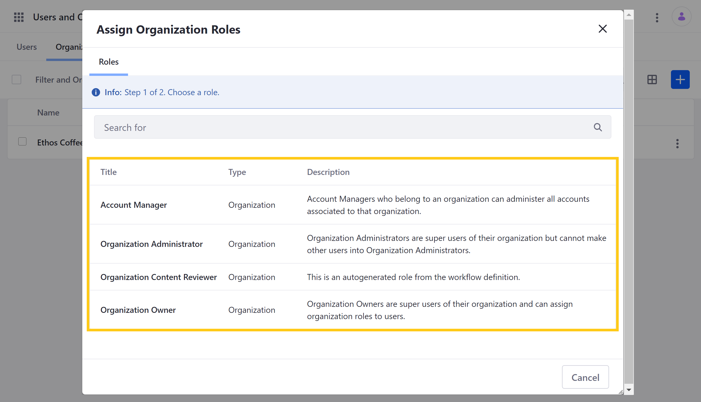

# Organization Roles

Liferay [Organizations](./understanding-organizations.md) provide a convenient way to implement distributed User management. With them, you can use Organization-scoped Roles to assign standard permissions to all members of an Organization, as well as assign more specialized permissions to Users based on their specific responsibilities. Doing this can save you time and help ensure that your portal design corresponds to your real-world hierarchy.

## Understanding Organization Roles

Organization role permissions are defined at the global level and are scoped to the specific Organization in which they're assigned. These roles also grant Users corresponding, implicit privileges in a connected [Organization Site](./organization-sites.md). However, some Organization roles also grant privileges in child Organizations and their Sites. If desired, you can use Site Roles and create [Site Teams](../../site-building/building-sites/site-membership/creating-teams-for-sites.md) to explicitly assign additional roles to Users within an Organization Site. See [Understanding Roles and Permissions](../roles-and-permissions/understanding-roles-and-permissions.md) for more information.

```{note}
By default, Organization roles do not grant access to the Control Panel. However, Organization Administrators and Owners can access any Organizations they manage by clicking on *My Organizations* in the dropdown *Personal Menu*.
```

Liferay DXP provides the following default Organization Roles:

### Organization User

This role grants basic privileges within an Organization and is automatically assigned to all its members. If the Organization has an attached Site, this role also grants the User basic Site membership.

```{note}
Members of child Organizations are implicit members of their parent Organizations. This means, for example, that members of child Organizations can access the pages of their parent Organizations. This behavior can be customized in the `Organizations` [section of the portal-ext.properties](https://learn.liferay.com/reference/latest/en/dxp/propertiesdoc/portal.properties.html#Organizations) file where the properties specific to Organizations are listed.
```

### Organization Administrator

This role grants super-User privileges within an Organization and its Site, as well as within child Organizations and their Sites. This includes the ability to create and remove child Organizations, assign existing Organization members to a child Organization, create and remove Organization Sites, and create new portal Users within Organization affiliations. Within Organization Sites, this role grants access to the Site menu, as well as Content, Accounts, Search Tuning, Communication, App Builder, and Custom Apps in the Applications tab of the Global Menu. However, this role does not grant the ability to assign or remove Organization Administrators or Organization Owners.

### Organization Owner

This role grants all privileges granted by the Organization Administrator role along with the ability to assign or remove Organization Administrators and Organization Owners. However, the Organization Owner privileges remain scoped to the Organization in which they are given, as well as any child Organizations or attached Sites.

## Assigning Organization Roles

Follow these steps to assign an Organization role to existing Organization Users:

1. Open the *Global Menu*, and go to *Control Panel* &rarr; *Users* &rarr; *Users and Organizations*. Then, click on the *Organizations* tab.

1. Click on the *Actions* button () for an existing Organization, and select *Assign Organization Roles*.

    

1. Click on the *Organization role* you want to assign to Users.

    

1. Use the *checkboxes* to select which Users are assigned the role.

    

1. Click on *Update Associations* when finished.

## Additional Information

* [Understanding Organizations](./understanding-organizations.md)
* [Creating and Managing Organizations](./creating-and-managing-organizations.md)
* [Adding Users to Organizations](./adding-users-to-organizations.md)
* [Organization Sites](./organization-sites.md)
