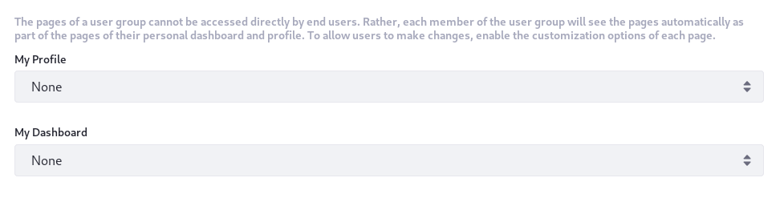
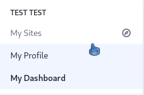

# User Group Sites

With User Group Sites, you can create pages that are added automatically to each member’s [personal Site](../../site-building/building-sites/managing-personal-sites.md). These pages are organized into two [page sets](../../site-building/creating-pages/understanding-pages/understanding-pages.md#page-sets), *My Profile* (public) and *My Dashboard* (private), just like personal Sites. If users belong to multiple User Groups, all pages from those groups are also added to their Sites.



By default, inherited pages can only be edited from the User Group Site and cannot be edited from a personal Site. If needed, User Group administrators can define customizable page areas so users can add and configure widgets in a page.

User Group Sites can be designed [manually](#designing-user-group-sites-manually) or using a [Site Template](#using-site-templates).

```{important}
For Liferay 7.4 U22+ and GA22+, new Liferay installations include a release feature flag that disables the creation of Private Pages, including My Dashboard pages. To manually create custom dashboard pages for a User Group, Private Pages must be enabled for your Liferay system. See [Enabling Private Pages](../../site-building/creating-pages/understanding-pages/understanding-pages.md#enabling-private-pages) for more information.

Alternatively, when Private Pages are disabled, you can add My Dashboard pages using a Site Template. Pages added to the template and applied to the My Dashboard page set are treated as Private Pages.
```

## Designing User Group Sites Manually

Follow these steps to design a User Group Site manually:

1. Open the *Global Menu* (), go to the *Control Panel*, and click *User Groups*.

1. Click the *Actions* button () for the desired group and select *Manage Pages*.

1. [Add and design Site Pages](../../site-building/creating-pages/adding-pages/adding-a-page-to-a-site.md).

   ```{note}
   While private pages are disabled, all pages added in this way are added to the *My Profile* page set. You must enable and create private pages to add pages to the *My Dashboard* set.
   ```

1. (Optional) Click the *Site Menu* () to access additional Site applications and configuration options.

Once pages are added to a User Group Site, you can view them via the the *User Groups* application. Just click the *Actions* button () for the desired group and select *Go to Profile Pages* or *Go to Dashboard Pages*.

## Using Site Templates

Follow these steps to populate a User Group Site with profile and dashboard pages using [Site Templates](../../site-building/building-sites/building-sites-with-site-templates.md):

1. Open the *Global Menu* (), go to the *Control Panel*, and click *User Groups*.

1. Click the *Actions* button () for the desired group and select *Edit*.

1. Use the *My Profile* and *My Dashboard* dropdown menus to select a Site Template for each page set.

   

1. Determine whether to enable propagation of changes from the Site Templates.

   ```{note}
   When enabled, changes in the template are automatically propagated to the User Group Site. If you disable this option but enable it again later, the template's pages are copied to the Users' Sites, overwriting any changes made.
   ```

1. Click *Save*.

Once saved, the template's pages are added to each group member's personal Site under their *My Profile* or *My Dashboard* page sets.

## Legacy User Group Sites Behavior

There is no impact on performance for inheritance of User Group Site pages, even with millions of users. Versions of Liferay Portal and Liferay DXP prior to 7.0, however, required User Group pages be copied to each User's personal Site.

If you're on Liferay DXP 7.2 and must keep that behavior, enable it by adding the following line to your `portal-ext.properties` file:

```
user.groups.copy.layouts.to.user.personal.site=true
```

This property was removed in Liferay DXP 7.3.

When this property is set to `true`, the template pages are copied to a User's personal Site once, and then may be modified by the User. This means that if changes are made to the template pages later, they only affect Users added to the User Group after the change is made. Users with administrative privileges over their personal Sites can modify the pages and their content if the *Allow Site Administrators to Modify the Pages Associated with This Site Template* box has been checked for the template. When a User is removed from a User Group, the associated pages are removed from the User's personal Site. If a User is removed from a group and is subsequently added back, the group's template pages are copied to the User's Site a second time. Note that if a User Group's Site is based on a Site Template and an administrator modifies the User Group's Site Template after users have already been added to the group, those changes only take effect if the *Enable propagation of changes from the Site Template* box for the User Group was checked.
