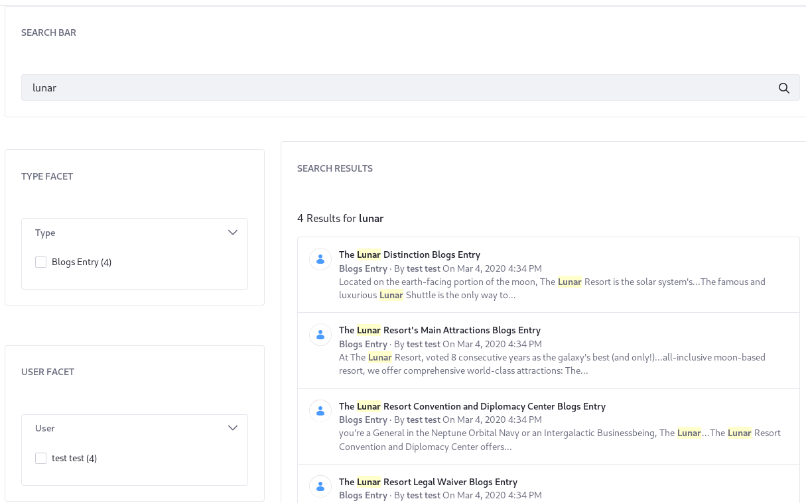
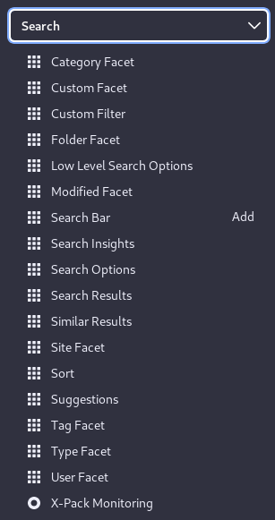
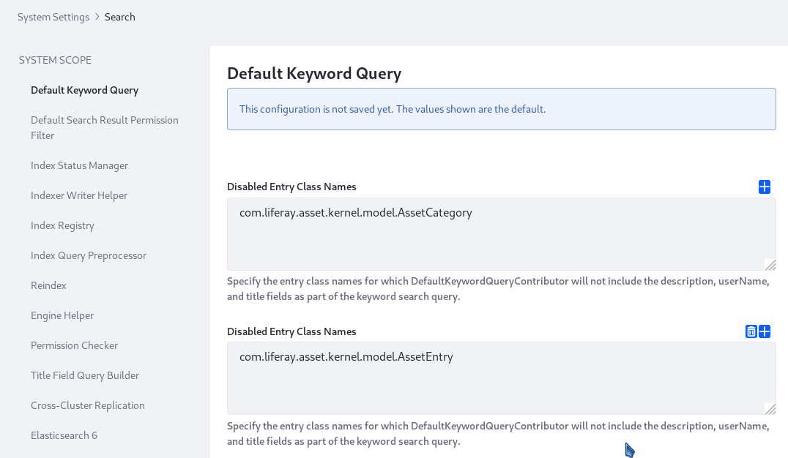
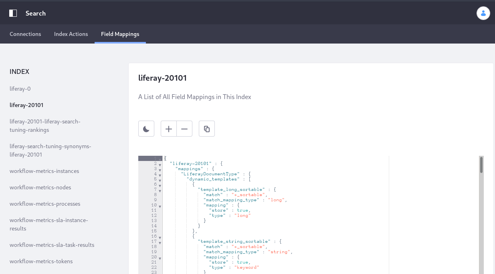

# Search Overview

Search is a fundamental component of Liferay. Elasticsearch is bundled with Liferay for testing and development purposes. Production environments require Elasticsearch running on a remote server. [Getting Started with Elasticsearch](../installing-and-upgrading-a-search-engine/elasticsearch/getting-started-with-elasticsearch.md) explains remote server setup. You can explore the search functionality immediately, however, using the bundled Elasticsearch engine.

Here are the search features:

* Full-text search
* Indexing of all content types (blogs, documents, web content, etc.)
* Highly configurable search pages
* A search bar embedded in the header of every page
* Automatic index synchronization for added, updated, and deleted content
* Search result filtering by roles and permissions
* Search suggestions
* Search result configuration (e.g., filter and sort)
* Faceted search
* Enable or disable advanced search syntax (e.g., AND/OR/NOT, wildcards, and more)

## Search Pages and Widgets

The default search page (`localhost:8080/search`) has a practical set of search widgets. It is customizable and based on the global search page template (also customizable). 

To add search widgets to a page, click the Add button on the page, select _Widgets_, and open the Search category:

To learn more, visit [Configuring Search Pages](../search-pages-and-widgets/working-with-search-pages/search-pages.md) or [Search Pages and Widgets](../search-pages-and-widgets/working_with_search_pages.md).

## Search Configuration and Administration

In the Control Panel, you can configure search functionality, view connections and field mappings, and perform search index actions.

You can configure search at the system scope in the Control Panel. In the Configuration category, select *System Settings* &rarr; *Search*. The search settings page appears.

You can examine search connections and field mappings, and execute indexes in the search administration screens. Navigate them in the Control Panel, by selecting *Search* in the Configuration category.

Learn more at [Search Administration and Tuning](../search_administration_and_tuning.md).

## Custom Development in Search

Search customization usually involves at least one of these search phases:

**Indexing** is the sending one or more documents to the search engine. The document contains fields of various types (text, keyword, etc.). The search engine processes each field and determines whether to store the field or analyze it.

**Searching** is sending a search query and obtaining results (a.k.a. hits) from the search engine. Queries and filters can be part of the search request, both of which specify a field to search within and the value to match against. The search engine iterates through each field within the nested queries and filters, and optionally performs special analysis prior to executing the query (search time analysis). Search time analysis can be configured for each field via the mapping definitions.

Search functionality can be extended and invoked using the Service Provider Interfaces and APIs, respectively. 

* Service Provider Interfaces (SPIs) are meant to be implemented. In the source code, these are found in modules ending in `-spi` (for example, the [`portal-search-spi` module](https://github.com/liferay/liferay-portal/tree/[$LIFERAY_LEARN_PORTAL_GIT_TAG$]/modules/apps/portal-search/portal-search-spi)).

* APIs contain methods you can call in your own code. In the source code, these are found in modules ending in `-api` (for example, the [`portal-search-api` module](https://github.com/liferay/liferay-portal/tree/[$LIFERAY_LEARN_PORTAL_GIT_TAG$]/modules/apps/portal-search/portal-search-api)).

See the [Developer Guide](../developer_guide.md) for details.

## What's Next 

Explore the search features by [Searching for Content](./searching-for-content.md). When you're ready to configure search for production, see [Getting Started with Elasticsearch](../installing-and-upgrading-a-search-engine/elasticsearch/getting-started-with-elasticsearch.md).
