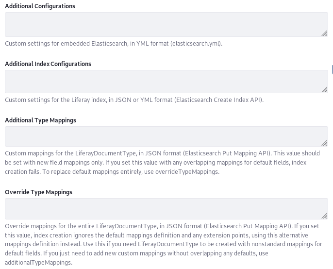

# Advanced Configuration of the Liferay Elasticsearch Connector

The [Elasticsearch connection](./connecting-to-elasticsearch.md) is configured using a [configuration file or via System Settings](./elasticsearch-connector-configuration-reference.md#configuration-files-and-system-settings-entries).

The Elasticsearch connector has a lot of configuration options out of the box; most Elasticsearch settings can be configured by a similarly or identically named Liferay setting (e.g., `httpSSLEnabled`). If you need a special configuration, add the configuration options you need using the [advanced settings](./../elasticsearch/elasticsearch-connector-configuration-reference.md). Most of these special configurations will be adding or overriding settings and mappings. 

* [Adding Index Configurations](#adding-index-configurations)
* [Adding Type Mappings](#adding-type-mappings)
* [Overriding Type Mappings](#overriding-type-mappings)
* [Adding Configurations to the Development Mode Elasticsearch](#adding-configurations-to-the-development-mode-elasticsearch)

If something is configurable for Elasticsearch, it's configurable using the Elasticsearch connector.

## Adding Settings and Mappings to the Liferay Elasticsearch Connector

Think of the available configuration options as being divided into two groups: the most common ones that are easily configured, and more complex configurations requiring entering YAML or JSON.



### Adding Index Configurations

The `additionalIndexConfigurations` configuration defines extra settings (in JSON or YAML) that are applied to each [company index](../../search-administration-and-tuning/elasticsearch-indexes-reference.md) (i.e., each Liferay Virtual Instance's index) when it's created. For example, you can create custom analyzers and filters using this setting. For a complete list of available settings, see the [Elasticsearch reference](https://www.elastic.co/guide/en/elasticsearch/reference/7.x/index-modules.html).

Here's an example that shows how to configure [analysis](https://www.elastic.co/guide/en/elasticsearch/reference/7.x/index-modules-analysis.html) that can be applied to a field or a dynamic template (see [below](#overriding-type-mappings) for an example application to a dynamic template).

```json
{  
    "analysis": {
        "analyzer": {
            "kuromoji_liferay_custom": {
                "filter": [
                    "cjk_width",
                    "kuromoji_baseform",
                    "pos_filter"
                ],
                "tokenizer": "kuromoji_tokenizer"
            }
        },
        "filter": {
            "pos_filter": {
                "type": "kuromoji_part_of_speech"
            }
        }
    }
}
```

### Adding Type Mappings

`additionalTypeMappings` defines extra mappings for indexing data into each [company and system indexes](../../search-administration-and-tuning/elasticsearch-indexes-reference.md) (i.e., each Liferay Virtual Instance's index). These are applied when the index is created. Add the mappings using JSON syntax. For more information see [here](https://www.elastic.co/guide/en/elasticsearch/reference/7.x/mapping.html) and [here](https://www.elastic.co/guide/en/elasticsearch/reference/7.x/indices-put-mapping.html). Use `additionalTypeMappings` for new field (`properties`) mappings and new dynamic templates, but don't try to override existing mappings. If any of the mappings set here overlap with existing mappings, index creation fails. Use `overrideTypeMappings` to replace default mappings.

As with dynamic templates, you can add sub-field mappings to Liferay's type mapping. These are referred to as [properties](https://www.elastic.co/guide/en/elasticsearch/reference/7.x/properties.html) in Elasticsearch.

To add a property, use this JSON syntax:

```json
{ 
    "LiferayDocumentType": {  
        "properties": {   
            "fooName": {
                "index": "true",
                "store": "true",
                "type": "keyword"
            }
        }   
    }
}
```

To see that your additional mappings have been added to the Liferay mappings, use `curl` to access this URL after saving your additions and re-indexing:

```bash
curl http://[HOST]:[ES_PORT]/liferay-[COMPANY_ID]/_mapping?pretty
```

Here's what it would look like for an Elasticsearch instance running on `localhost:9200`, with a Liferay Company ID of `20116`:

```bash
curl http://localhost:9200/liferay-20116/_mapping?pretty
```

In the above URL, `liferay-20116` is the index name. Including it indicates that you want to see the mappings that were used to create the index with that name.

See [here](https://www.elastic.co/guide/en/elasticsearch/reference/7.x/mapping-types.html) for more details on Elasticsearch's field datatypes.

The above example shows how a `fooName` field might be added to Liferay's type mapping. Because `fooName` is not an existing property in the mapping, it works fine. If you try to override an existing property mapping, index creation fails. Instead use the `overrideTypeMappings` setting to override `properties` in the mapping.

### Overriding Type Mappings

Use `overrideTypeMappings` to override Liferay's default type mappings and exert control over how data is indexed into the [company and system indexes](../../search-administration-and-tuning/elasticsearch-indexes-reference.md). This is an advanced feature that should be used only if strictly necessary. If you set this value, the default mappings used to define the Liferay Document Type in Liferay source code (for example, `liferay-type-mappings.json`) are ignored entirely, so include the whole mappings definition in this property, not just the segment you're modifying.

To make a modification, find the entire list of the current mappings being used to create the index by navigating to the URL

```
http://[HOST]:[ES_PORT]/liferay-[COMPANY_ID]/_mapping?pretty
```

Copy the contents in as the value of this property (either into System Settings or your OSGi configuration file). Leave the opening curly brace `{`, but delete lines 2 and 3 entirely (the line with the index name and the line with `mappings`):

```json
"liferay-[COMPANY_ID]": {
    "mappings" : {
```

Then, from the end of the mappings, delete the concluding two curly braces.

```json
    }
}
```

Now modify whatever mappings you'd like. The changes take effect once you save the changes and trigger a re-index from [Server Administration](../../../system-administration/using-the-server-administration-panel.md). 

Here's a partial example, showing a [dynamic template](https://www.elastic.co/guide/en/elasticsearch/reference/7.x/dynamic-templates.html) that uses the analysis configuration from `additionalIndexConfigurations` to analyze all string fields that end with `_ja`. You'd include this with all the other default mappings, replacing the provided `template_ja` with this custom one:

```json
{
    "LiferayDocumentType": {
        "dynamic_templates": [
            {
                "template_ja": {
                    "mapping": {
                        "analyzer": "kuromoji_liferay_custom",
                        "index": "analyzed",
                        "store": "true",
                        "term_vector": "with_positions_offsets",
                        "type": "string"
                    },
                    "match": "\\w+_ja\\b|\\w+_ja_[A-Z]{2}\\b",
                    "match_mapping_type": "string",
                    "match_pattern": "regex"
                }
                ...
            }
        ]
    }
}
```

### Adding Configurations to the Development Mode Elasticsearch

Use the Additional Configurations (`additionalConfigurations`) field to define extra settings (in YAML) for the embedded or sidecar Elasticsearch instance. This is only useful for testing environments. Any node settings normally set in `elasticsearch.yml` can be declared here. See the [Elasticsearch documentation](https://www.elastic.co/guide/en/elasticsearch/reference/7.x/index.html)  for a description of all possible node settings.

## Multi-line YAML Configurations

If you configure the settings from the last section using an OSGi configuration file, you might find yourself needing to write YAML snippets that span multiple lines. The syntax for that is straightforward and just requires appending each line with `\n\`, like this:

```yaml
additionalConfigurations=\
                    cluster.routing.allocation.disk.threshold_enabled: false\n\
                    cluster.service.slow_task_logging_threshold: 600s\n\
                    index.indexing.slowlog.threshold.index.warn: 600s\n\
                    index.search.slowlog.threshold.fetch.warn: 600s\n\
                    index.search.slowlog.threshold.query.warn: 600s\n\
                    monitor.jvm.gc.old.warn: 600s\n\
                    monitor.jvm.gc.young.warn: 600s
```

From simple configurations to overriding existing type mappings, Elasticsearch and Liferay's connector to Elasticsearch are configurable.
