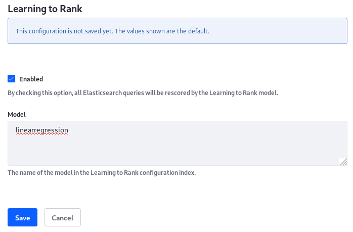

# Learning to Rank

> **Liferay Enterprise Search (LES) Subscribers**

Search engines like Elasticsearch have well-tuned relevance algorithms, good for general search purposes.

LES Learning to Rank harnesses machine learning to improve search result rankings. It combines the expertise of data scientists with machine learning to produce a smarter scoring function that's applied to search queries.

LES Learning to Rank requires a Liferay Enterprise Search subscription. It's important to understand that the [Elasticsearch Learning to Rank plugin](https://elasticsearch-learning-to-rank.readthedocs.io/en/latest/index.html) is not produced by Elastic, and there is not a pre-built plugin for all of Liferay's supported Elasticsearch versions. See the [LES Compatibility Matrix for details](https://help.liferay.com/hc/en-us/articles/360016511651#Liferay-Enterprise-Search).

## Disabling Learning to Rank on a Search Page

Learning to Rank does not work with the [Sort widget](../search-pages-and-widgets/search-results/sorting-search-results.md).

If LES Learning to Rank is deployed, but you must disable it on a particular Search page (perhaps to use the Sort widget),

1. Add a [Low Level Search Options](../search-pages-and-widgets/search-results/understanding-low-level-search-options.md) widget to the Search page.

1. Open the widget's Configuration screen by clicking 

   _Configure additional low level search options in this page._

1. In the Contributors to Exclude field, enter

    `com.liferay.portal.search.learning.to.rank`

Now the Learning to Rank re-scoring process is skipped for queries entered into the page's Search Bar. Its results are sortable and returned using the default relevance algorithm.

## Prerequisites 

There are some prerequisites for using Learning to Rank to re-score Liferay queries sent to Elasticsearch:

- A [Liferay Enterprise Search](https://www.liferay.com/products/dxp/enterprise-search) (LES) subscription is required for Learning to Rank. Once you have a subscription, [download the Liferay Enterprise Search Learning to Rank](https://customer.liferay.com/en/downloads?p_p_id=com_liferay_osb_customer_downloads_display_web_DownloadsDisplayPortlet&_com_liferay_osb_customer_downloads_display_web_DownloadsDisplayPortlet_productAssetCategoryId=118191013&_com_liferay_osb_customer_downloads_display_web_DownloadsDisplayPortlet_fileTypeAssetCategoryId=118191060) LPKG file and [install it](../../system-administration/installing-and-managing-apps/installing-apps.md).

   ```{note}
   Starting with Liferay DXP 7.4, the Liferay Enterprise Search (LES) applications are included with all Liferay DXP bundles and Docker containers. See [Activating LES](./activating-liferay-enterprise-search.md) for more information.
   ```

- A remote Elasticsearch server with your data indexed into it.

- The corresponding version of the [Elasticsearch Learning to Rank](https://github.com/o19s/elasticsearch-learning-to-rank) plugin installed into Elasticsearch.

- A [trained model](https://elasticsearch-learning-to-rank.readthedocs.io/en/latest/training-models.html) uploaded into the Learning to Rank plugin. 

## Technical Overview

In a normal search, the user sends a query to the search engine via Liferay DXP's [Search Bar](../getting-started/searching-for-content.md). The order of returned results is dictated by the search engine's [relevance scoring algorithm](https://www.elastic.co/guide/en/elasticsearch/reference/7.x/index-modules-similarity.html#bm25).

Here's where Learning to Rank intervenes and makes that process different:

1. User enters a query into the search bar.

1. Liferay sends the query to Elasticsearch and retrieves the first 1000 results as usual, using the search engine's relevance algorithm. 

1. The top 1000 results are not returned as search hits, but are used by Elasticsearch for [re-scoring](https://www.elastic.co/guide/en/elasticsearch/reference/7.x/search-request-body.html#request-body-search-rescore) via the [re-score functionality](https://elasticsearch-learning-to-rank.readthedocs.io/en/latest/searching-with-your-model.html#rescore-top-n-with-sltr).

1. The results are re-scored by the [SLTR query](https://elasticsearch-learning-to-rank.readthedocs.io/en/latest/searching-with-your-model.html), which includes the keywords and the trained model to use for re-scoring.

1. Once the trained model re-ranks the results, they're returned in Liferay's [Search Results]( ../search-pages-and-widgets/search-results/search-results.md) in their new order.

Though it's just a sub-bullet point in the ordered list above, much of the work in this paradigm is in creating and honing the trained model. That's beyond the scope here, but below is help in getting all the pieces in place to orchestrate the magic of machine learning on your Liferay queries. Here's a brief overview of what constitutes _model training_.

## Model Training

A useful trained model is produced when a good judgment list and a good feature set are fed to a Learning to Rank algorithm (this is the machine learning part of the puzzle). Therefore, it's incumbent on you to assemble

- The Learning to Rank algorithm you wish to use for creating a training model. This demonstration uses [RankLib](https://sourceforge.net/p/lemur/wiki/RankLib/).

- A _judgment list_, containing a graded list of search results. The algorithm produces a model that honors the ordering of the judgment list.

- A feature set containing all the _features_ you're handing to the Learning to Rank algorithm, which it uses in conjunction with the judgment list to produce a reliable model. An example feature set for Liferay is shown in the example.


[Judgment lists](https://elasticsearch-learning-to-rank.readthedocs.io/en/latest/core-concepts.html#judgments-expression-of-the-ideal-ordering) are lists of graded search results.

[Features](https://elasticsearch-learning-to-rank.readthedocs.io/en/latest/core-concepts.html#features-the-raw-material-of-relevance) are the variables that the algorithm uses to create a function that can score results in a smarter way. If you don't give enough---or the correct---relevant features, your model won't be "smart" enough to provide improved results.

Before beginning, you must have a remote [Elasticsearch](../installing-and-upgrading-a-search-engine/elasticsearch.html) cluster communicating with Liferay. See the [Search Engine Compatibility Matrix for more information](https://help.liferay.com/hc/en-us/articles/360016511651).

```{tip}
Use [Suggestions](../search-pages-and-widgets/search-results/enabling-search-suggestions.md) to discover the most common queries (this can be one way to decide which queries to create Learning to Rank models for).
```

## Step 1: Install the Learning to Rank Plugin on Elasticsearch

See [the Elasticsearch Learning to Rank plugin documentation](https://elasticsearch-learning-to-rank.readthedocs.io/en/latest/#installing) to learn about installing the Learning to Rank plugin.

You'll be running a command like this one, depending on the plugin version you're installing:

```bash
./bin/elasticsearch-plugin install https://github.com/o19s/elasticsearch-learning-to-rank/releases/download/v1.5.7-es7.13.4/ltr-plugin-v1.5.7-es7.13.4.zip
```

If using [X-Pack security in your Elasticsearch cluster](../installing-and-upgrading-a-search-engine/elasticsearch/securing-elasticsearch.md), there [may be additional steps.](https://elasticsearch-learning-to-rank.readthedocs.io/en/latest/x-pack.html)

## Step 2: Training and Uploading a Model

Detailed instructions on training models is outside the scope of this guide. This requires the intervention of data scientists, who can recommend appropriate tools and models. Use what works for you. In doing so, you'll almost certainly be compiling [Judgment lists](https://elasticsearch-learning-to-rank.readthedocs.io/en/latest/core-concepts.html#judgments-expression-of-the-ideal-ordering) and [feature sets](https://elasticsearch-learning-to-rank.readthedocs.io/en/latest/building-features.html) that can be used by the training tool you select to generate a model that produces good search results. Once you have a model, upload it to the Learning to Rank plugin.

## Step 3: Upload the Model to the Learning to Rank Plugin

You'll upload the model using a `POST` request, but first you need to make sure you have a `_ltr` index and a feature set uploaded to the Learning to Rank plugin. Use Kibana (via the [LES Monitoring widget](./monitoring-elasticsearch.md)), to make these tasks easier.

1. If you don't already have an `_ltr` index, create one:

   ```json
   PUT _ltr
   ```

1. Add a feature set to the `_ltr` index. In this example the set is called `liferay`:

   ```json
   POST _ltr/_featureset/liferay
   {
     "featureset": {
       "name": "liferay",
       "features": [
         {
           "name": "title",
           "params": [
             "keywords"
           ],
           "template": {
             "match": {
               "title_en_US": "{{keywords}}"
             }
           }
         },
         {
           "name": "content",
           "params": [
             "keywords"
           ],
           "template": {
             "match": {
               "content_en_US": "{{keywords}}"
             }
           }
         },
         {
           "name": "asset tags",
           "params": [
             "keywords"
           ],
           "template": {
             "match": {
               "assetTagNames": "{{keywords}}"
             }
           }
         }
       ]
     }
   }
   ```

   Take note of the syntax used here, since it's required.

1. Add the trained model to the feature set: 

   ```json
   POST _ltr/_featureset/liferay/_createmodel
   {
     "model": {
       "name": "linearregression",
       "model": {
         "type": "model/ranklib",
         "definition": """
   ## Linear Regression
   ## Lambda = 1.0E-10
   0:-0.717621803830712 1:-0.717621803830712 2:-2.235841905601106 3:19.546816765721594
   """
       }
     }
   }
    ```

This is a very high level set of instructions, because there's not much to do in Liferay itself. To learn in more detail about what's required, see the [Learning to Rank plugin's documentation](https://elasticsearch-learning-to-rank.readthedocs.io/en/latest/index.html).

```{tip}
Keep reworking those judgment lists!
```

## Step 4: Enable Learning to Rank

Enable Learning to Rank from Control Panel &rarr; Configuration &rarr; System Settings &rarr; Search &rarr; Learning to Rank. There's a simple on/off configuration and a text field where you must enter the name of the trained model to apply to search queries.

The model in the previous step was named `linearregression`, so that's what you'd enter.



That's all the configuration required to get the Elasticsearch Learning to Rank plugin using a trained model, a feature set, and search queries from Liferay.
