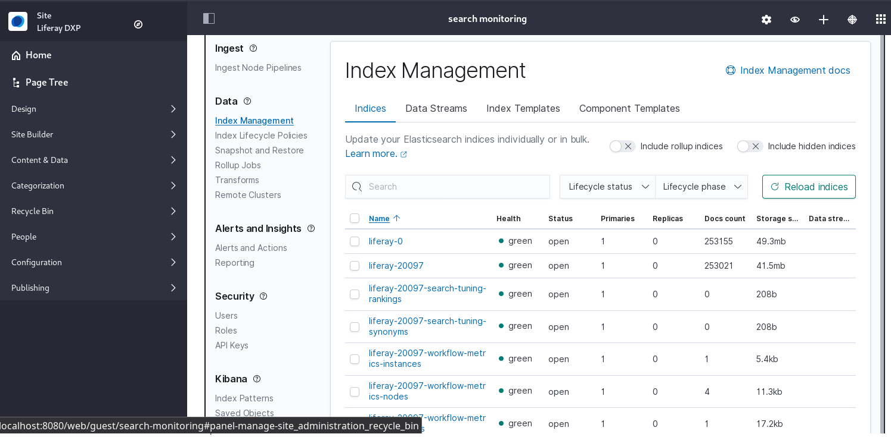

# Monitoring Elasticsearch

> LES Subscribers

If you have a Liferay Enterprise Search (LES) [subscription](https://www.liferay.com/products/dxp/enterprise-search), you can integrate Elastic's [Kibana monitoring UI](https://www.elastic.co/guide/en/kibana/7.x/introduction.html) with Liferay DXP, so your monitoring activities can be done within Liferay itself.



Monitoring the [secured](../installing-and-upgrading-a-search-engine/elasticsearch/securing-elasticsearch.md) Elasticsearch cluster where Liferay's data is indexed takes only five steps: 

1. Tell Elasticsearch to enable data collection.

1. Download and install Kibana.

1. Configure Kibana with the proper security settings.

1. Install the LES Monitoring app.

1. Configure the LES Monitoring app to communicate with Elasticsearch.

## Enable Data Collection

Monitoring is enabled on Elasticsearch by default, but data collection isn't. Enable data collection by adding this line to `elasticsearch.yml`.

```yaml
xpack.monitoring.collection.enabled: true
```

Restart Elasticsearch, then install Kibana.

## Install Kibana

Make sure the Kibana version matches the Elasticsearch version. Check the [Liferay Enterprise Search compatibility matrix](https://help.liferay.com/hc/en-us/articles/360016511651) for details.

```{note}
Elasticsearch 6.x has reached [end of life](https://www.elastic.co/support/eol#elasticsearch). Liferay 7.2 systems still using Elasticsearch 6.x should be upgraded to Elasticsearch 7.x. See  [Upgrading to Elasticsearch 7](./../installing-and-upgrading-a-search-engine/elasticsearch/upgrading-elasticsearch/upgrading-to-elasticsearch-7.md) for details.
```

1. [Download Kibana](https://www.elastic.co/downloads/kibana) and extract it. The root folder is referred to as *Kibana Home*.

1. Tell Kibana where to send monitoring data by setting Elasticsearch's URL in `kibana.yml`:

   ```yaml
   elasticsearch.hosts: [ "https://localhost:9200" ]
   ```

   If TLS/SSL is not enabled on Elasticsearch, this is an `http` URL, otherwise use `https`.

   If you're not configuring security, start Kibana.

1. Now configure authentication. Set the password for the built-in `kibana_system` user in `[Kibana Home]/config/kibana.yml`:

   ```yaml
   elasticsearch.username: "kibana_system"
   elasticsearch.password: "liferay"
   ```

   Use the `kibana_system` user password from your [security configuration](../installing-and-upgrading-a-search-engine/elasticsearch/securing-elasticsearch.md). Once Kibana is installed, you can change the built-in user passwords from the *Management* user interface.

1. Begin configuring encryption by providing certificate files. See [Elastic's guide](https://www.elastic.co/guide/en/kibana/7.x/using-kibana-with-security.html#using-kibana-with-security) for more details.

   To reuse the files [created for Elasticsearch itself](../installing-and-upgrading-a-search-engine/elasticsearch/securing-elasticsearch.md#generate-node-certificates), copy the `[Elasticsearch Home]/config/certs` folder into the `[Kibana Home]/config/` folder.

   If you wish to generate a separate certificate for your Kibana instance, make sure it's signed by the same CA as the Elasticsearch node certificates.

1. Add these settings to `kibana.yml`:

   ```yaml
   elasticsearch.ssl.truststore.path: "config/certs/elastic-stack-ca.p12"
   elasticsearch.ssl.truststore.password: "liferay"   
   elasticsearch.ssl.keystore.path: "config/certs/elastic-nodes.p12"
   elasticsearch.ssl.keystore.password: "liferay"
   elasticsearch.ssl.verificationMode: certificate

   server.ssl.enabled: true
   server.ssl.truststore.path: "config/certs/elastic-stack-ca.p12"
   server.ssl.truststore.password: "liferay"
   server.ssl.keystore.path: "config/certs/elastic-nodes.p12"    
   server.ssl.keystore.password: "liferay"

   xpack.security.encryptionKey: "xsomethingxatxleastx32xcharactersx"
   xpack.security.session.idleTimeout: "1h"
   xpack.security.session.lifespan: "30d"

   # Below Kibana 7.6.0 (https://www.elastic.co/guide/en/kibana/7.6/release-notes-7.6.0.html)
   # only PEM format certificates and keys are supported. Comment out the trust/keystore
   # paths and passwords above and instead use:

   #elasticsearch.ssl.certificateAuthorities: [ "config/certs/ca.crt" ]
   #elasticsearch.ssl.certificate: config/certs/elastic-nodes.crt
   #elasticsearch.ssl.key: config/certs/elastic-nodes.key

   #server.ssl.certificateAuthorities: [ "config/certs/ca.crt" ]
   #server.ssl.certificate: config/certs/elastic-nodes.crt
   #server.ssl.key: config/certs/elastic-nodes.key
   ```

After this step you can access Kibana at `https://localhost:5601` and sign in with a Kibana user to verify the configuration. The last step is to connect Kibana to Liferay.

Stop Kibana before continuing.

## Install and Configure the LES Monitoring App

```{note}
Starting with Liferay DXP 7.4, the Liferay Enterprise Search (LES) applications are included with all Liferay DXP bundles and Docker containers. Therefore, installing the module is unnecessary on Liferay DXP 7.4+. See [Activating LES](./activating-liferay-enterprise-search.md) for more information.
```

Download the LES Monitoring app and install the LPKG file by copying it into the `[Liferay Home]/deploy` folder. If Liferay DXP is running, you may be prompted to restart your server. Alternatively, you can also place the LPKG file into the `[Liferay Home]/marketplace` folder while Liferay is not running.

1. Once the connector is installed and Kibana and Elasticsearch are securely configured, create a [configuration file](../../system-administration/configuring-liferay/configuration-files-and-factories/using-configuration-files.md) named `com.liferay.portal.search.elasticsearch.monitoring.web.internal.configuration.MonitoringConfiguration.config`.

   In Liferay DXP 7.2, name the file `com.liferay.portal.search.elasticsearch6.xpack.monitoring.web.internal.configuration.XPackMonitoringConfiguration.config`

1. Place these settings in the `.config` file:

   ```properties
   kibanaPassword="liferay"
   kibanaUserName="elastic"
   kibanaURL="https://localhost:5601"
   ```

   During development and testing, enabling proxy servlet logging can be helpful:

   ```properties
   proxyServletLogEnable=B"true"
   ```

   The exact configuration values depend on your Kibana configuration. For example, use a URL such as `kibanaURL="http://localhost:5601"` if you are not enabling TLS.

   Alternatively, configure the monitoring adapter from [System Settings](../../system-administration/configuring-liferay/system-settings.md). In the Global Menu, navigate to *Control Panel* &rarr; *Configuration* &rarr; *System Settings* and find the Elasticsearch Monitoring entry in the Search category. All the configuration options for the monitoring connector appear there.

1. Deploy the configuration file to `Liferay Home/osgi/configs`, and your running instance applies the settings.

1. Add two more settings to Kibana itself. The first forbids Kibana from rewriting requests prefixed with `server.basePath`. The second sets Kibana's base path for the Monitoring portlet to act as a proxy for Kibana's monitoring UI. Add this to `kibana.yml`:

   [Liferay DXP 7.3]
   ```yaml
   server.rewriteBasePath: false
   server.basePath: "/o/portal-search-elasticsearch-monitoring/monitoring-proxy"
   ```

   [Liferay DXP 7.2]
   ```yaml
   server.rewriteBasePath: false
   server.basePath: "/o/portal-search-elasticsearch-xpack-monitoring/xpack-monitoring-proxy"
   ```

   Once you set the `server.basePath`, you cannot access the Kibana UI through Kibana's URL (e.g., `https://localhost:5601`). All access to the Kibana UI is through the Monitoring portlet, which is only accessible to signed in Liferay users. Navigate directly to the portlet using the URL

   [http://localhost:8080/o/portal-search-elasticsearch-monitoring/monitoring-proxy/app/monitoring](http://localhost:8080/o/portal-search-elasticsearch-monitoring/monitoring-proxy/app/monitoring)

1. Because you're using the Monitoring portlet in Liferay as a proxy to Kibana's UI and you are using a self-signed certificate, you must configure the application server's startup JVM parameters to trust Kibana's certificate.

   One approach is to add the truststore path, password and type to your application server's startup JVM parameters. Here are example truststore and path parameters for appending to a Tomcat server's `CATALINA_OPTS`:

    ```bash
    -Djavax.net.ssl.trustStore=/path/to/elastic-nodes.p12 -Djavax.net.ssl.trustStorePassword=liferay -Djavax.net.ssl.trustStoreType=pkcs12
    ```

1. If your stack includes Kibana 7.11+ and JDK 11, you must disable TLS version 1.3. Disable TLS 1.3 in Kibana itself by adding `--tls-max-v1.2` to `KIBANA_HOME/config/node.options`. See [Troubleshooting the Monitoring Setup](#troubleshooting-the-monitoring-setup) for details and an alternative solution.

Restart Liferay and Kibana.

## Monitoring in Liferay

Once you have Kibana and LES Monitoring installed, configured, and all the
servers are running, add the Elasticsearch Monitoring widget to a page:

1. Open the *Fragments and Widgets* menu on a Content Page, or the Add Widgets menu on a Widget Page.

1. Use the widget search bar to search for *monitoring* and drag the *Elasticsearch Monitoring* widget from the Search category onto the page. If on Liferay DXP 7.2, the widget is called *X-Pack Monitoring*.

> For more information, see the related Elasticsearch documentation:
> * [Monitoring a cluster](https://www.elastic.co/guide/en/elasticsearch/reference/7.x/es-monitoring.html)
> * [Set up X-Pack---monitoring and security best practices in a clustered environment](https://www.elastic.co/guide/en/elasticsearch/reference/7.x/setup-xpack.html)

## Example Kibana Configuration

Here's the complete `kibana.yml` demonstrated above:

```yaml
# X-Pack Security enabled (Basic Auth)
elasticsearch.username: "kibana_system"
elasticsearch.password: "liferay"
elasticsearch.hosts: [ "https://localhost:9200" ]

# When TLS/SSL is enabled in X-Pack Security
xpack.security.encryptionKey: "xsomethingxatxleastx32xcharactersx"
xpack.security.session.idleTimeout: "1h"
xpack.security.session.lifespan: "30d"
# Enable TLS/SSL for out-bound traffic: from Kibana to Elasticsearch
elasticsearch.ssl.truststore.path: "config/certs/elastic-stack-ca.p12"
elasticsearch.ssl.truststore.password: "liferay"   
elasticsearch.ssl.keystore.path: "config/certs/elastic-nodes.p12"
elasticsearch.ssl.keystore.password: "liferay"
elasticsearch.ssl.verificationMode: certificate

# Enable TLS/SSL for in-bound traffic: from browser or
#  DXP (Elasticsearch Monitoring widget, proxy) to Kibana
server.ssl.enabled: true
server.ssl.truststore.path: "config/certs/elastic-stack-ca.p12"
server.ssl.truststore.password: "liferay"
server.ssl.keystore.path: "config/certs/elastic-nodes.p12"    
server.ssl.keystore.password: "liferay"

# To use Kibana inside the Elasticsearch Monitoring widget
server.rewriteBasePath: false
server.basePath: "/o/portal-search-elasticsearch-monitoring/monitoring-proxy"

# Below Kibana 7.6.0 (https://www.elastic.co/guide/en/kibana/7.6/release-notes-7.6.0.html)
# only PEM format certificates and keys are supported. Comment out the trust/keystore
# paths and passwords above and instead use:

#elasticsearch.ssl.certificateAuthorities: [ "config/certs/ca.crt" ]
#elasticsearch.ssl.certificate: config/certs/elastic-nodes.crt
#elasticsearch.ssl.key: config/certs/elastic-nodes.key

#server.ssl.certificateAuthorities: [ "config/certs/ca.crt" ]
#server.ssl.certificate: config/certs/elastic-nodes.crt
#server.ssl.key: config/certs/elastic-nodes.key
```

## Troubleshooting the Monitoring Setup

When Liferay DXP is configured to use JDK version 11 and communicate with Kibana version 7.11+, the following error can result:

```bash
SSLException: No PSK available. Unable to resume
```

The error is caused by Kibana 7.11+'s reliance on TLS version 1.3. The recommended solution is to disable TLS 1.3 in your Liferay DXP-Kibana stack using one of the following methods:

1. Disable TLS 1.3 for outbound connections in Tomcat. Set `-Dhttps.protocols=TLSv1.1,TLSv1.2` in Tomcat's `setenv.bat/sh` (add to `CATALINA_OPTS`).
1. Disable TLS 1.3 in Kibana by adding `--tls-max-v1.2` to `KIBANA_HOME/config/node.options`.
1. Switch to a [compatible JDK version](https://help.liferay.com/hc/en-us/articles/360016511651) where the root issue ([JDK-8213202](https://bugs.openjdk.java.net/browse/JDK-8213202)) is already fixed.

## Related Topics

* [Securing Elasticsearch](../installing-and-upgrading-a-search-engine/elasticsearch/securing-elasticsearch.md)
* [Cross-Cluster Replication](./cross-cluster-replication.md)
* [Search Tuning](../search-administration-and-tuning.md)
* [Liferay Installation and Upgrades](../../installation-and-upgrades.md)
