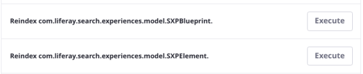

# Search Experiences

```{toctree}
:maxdepth: 1

search-experiences/understanding-search-blueprints.md
search-experiences/creating-and-managing-search-blueprints.md
search-experiences/using-a-search-blueprint-on-a-search-page.md
search-experiences/personalizing-the-search-experience.md
search-experiences/search-blueprints-elements-reference.md
```

> **Liferay Enterprise Search (LES) Subscribers**

The Liferay Enterprise Search Experiences app includes a suite of features granting fine-grained control over the end user's search experience. As the search administrator you can use Search Experiences for search customizations varying in complexity:

- Make minor tweaks to Liferay's default search page behavior
- Override the search page behavior completely
- Configure context-aware search results based on attributes of the search user

## Search Blueprints

Search Blueprints is the first feature in the Search Experiences application. To learn about it's capabilities and fundamental components, see

- [Understanding Blueprints](./search-experiences/understanding-search-blueprints.md)
- [Creating and Managing Search Blueprints](./search-experiences/creating-and-managing-search-blueprints.md)
- [Using a Search Blueprint on a Search Page](./search-experiences/using-a-search-blueprint-on-a-search-page.md)
- [Personalizing the Search Experience](./search-experiences/personalizing-the-search-experience.md)
- [Search blueprints Elements Reference](./search-experiences/search-blueprints-elements-reference.md)

```{important}
Out of the box, elements are available to use in creating your Blueprints. However, if you've installed the Search Experiences application into an existing Liferay installation, you must re-index the `SXPElement` entity for the elements to appear in the Blueprints UI. Navigate to Control Panel &rarr; Search &rarr; Index Actions, then find the `com.liferay.search.experiences.model.SXPElement` entry and click _Execute_.


```

## Getting Liferay Search Experiences

Liferay Search Experiences will be made available to Liferay DXP customers with a [Liferay Enterprise Search](../liferay-enterprise-search.md) subscription in Liferay DXP 7.3 and 7.4:

* Starting with Liferay DPX 7.4 Update 5 (see more about updates [here](../../../installation-and-upgrades/maintaining-a-liferay-installation/updating-liferay.md)), Search Experiences is a bundled application, like all the LES apps.
* In Liferay DXP 7.3, Search Experiences will be made available to LES subscribers through the Customer Portal as an add-on application. Check [Liferay Enterprise Search for Liferay DXP 7.3](https://customer.liferay.com/downloads/-/download/liferay-enterprise-search-for-liferay-dxp-7-3) for availability.

## Search Experiences REST API

The Search Experiences applications publish and consume REST API endpoints (under the path `search-experiences-rest`) to remain consistent with Liferay's other native applications.

```{warning}
It is not advisable for third party code to consume the Search Experiences APIs as they are volatile: this includes the `/search` endpoint which is only intended to be used by the [Blueprints preview feature](./search-experiences/creating-and-managing-search-blueprints.md#testing-a-blueprint-with-the-preview-sidebar). Schema changes are expected to happen as the features evolve, and Liferay will not support custom code that uses the Search Experiences APIs. This decision may change in the future as the APIs become more stable.
```
