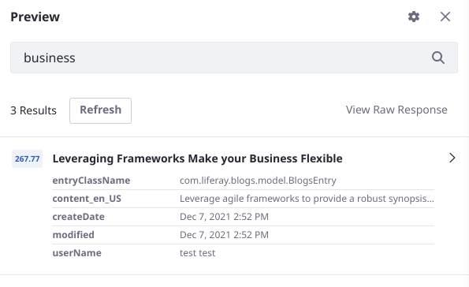

# Creating and Managing Blueprints

<!-- As of Tuesday 11/23/2021, to create a blueprint (master build) you must add elements from the Blueprint Query Builder, using the Custom JSON Element from the sidebar. But there's a likelihood that by tomorrow custom -->
To create Search Blueprints,

1. Open the Blueprints application by clicking _Blueprints_ in the Global Menu &rarr; Applications.

1. Add a Blueprint by clicking the Add () button.

   

1. In the modal window, give the Blueprint a name (required) and a description (optional).

1. Decide whether to start by including all the clauses from Liferay's search framework, or to start with a minimal baseline of clauses to use as the foundation for a more fully customized search experience. Click _Create_.

1. Depending on your [blueprint plan](#planning-a-blueprint), next you'll use these menus to continue building the [Blueprint](./understanding-search-blueprints.md#what-is-a-blueprint):

   - [Query Builder](#using-the-query-builder): add new query clauses to the search by choosing or composing Elements for the Blueprint.
   - [Clause Contributors](#configuring-default-clauses): Further refine which clauses are included from Liferay's Indexers and Keyword Query Contributors. 
   - [Settings](#adding-settings): Configure advanced settings like Aggregations, or Facets, in the search.

<!-- Preview will likely be postponed -->
1. Preview the Blueprint. Click _Preview_.

   

1. Save the Blueprint. Click _Save_.

## Using the Query Builder

<!-- As of Tuesday 11/23/2021, to create a blueprint (master build) you must add elements from the Blueprint Query Builder, using the Custom JSON Element from the sidebar (which, alas, won't save yet). But there's a likelihood that by tomorrow ootb JSON elements will be available -->

Use the Query Builder to

1. Add Elements to the Blueprint.
1. Choose which Liferay assets to search.

### Add Elements to the Blueprint

Add Custom JSON Elements to begin adding query clauses to the Blueprint:

1. 

Link to something on Building Elements with JSON.

### Choose which Liferay Assets to Search

Decide which Liferay Asset Types to include in the Blueprint's query:

1. 

List them

What are the repercussions of choosing ll, or none?

By default, which is it? 

The Query Builder in early versions of the Blueprints application has .

## Configuring Default Clauses

## Adding Settings

<!-- Explore whether this makes sense as a standalone article -->
## Importing and Exporting Blueprints

<!-- Should be able to import and export the JSON of a blueprint. -->

<!-- Maybe not part of v1: Applying Blueprints to a Search (at first one, then multiple blueprints will be able to be applied to a single search page. -->

## Planning a Blueprint
<!-- should Planning a Blueprint (is `Designing` a better verb?) go  in the overview article, Understanding Blueprints? -->

Start with the use case.

