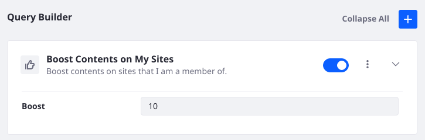
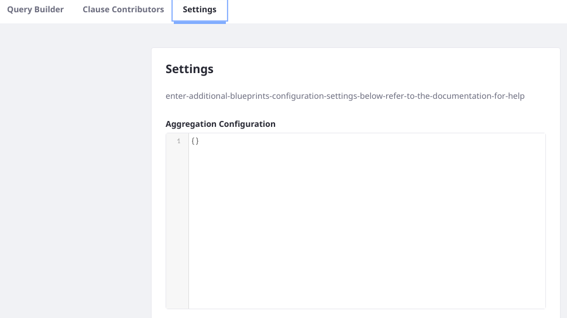

# Creating and Managing Blueprints

As with other Liferay entities, Search Blueprints are managed in a Control Panel App. Open Blueprints from the Global menu's Applications section (in the Search Experiences category).

To create Search Blueprints,

1. Open the Blueprints application by clicking _Blueprints_ in the Global Menu &rarr; Applications.

1. Add a Blueprint by clicking the Add () button.

   

1. In the modal window, give the Blueprint a name (required) and a description (optional).

1. Decide whether to start by including all the clauses from Liferay's search framework, or to start with a minimal baseline of clauses to use as the foundation for a more fully customized search experience. Click _Create_.

   See [Configuring Default Clauses](#configuring-default-clauses) to learn more about the impacts of excluding Liferay's Indexers or certain Clause Contributors from the search query.

1. Depending on your [blueprint plan](#planning-a-blueprint), next you'll use these menus to continue building the [Blueprint](./understanding-search-blueprints.md#what-is-a-blueprint):

   - [Query Builder](#using-the-query-builder): add new query clauses to the search by choosing or composing Elements for the Blueprint.
   - [Clause Contributors](#configuring-default-clauses): Further refine which clauses are included from Liferay's Indexers and Keyword Query Contributors. 
   - [Settings](#adding-settings): Configure advanced settings (e.g., Sorts or Facets) in the search.

<!-- SME Question: I heard that Preview will likely be postponed. Please confirm. -->
1. Preview the Blueprint. Click _Preview_.

   

1. Click _Save_.

Edit or delete a Blueprint from its Actions menu ().


<!-- SME Question: what about editing or deleting a blueprint while in use? do we have any safety mechanism for this? maybe a warning to the user? should we say something about it here? -->


<!-- SME Question: How about Import/Export? Postponed? Please confirm. -->
In addition to the CRUD options, Search Blueprints can be [imported and exported](#importing-and-exporting-blueprints).

## Using the Query Builder

Many Blueprints will require heavy use of the Query Builder to implement the desired use case. Use the Query Builder to

1. [Add Elements to the Blueprint](#adding-elements-to-the-blueprint).
1. [Choose which Liferay assets to search](#choosing-which-liferay-assets-to-search).

### Adding Elements to the Blueprint

Add Elements to begin adding query clauses to the Blueprint:

1. In the Query Builder's sidebar, Add Query Elements, expand the Element category you'd like to explore.
1. Hover over the Element, then click the _Add_ button.
1. The Element is added to the Query Builder, ready to configure:
   
1. Add as many Elements as needed to configure the search query as desired.

   See [Search Blueprints Elements Reference](./search-blueprints-elements-reference.md) (not yet written) for a description of each out of the box Element.

1. If any custom Elements are required, add the Custom JSON Element to the Query Builder and write the query clause you need.

   See [Creating Elements](./creating-elements.md) (not yet written) to learn about building Custom JSON Elements.

<!-- TODO: Remove not yet written statements when written -->

After adding Elements, make sure you save the Blueprint.

### Choosing which Liferay Assets to Search

Decide which Liferay Asset Types to include in the Blueprint's query. Use the Query Settings &rarr; Searchable Types dropdown:


- All assets are selected by default.
- To remove specific assets, click each one's .
- To deselect all assets and manage the types in bulk, open the Select Types modal by clicking the Select Types button.
    

<!-- SME Question: What are the repercussions of choosing all, or none? Do I need to add information based on https://docs.google.com/document/d/1i3TI3F2ieswmyukKduDLPsYtaTUfbLAOBYQ-ru1yFDI/edit ? --> 

Always save the Blueprint after editing its Asset Types configuration.

## Configuring Default Clauses

Query clauses are contributed to the ongoing search by classes created in the backend Liferay code (and potentially any custom applications you've deployed to Liferay).

The classes that contribute these clauses can be Indexers or Clause Contributors. 

In Search Blueprints you can enable or disable these classes from contributing search query clauses to the Search Blueprint. Use the Clause Contributors tab of the Blueprint:


```{note}
Due to internal limitations, you must choose to enable or disable all of Liferay's Indexers. Clause Contributors can be managed more flexibly: choose to include all, none, or ny subset of contributors you wish.
```

When you edit the Clause Contributors or Indexer behavior, make sure to save the Blueprint.

<!-- TODO: Read and incorporate Andre's GDoc content:  https://docs.google.com/document/d/1i3TI3F2ieswmyukKduDLPsYtaTUfbLAOBYQ-ru1yFDI/edit -->

## Adding Settings

In addition to micromanaging the search query, additional Search Blueprint settings add JSON configurations for

- Aggregations
- Highlights
- Sorts
- Parameters
- Advanced Configurations



To add these, click the Settings tab, then find the text entry box for the desired configuration. Enter your JSON, then save the Blueprint.

Here's an example Sort that sorts the search results by the `name` field, in descending (reverse alphabetical--Z-A) order:

```json
{
	"sorts": [
		{
			"name": "desc"
		}
	]
}
```

## Importing and Exporting Blueprints

<!-- Not in master as of 12/1/2021 -->

A Blueprint is a JSON object. Export the JSON of a Blueprint from one environment and import it into the other.

<!-- Should be able to import and export the JSON of a blueprint. -->

<!-- Maybe not part of v1: Applying Blueprints to a Search (at first one, then multiple blueprints will be able to be applied to a single search page. -->


## Planning a Blueprint
<!-- should Planning a Blueprint (is `Designing` a better verb?) go  in the overview article, Understanding Blueprints? -->

Start with the use case.
