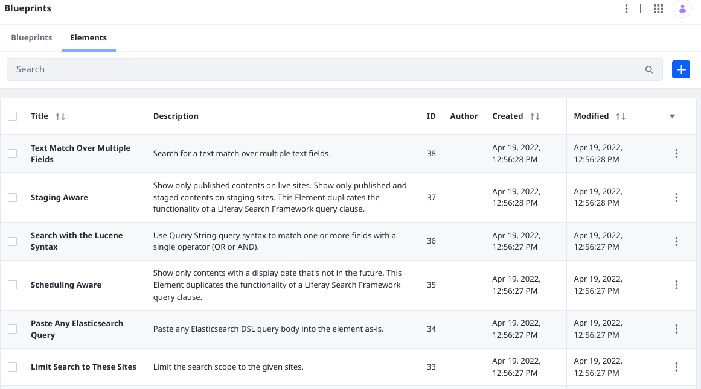

# Creating and Managing Elements

```{toctree}
:maxdepth: 1

creating-and-managing-elements/creating-elements.md
creating-and-managing-elements/managing-elements.md
creating-and-managing-elements/predefined-element-variables-reference.md
```


Elements are one of the fundamental building blocks of [Search Blueprints](understanding-search-blueprints.md) and are managed within the Blueprints application. Open the Global menu's Applications section and find the Search Experiences category to open Search Blueprints. Click the _Elements_ tab to add a new Element and manage existing Elements.



- [Creating Elements](./creating-and-managing-elements/creating-elements.md)
- [Managing Elements](./creating-and-managing-elements/managing-elements.md)
- [Predefined Element Variables Reference](./creating-and-managing-elements/predefined-element-variables-reference.md)
