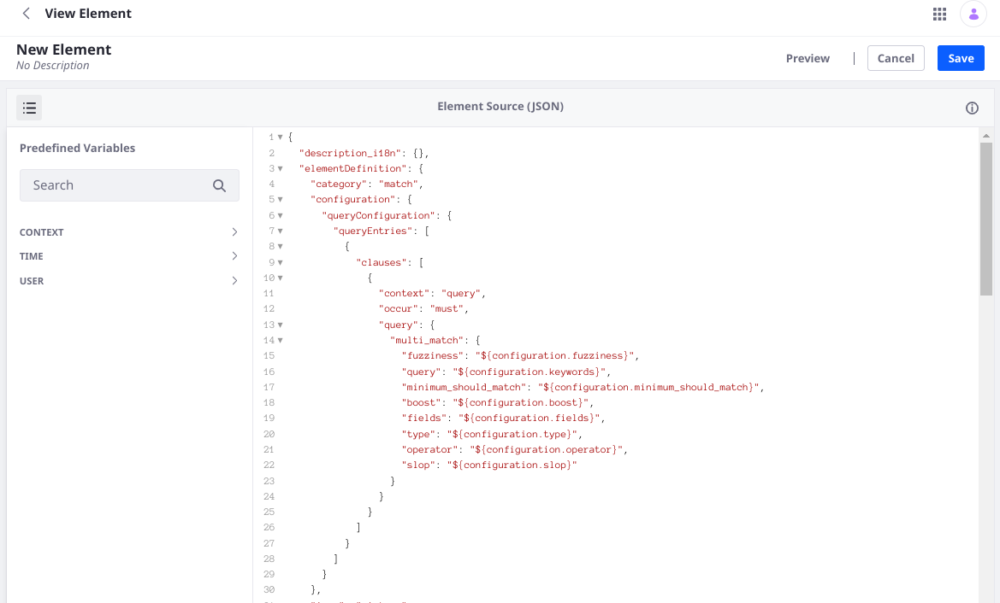

# Creating and Managing Elements

Elements are one of the fundamental building blocks of [Search Blueprints](understanding-search-blueprints.md) and are managed within the Blueprints application. Open the Global menu's Applications section and find the Search Experiences category to open Search Blueprints. Click the _Elements_ tab to add a new Element and manage existing Elements.


To create new Elements, click the Add () button. See [Creating Elements](#creating-elements) for more details.

To delete existing custom Elements, select the Element(s) using the checkbox selector and click the Delete () button.

```{warning} System (i.e., out of the box) Elements cannot be edited or deleted. Duplicate and existing Element if you would like to create a custom Element base don an existing Element.
```

To duplicate an existing Element, click the Actions () button and select _Copy_. The duplicated Element can be deleted or edited just like any other custom Element.

To export an Element, click the Actions () button and select _Export_.

To preview what the Element's configuration window will look like in the Query Builder, click the _Preview_ link (next to the Cancel button).


## Creating Elements

There are a lot of [system Elements that ship with Search Blueprints](search-blueprints-elements-reference.md). If a system Element doesn't meet your need, there are a variety of ways to create your own Search Blueprints Elements:

* Using the Custom JSON Element
* Using the Add Element source editor
* Duplicating a system Element
* Pasting an Elasticsearch query into the [Paste Any Elasticsearch Query](search-blueprints-elements-reference.md#paste-any-elasticsearch-query) Element

### Using the Custom JSON Element

Elements can be added right from the [Query Builder](creating-and-managing-search-blueprints.md#using-the-query-builder). Add the Custom JSON Element to the builder and begin editing the boilerplate JSON:


```json
{
	"description_i18n": {
		"en_US": "Editable JSON Text Area"
	},
	"elementDefinition": {
		"category": "custom",
		"configuration": {},
		"icon": "custom-field"
	},
	"title_i18n": {
		"en_US": "Custom JSON Element"
	}
}
```

While any Element can be written in the Custom JSON Element, usually this approach is best reserved for simple Elements that add a query clause and perhaps a condition. Often these will not need a `uiConfiguration` section and will not make extensive use of the predefined template variables that can be used in an Element. For more complex cases, use the [Element Source Editor](#using-the-add-element-source-editor).

For example, the below Exclude Journal Articles Element is based on the Custom JSON Element. It adds a condition so that the Element's query is only applied if a parameter called `exclude.journal_articles` is `true`. The query adds a `must_not` term query clause to make sure that results do not match a Web Content article's `entryClassName` field.

```json
{
	"description_i18n": {
		"en_US": "Exclude journal articles from the search."
	},
	"elementDefinition": {
		"category": "hide",
		"configuration": {
			"queryConfiguration": {
				"queryEntries": [
					{
						"clauses": [
							{
								"context": "query",
								"occur": "filter",
								"query": {
									"bool": {
										"should": [
											{
												"bool": {
													"must_not": [
														{
															"term": {
																"entryClassName": {
																"value": "com.liferay.journal.model.JournalArticle"}
															}
														}
													]
												}
											},
											{
												"bool": {
													"must": [
														{
															"term": {
																"discussion": false
															}
														}
													]
												}
											}
										]
									}
								}
							}				
						],
						"condition": {
							"contains": {
								"parameterName": "exclude.journal_articles",
								"value": "true"
							}
						}
					}
				]
			}
		},
		"icon": "hidden"
	},
	"title_i18n": {
		"en_US": "Exclude Journal Articles"
	}
}
```

This Element depends on a custom template variable. See the [Search Blueprints Configuration Reference](./search-blueprints-configuration-reference.md#parameter-configuration) to learn about adding custom template variables to the Blueprint.

### Using the Add Element Source Editor

A more robust editing experience is available for building your Elements. From the Elements section of Search Blueprints, click the Add () button. 

Name the Element and click _Create_. The Element Source editor is displayed, and the Predefined Variables are shown in the pane to the left of the editor.



The boilerplate JSON populating the Element is nearly identical to the [Text Match over Multiple Field](search-blueprints-elements-reference.md#text-match-over-multiple-fields) system Element:

```json
{
	"description_i18n": {},
	"elementDefinition": {
		"category": "match",
		"configuration": {
			"queryConfiguration": {
				"queryEntries": [
					{
						"clauses": [
							{
								"context": "query",
								"occur": "must",
								"query": {
									"multi_match": {
										"fuzziness": "${configuration.fuzziness}",
										"query": "${configuration.keywords}",
										"minimum_should_match": "${configuration.minimum_should_match}",
										"boost": "${configuration.boost}",
										"fields": "${configuration.fields}",
										"type": "${configuration.type}",
										"operator": "${configuration.operator}",
										"slop": "${configuration.slop}"
									}
								}
							}
						]
					}
				]
			}
		},
		"icon": "picture",
		"uiConfiguration": {
			"fieldSets": [
				{
					"fields": [
						{
							"defaultValue": [
								{
									"field": "localized_title",
									"locale": "${context.language_id}",
									"boost": "2"
								},
								{
									"field": "content",
									"locale": "${context.language_id}",
									"boost": "1"
								}
							],
							"label": "Fields",
							"name": "fields",
							"type": "fieldMappingList",
							"typeOptions": {
								"boost": true
							}
						},
						{
							"defaultValue": "or",
							"label": "Operator",
							"name": "operator",
							"type": "select",
							"typeOptions": {
								"options": [
									{
										"label": "OR",
										"value": "or"
									},
									{
										"label": "AND",
										"value": "and"
									}
								]
							}
						},
						{
							"defaultValue": "best_fields",
							"label": "Match Type",
							"name": "type",
							"type": "select",
							"typeOptions": {
								"options": [
									{
										"label": "Best Fields",
										"value": "best_fields"
									},
									{
										"label": "Most Fields",
										"value": "most_fields"
									},
									{
										"label": "Cross Fields",
										"value": "cross_fields"
									},
									{
										"label": "Phrase",
										"value": "phrase"
									},
									{
										"label": "Phrase Prefix",
										"value": "phrase_prefix"
									},
									{
										"label": "Boolean Prefix",
										"value": "bool_prefix"
									}
								]
							}
						},
						{
							"defaultValue": "AUTO",
							"helpText": "Only use fuzziness with the following match types: most fields, best fields, bool prefix.",
							"label": "Fuzziness",
							"name": "fuzziness",
							"type": "select",
							"typeOptions": {
								"nullable": true,
								"options": [
									{
										"label": "Auto",
										"value": "AUTO"
									},
									{
										"label": "0",
										"value": "0"
									},
									{
										"label": "1",
										"value": "1"
									},
									{
										"label": "2",
										"value": "2"
									}
								]
							}
						},
						{
							"defaultValue": "0",
							"label": "Minimum Should Match",
							"name": "minimum_should_match",
							"type": "text",
							"typeOptions": {
								"nullable": true
							}
						},
						{
							"defaultValue": "",
							"helpText": "Only use slop with the following match types: phrase, phrase prefix.",
							"label": "Slop",
							"name": "slop",
							"type": "number",
							"typeOptions": {
								"min": 0,
								"nullable": true,
								"step": 1
							}
						},
						{
							"defaultValue": 1,
							"label": "Boost",
							"name": "boost",
							"type": "number",
							"typeOptions": {
								"min": 0
							}
						},
						{
							"helpText": "If this is set, the search terms entered in the search bar will be replaced by this value.",
							"label": "Text to Match",
							"name": "keywords",
							"type": "keywords",
							"typeOptions": {
								"required": false
							}
						}
					]
				}
			]
		}
	},
	"title_i18n": {
		"en_US": "My Element"
	},
	"type": 0
}
```

## Understanding the Element Schema
