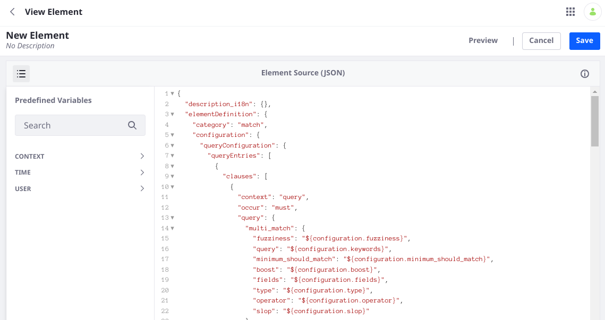

# Creating Elements

There are a lot of [system Elements that ship with Search Blueprints](../search-blueprints-elements-reference.md). If none of the system Elements can meet your need, there are a variety of ways to create your own Search Blueprints Elements:

* [Use the Custom JSON Element](#using-the-custom-json-elements) to create Elements from the Search Blueprints [Query Builder](../creating-and-managing-search-blueprints.md#using-the-query-builder).
* [Use the Add Element source editor](#using-the-add-element-source-editor) to write Elements using a more robust Element editor, including handy preview functionality and a listing of the predefined template variables in the system. 
* [Duplicate a system Element](./managing-elements.md) to get a head start on developing your own custom Element.
* Use the [Paste Any Elasticsearch Query system Element](../search-blueprints-elements-reference.md#paste-any-elasticsearch-query) if you're familiar with using the [Elasticsearch query DSL](https://www.elastic.co/guide/en/elasticsearch/reference/7.x/query-dsl.html) and need to cook up an Element quickly based on an Elasticsearch query.

## Using the Custom JSON Element

Elements that are not meant to be reused in other Blueprints can be added in the [Query Builder](creating-and-managing-search-blueprints.md#using-the-query-builder) while working on a Blueprint. These are only available in the Blueprint of origin and are not visible in the Elements section of Search Blueprints. 

Add the Custom JSON Element to the builder and begin editing the boilerplate JSON:

```json
{
   "description_i18n": {
      "en_US": "Editable JSON Text Area"
   },
   "elementDefinition": {
      "category": "custom",
      "configuration": {},
      "icon": "custom-field"
   },
   "title_i18n": {
      "en_US": "Custom JSON Element"
   }
}
```

As you type in the JSON editor, auto-completion reveals the available properties. To further understand the available JSON properties, see [Understanding the Schema](#understanding-the-element-schema).

While any Element can be written in the Custom JSON Element, usually this approach is best reserved for simple Elements that add a query clause and perhaps a condition. Often these will not need a `uiConfiguration` section and will not make extensive use of the predefined template variables that can be used in an Element. For more complex cases, use the [Element source editor](#using-the-add-element-source-editor).

For example, the below Exclude Journal Articles Element is based on the Custom JSON Element. It adds a condition so that the Element's query is only applied if a parameter called `exclude.journal_articles` is `true`. The query adds a `must_not` term query clause to make sure that results do not match a Web Content article's `entryClassName` field.

```json
{
   "description_i18n": {
      "en_US": "Exclude journal articles from the search."
   },
   "elementDefinition": {
      "category": "hide",
      "configuration": {
         "queryConfiguration": {
            "queryEntries": [
               {
                  "clauses": [
                     {
                        "context": "query",
                        "occur": "filter",
                        "query": {
                           "bool": {
                              "should": [
                                 {
                                    "bool": {
                                       "must_not": [
                                          {
                                             "term": {
                                                "entryClassName": {
                                                "value": "com.liferay.journal.model.JournalArticle"}
                                             }
                                          }
                                       ]
                                    }
                                 },
                                 {
                                    "bool": {
                                       "must": [
                                          {
                                             "term": {
                                                "discussion": false
                                             }
                                          }
                                       ]
                                    }
                                 }
                              ]
                           }
                        }
                     }           
                  ],
                  "condition": {
                     "contains": {
                        "parameterName": "exclude.journal_articles",
                        "value": "true"
                     }
                  }
               }
            ]
         }
      },
      "icon": "hidden"
   },
   "title_i18n": {
      "en_US": "Exclude Journal Articles"
   }
}
```

This Element depends on a custom variable that can be added using the Parameter Configuration of a Blueprint. See the [Search Blueprints Configuration Reference](../search-blueprints-configuration-reference.md#parameter-configuration) to learn about adding custom variables to the Blueprint.

## Using the Add Element Source Editor

A more robust editing experience is available for building your Elements. From the Elements section of Search Blueprints, click the Add () button. 

Name the Element and click _Create_. The Element Source editor is displayed, and the Predefined Variables are shown in the pane to the left of the editor. As you type in the JSON editor, auto-completion reveals the available properties. To further understand the available JSON properties, see [Understanding the Schema](#understanding-the-element-schema).




To preview what the Element's configuration window will look like in the Query Builder, click the _Preview_ link (next to the Cancel button).


### Using Predefined Variables

To add a Predefined Variable to the Element in the Element Source editor, place the cursor where the variable will be, then click on the variable in the left hand sidebar to have it inserted. In the Custom JSON Element you must type the variable directly into the editor.

See [Predefined Element Variables Reference](./predefined-element-variables-reference.md) for details.

## Understanding the Element Schema

```{warning}
The [Element schema](#understanding-the-element-schema) can change. If the schema changes between Liferay versions, importing the older Element's JSON may fail.
```

The schema for Search Blueprint Elements is defined in the [sxp-query-element.schema.json](https://github.com/liferay/liferay-portal/blob/master/modules/dxp/apps/search-experiences/search-experiences-web/src/main/resources/META-INF/resources/sxp_blueprint_admin/schemas/sxp-query-element.schema.json) file. Users with access to the REST API Explorer can browse the schema more conveniently. While logged in to Liferay visit

<http://localhost:8080/o/api?endpoint=http://localhost:8080/o/search-experiences-rest/v1.0/openapi.json>

Expand the _POST /v1.0/sxp-blueprints_ endpoint entry. Scroll down and click the _Schema_ link (next to the _Example Value_ link).


```{tip}
Inspect the syntax in the system Elements to better understand how the Elements are constructed using the schema elements.
```

Each Element has these two mandatory top-level properties: `elementDefinition` and `title_i18n`. The `elementDefinition` must include the `category` and the `configuration` &rarr; `queryConfiguration` properties:

```json
{
	"elementDefinition": {
		"category": "custom",
		"configuration": {
			"queryConfiguration": {}
		}
	},
	"title_i18n": {
		"en_US": "Custom JSON Element"
	}
}
```

In the title field, set the title text for the Element in as many languages as needed.

### Creating the Element `elementDefinition`

The `elementDefinition` is where you'll do the bulk of the work. Its properties include `category`, `configuration`, `icon`, and `uiConfiguration`. 

- `category` provides a string that classifies the behavior of the Element. Specify `match`, `boost`, `conditional`, `filter`, `hide`, or `custom`.
- `configuration` provides the `queryConfiguration`, which holds the query clauses you're contributing, via the `queryEntries` property.
- `icon` sets a string that sets which available icon to use for the Element. Any image available in the [Lexicon Icon Library](../../../../building-applications/developing-a-java-web-application/using-mvc/tag-libraries/clay-tag-library/clay-icons.md) can be used (e.g., `thumbs-up`).
- `uiConfiguration` sets the configuration elements that you'll show in the UI and then pass into your custom Element with the configured values. 

For example, an Element that boosts a term query match on the `entryClassName` field can configure the query and the UI like this:

```json
"configuration": {
   "queryConfiguration": {
      "queryEntries": [
         {
            "clauses": [
               {
                  "query": {
                     "term": {
                        "entryClassName": {
                           "boost": "${configuration.boost}",
                           "value": "${configuration.entry_class_name}"
                        }
                     }
                  }
               }
            ]
         }
      ]
   }
},
"uiConfiguration": {
   "fieldSets": [
      {
         "fields": [
            {
               "defaultValue": 1,
               "label": "Boost",
               "name": "boost",
               "type": "number",
               "typeOptions": {
                  "min": 0
               }
            }
         ]
      }
   }
```

### Defining the Element `configuration`

The `configuration` property holds the nested properties `queryConfiguration` &rarr; `queryEntries`.

Diving into the `queryEntries` JSON, it can contain the properties `clauses`, `conditions`, `enabled`, `postFilterClauses`, and `rescores`. 

- The snippet above shows how `clauses` (an array of elements) is used to add a query clause the Element contributes to the Blueprint-driven search. In addition to `query`, you can add `additive`, `boost`, `content`, `disabled`, `field`, `name`, `occur`, `parent`, `type`, or `value` properties.
- A `condition` provides a boolean check. If true the provided clauses are included in the search query, if false they are left out.
- Set `enabled` to false (it's true by default) to disable the Element.
- Add `postFilterClauses` (as an array of `clause` elements). You can add `additive`, `boost`, `content`, `disabled`, `field`, `name`, `occur`, `parent`, `query`, `type`, or `value` properties.
- Add `rescores` to recalculate the relevance score for results of a query. Specify the `query`, `queryWeight`, `rescoreQueryWeight`, `scoreMode`, and `windowSize`. See the [Elasticsearch documentation](https://www.elastic.co/guide/en/elasticsearch/reference/7.x/filter-search-results.html#rescore) for details.

The `uiConfiguration` property holds the nested properties `fieldSet` and `field`.

There are a number of configuration properties you can add for each field in the UI Configuration:

- `fieldMappings` <!--not sure what this does -->
- Enter `helpText` to display help text for the field in the Blueprints UI.
- Enter a human readable `label`.
- Enter a `name` that can be used to reference the field elsewhere in the Element, like when passing the field value into the query clause: `${configuration.name}`.
- `step`
- Set the `type` of the field. Choose from `date`, `fieldMapping`, `fieldMappingList` (a list of the available fields, with their locale and a field boost), `itemSelector`, `json`, `keywords`, `multiselect`, `number`, `select`, `slider`, and `text`
- Use the `typeOptions` property to configure the options available for each type of field. For example, set the `options` displayed for a select field.
   - `boost` sets a per-field numeric boost value.
   - `format` determines the [acceptable date format](https://www.elastic.co/guide/en/elasticsearch/reference/7.x/mapping-date-format.html) (e.g., `yyyyMMddHHmmss`).
   - `nullable` sets whether a null value can be passed.
   - `options` sets the options of a select field.
   - `required` sets whether the configuration must have a value.
   - `step` sets the numeric increment or decrement value for a number or slider field.
   - `unit` sets the unit of measurement for a number field.
   - `unitSuffix` sets the unit notation to display for a number field with a unit (for example, if `unit` is `km`, you could set the `unitSuffix` as `km` or `kilometers`).

## Additional Information

- [Creating and Managing Search Blueprints](../creating-and-managing-search-blueprints.md)
- [Search Blueprints Elements Reference](../search-blueprints-elements-reference.md)
- [Search Blueprints Configuration Reference](../search-blueprints-configuration-reference.md) 
