# Creating and Managing Search Blueprints

[Search Blueprints](./understanding-search-blueprints.md) are created, updated, and deleted using an administrative application in the Global Menu. Open the Global menu's Applications section and find the Search Experiences category. If you already have a Blueprint and want to apply it's functionality in a Liferay [Search Page](../../search-pages-and-widgets/working-with-search-pages.md), see [Using a Search Blueprint on a Search Page](using-a-search-blueprint-on-a-search-page.md).

To create Search Blueprints,

1. Open the Blueprints application by clicking _Blueprints_ from Global Menu &rarr; Applications (Search Experiences).

1. Add a Blueprint by clicking the Add () button.

   

1. In the New Search Blueprint window, give the Blueprint a name (required) and a description (optional).

1. Depending on your [Blueprint plan](./planning-a-blueprint.md), next you'll use these menus to continue building the [Blueprint](./understanding-search-blueprints.md#what-is-a-blueprint):

   - [Query Builder](#using-the-query-builder): in the Query Elements section, add new query clauses to the search by choosing or composing Elements for the Blueprint. In the Query Settings section, configure additional settings for the query (like which asset and object types to search).

        ```{note}
        Out of the box, elements are available to use in creating your Blueprints. However, if you've installed the Search Experiences application into an existing Liferay installation, you must re-index the `SXPElement` entity for the elements to appear in the Blueprints UI. Navigate to Control Panel &rarr; Search &rarr; Index Actions, then find the `com.liferay.search.experiences.model.SXPElement` entry and click _Execute_.

        
        ```

   - [Configuration](#adding-configurations): Configure advanced settings (e.g., Sorts or Aggregations) in the search.

1. Test the Blueprint as you build and configure it. Click _Preview_ and enter a search keyword.

   

   See [Testing a Blueprint](#testing-a-blueprint-with-the-preview-sidebar) for more details.

1. Once you're finished with the initial Blueprint creation, Click _Save_.

The Blueprint creation process can be fast and simple, but sometimes involves more iterating and testing. Make sure you save the Blueprint often to ensure your work is preserved.

Edit or delete a Blueprint from its Actions menu ().

In addition to the CRUD options, Search Blueprints can be [imported and exported](#importing-and-exporting-blueprints).

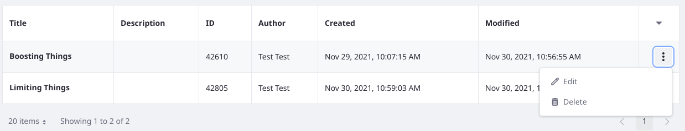

## Using the Query Builder

Many use cases for Blueprints will require using its Query Builder. Use the Query Builder to

1. [Add Elements to the Blueprint](#adding-elements-to-the-blueprint).
1. [Choose which Liferay assets to search](#choosing-which-liferay-assets-to-search).

### Adding Elements to the Blueprint

Add Elements to begin adding query clauses to the Blueprint:

1. Open the Add Query Elements sidebar by clicking the Add () button on the Query Elements screen. 
   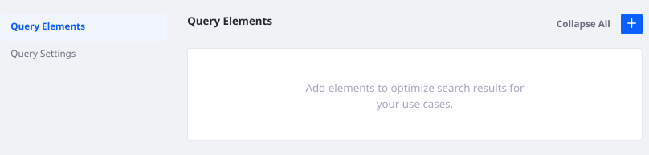
1. Expand the Element category you'd like to explore.
1. Hover over the Element, then click the _Add_ button.
1. The Element is added to the Query Builder, ready to configure:
   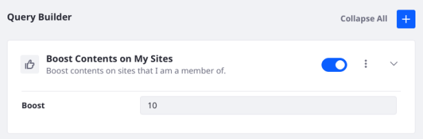
1. Add as many Elements as needed to configure the search query as desired.

   See [Search Blueprints Elements Reference](./search-blueprints-elements-reference.md) for a description of each out of the box Element.

1. If any custom Elements are required, add the Custom JSON Element to the Query Builder and write the query clause you need.

   See [Creating Elements](./creating-elements.md) to learn about building Custom JSON Elements.

<!-- TODO: Remove not yet written statements when written -->

```{important}
Some Elements require more action than simply adding them to the Blueprint in the Query Builder. For example, to use either the Boost Longer Contents element or the Boost Contents with More Versions element, you must re-index the following entries in Control Panel &rarr; Search &rarr; Index Actions:


* `com.liferay.blogs.model.BlogsEntry`
* `com.liferay.document.library.kernel.model.DLFileEntry`
* `com.liferay.journal.model.JournalArticle`
* `com.liferay.knowledge.base.model.KBArticle`
* `com.liferay.wiki.model.WikiPage`

Other Elements require additional setup, like the Elements that provide geolocation features  (e.g., Boost Proximity). For details, see the [Elements Reference](./search-blueprints-elements-reference.md).
```

After adding Elements, make sure you save the Blueprint.

### Choosing which Liferay Assets to Search

Decide which Liferay Asset Types to include in the Blueprint's query. Use Query Settings &rarr; Searchable Types:

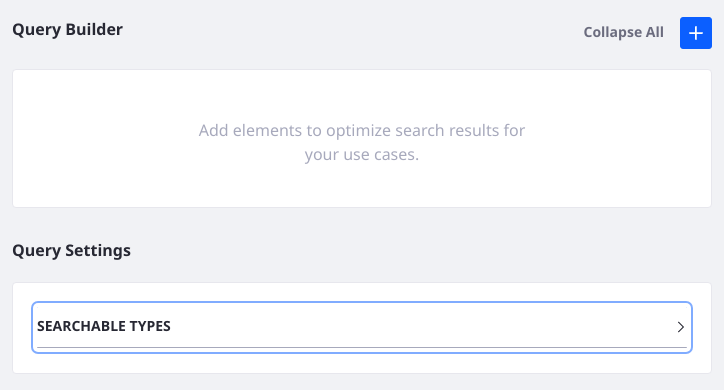

- All asset and object types are selected by default.
- To remove specific types, open the Select Types modal by clicking the Select Asset Types button, then de-select the corresponding checkboxes.
    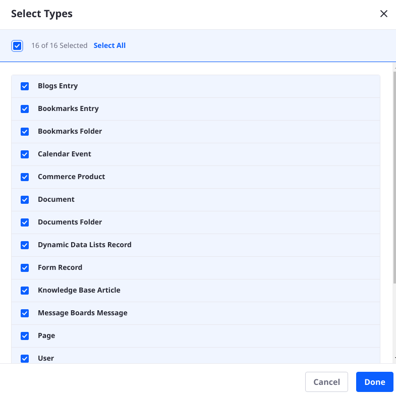

```{note}
De-selecting all assets in the Searchble Types modal is identical to selecting all types: all the asset and object types will be searched. See [Configuring Query Clause Contributors](#advanced-configuring-query-clause-contributors) to learn about disabling most of Liferay's search clauses.
```

Always save the Blueprint after editing its Searchable Types configuration.

Disabling an asset type in the Searchable Types configuration means that the query clauses usually contributed by its indexing code are excluded. Therefore, the type will not be searchable and the end user will not see results of the excluded type when the Blueprint is applied to a search.

More information is included in the next section, as the Searchable Types configuration has important implications for the other clause contributors configuration options.

### Advanced: Configuring Query Clause Contributors

Query clauses are contributed to the ongoing search by Liferay's backend code (and potentially any custom applications deployed in your Liferay instance).

Search Blueprints provides configurability for these backend-contributed query clauses. However, most Users should never touch the settings Search Framework Indexer Clauses or Search Framework Query Contributors. The default settings are usually enough. If you're sure you must tweak this behavior beyond using the [Searchable Types](#choosing-which-liferay-assets-to-search), you must understand the way these backend contributors work:

1. Use **Searchable Types** to disable individual indexers from participating in the search. If you disable a type's indexer, no clauses for the type will be added to the search query, even if its Query Contributors are selected. The search end user will not see results for these types.

1. Use **Search Framework Indexer Clauses** to disable all Liferay's indexers from contributing clauses to the search. The only reason to disable all indexers is to build a search query from scratch, disabling all Query Contributors and Searchable Assets as well.

1. Use the **Search Framework Query Contributors** section to remove certain contributors from participating in the search. Disable certain clause contributors if you want to override them using your own Blueprints configuration, or all clauses to completely override Liferay's search behavior, disabling Liferay's Indexers and Searchable Types as well.

```{important}
* Even when you disable all Indexers and Query Contributors, certain mandatory clauses are always added by Liferay's search framework. Therefore, you're never truly building a query from scratch with Blueprints.

* Liferay's Indexer framework was refactored in Liferay 7.2. Some of Lifery's core assets, like Web Content Articles and Folders, have not been updated to the new pattern. This has an impact on Search Blueprints because there are no Query Contributors for these assets. Therefore, the standard clauses for the assets will always be added to the search query when Liferay Indexer Clauses is enabled. Therefore, a complete override of the Web Content Article's clauses is not possible. You can, hoswever, tweak the search behavior of these assets by layering more clauses on top (boosting certain clause matches, for example).

* Due to internal limitations, you must choose to enable or disable all of Liferay's `Indexer`s. The other clause contributors can be managed more flexibly: choose to include all, none, or any subset of contributors you wish.

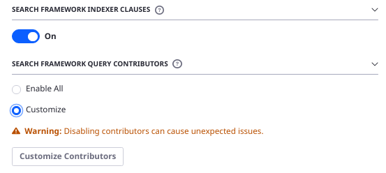
```


When you edit the clause contributors or indexer behavior, make sure to save the Blueprint.

## Adding Configurations

In addition to micromanaging the search query, add Search Blueprint settings add JSON configurations for

- Aggregations
- Highlights
- Sorts
- Parameters
- Advanced Configurations

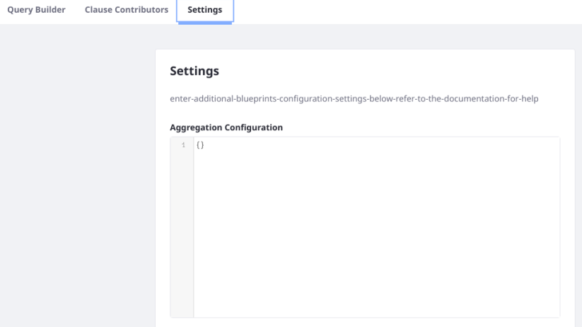

To add these, click the Configuration tab, then find the text entry box for the desired configuration. Enter your JSON, then save the Blueprint.

Here's an example Sort that sorts the search results by the `name` field, in descending (reverse alphabetical--Z-A) order:

```json
{
	"sorts": [
		{
			"title_sortable": "desc"
		}
	]
}
```

For more details see [Blueprints Configuration](./blueprints-configurations.md)

## Importing and Exporting Blueprints

A Blueprint is a JSON object. Export the JSON of a Blueprint from one environment and import it into the other. This can be useful when bringing the Blueprint from a staging and testing environment to production.

To export the Blueprint JSON, 

1. Open the Blueprints application from the Global Menu &rarr; Applications &rarr; Blueprints (in the Search Experiences section).

1. From the list of Blueprints, open a Blueprint's Actions () menu and click _Export_.

To import a Blueprint's JSON definition,

1. Open the Blueprints application from the Global Menu &rarr; Applications &rarr; Blueprints (in the Search Experiences section).

1. Open the main Blueprints Actions () menu and click _Import_.

1. Use the Import modal to choose a valid Blueprint JSON file. Valid Element JSON files can also be imported from this screen.

   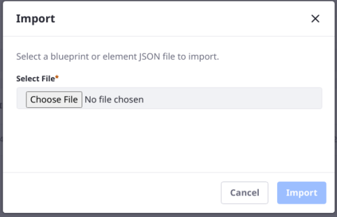

1. Click _Import_.

## Testing a Blueprint with the Preview Sidebar

There's a preview sidebar that's handy for examining the results of a search backed by the Blueprint in progress. Access the preview by clicking the _Preview_ button from the Edit Blueprint screen.


There's more functionality in this screen than first meets the eye:

- Click _View Raw Response_ to see the entire search response string. This is the same string you can see in the [Search Insights](../../search-pages-and-widgets/search-insights.md) widget on the Search page. The response is opened in a Raw Response modal and can be copied to the clipboard or downloaded as a JSON file.

   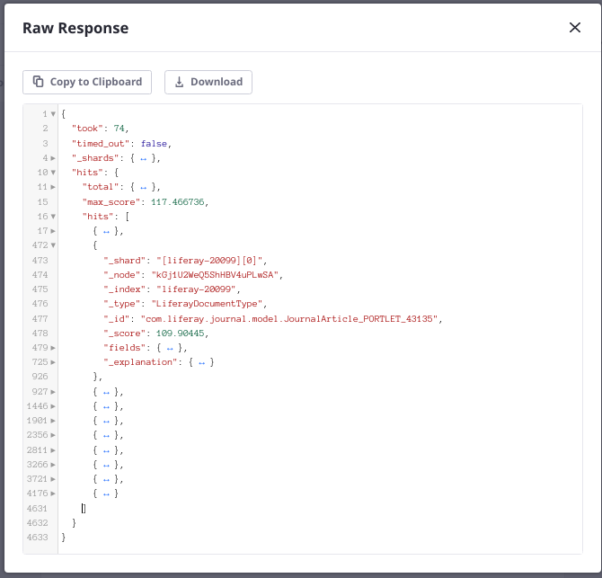

- The score of each result is displayed to the left of the result title. Click the score to see the Score Explanation modal.

   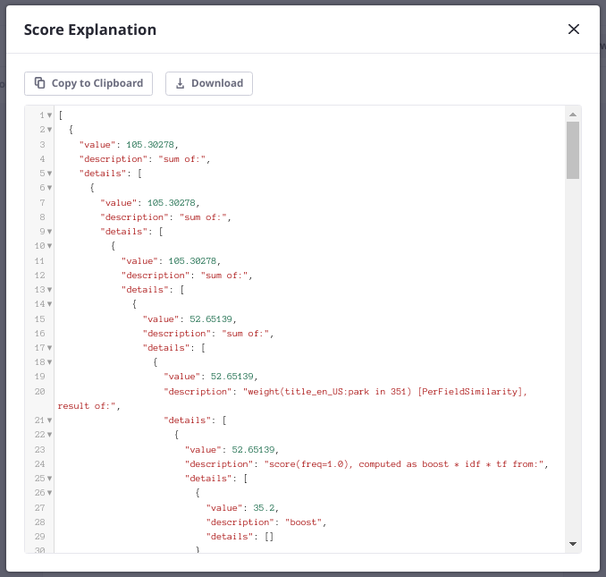

- To expand a result and see all the fields of its returned document, click the right facing angle bracket to the right of the result title.

   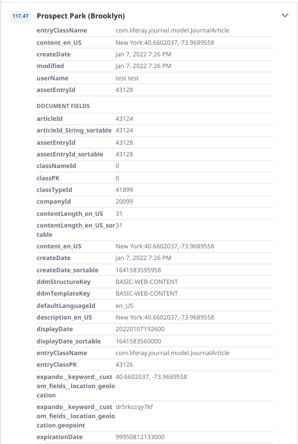

[Some Elements](./search-blueprints-elements-reference.md) read search context attributes that you can provide or override manually. To test Blueprints with these Elements, add search context attributes to the Blueprint preview search by clicking the gear icon (). Enter the key/value pair for the attribute, then click _Done_. Just keep in mind this attribute is only set for the Blueprint preview and isn't saved with the Blueprint itself. You can configure these attributes on a Search Page using the [Blueprints Search Options](./setting-a-blueprint-on-a-search-page.md) widget.

For example, 

1. Add a new [Vocabulary with a Category](../../../content-authoring-and-management/tags-and-categories.md) called _administrative_.
1. Add two new [Web Content Articles](../../../content-authoring-and-management/web-content/web-content-articles.md); make sure both have _test_ in the title field. Associate one of them to the category you created.
1. Create a new Blueprint and add the Conditional Element _Hide Contents in a Category for Guest Users_. You need the Asset Category ID for the Category you created, but you can find that in the Preview window.
1. Search for _administrative_ in the preview. Expand the document of the Web Content Article with the category, then find the `assetCategoryId` (e.g., 43013).
1. Use the ID in the Element's configuration.
1. Open the Preview sidebar's Attributes modal, and enter

   Key: `user.is_signed_in`

   Value: `false`

1. Click _Done_ then enter a search for _test_.

Now only the uncategorized Web Content Article is returned. The other one has been hidden because of the search context attribute that causes the search to behave as if the search User is a Guest.

This example uses an Element that reads the context variable `user.is_signed_in`: by setting a value manually, you're overriding the existing value so that the Blueprint can demonstrate a certain behavior. Because a value already exists in the search context, setting it manually is optional. Other Elements have required custom parameters that do not exist within a normal search request's context. These must be passed manually into the search context for the Element/Blueprint to function properly, whether testing the Blueprint from the preview sidebar or setting the Blueprint for use on a search page.

## What's Next

- [Using a Search Blueprint on a Search Page](using-a-search-blueprint-on-a-search-page.md)
