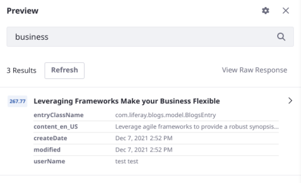

# Personalizing the Search Experience

One of the premier use cases for Search Experiences and Search Blueprints in particular is to personalize Liferay's [search results](../../search-pages-and-widgets/search-results.md). With a personalized search search experience, each User sees results depending on the particular details of his or her context. There are currently Elements and attributes for reacting to the answers of these contextual questions:

* Where is the User?
* What Roles does this User have?
* What Sites is the User a member of?
* What content does the User own?
* Is the User a Guest?
* Is the User a new User?
* What User Segments is the User part of?

Without a Blueprint tailored for each User's context, the default results are scored based on a query that scores relevance by how well the text of the searched keywords matches the [tokenized](https://www.elastic.co/guide/en/elasticsearch/reference/7.x/analysis-tokenizers.html) values of indexed documents.

Personalizing search results increases the chance that the User will find what's needed for their success. This in turn increases the chance of your site's success, by keeping Users engaged with your content. Some examples include

* Prioritizing certain results if they are near in proximity to the User's IP Address
* Prioritizing certain content if the User is new
* Hiding certain content if the User isn't authenticated

## Personalization Elements

There are several Elements that are especially useful for personalization efforts:

* Boost Proximity
* Boost Contents for the Current Language
* Hide Contents in a Category for Guest Users
* Limit Search to My Contents
* Limit Search to My Sites
* Boost Contents on My Sites
* Boost Contents in a Category for New User Accounts
* Boost Contents in a Category for a User Segment

<!-- TODO: Move these descriptions to the Elements Reference guide when written, and link to them. Since we don't currently have the Elements Reference guide written, we must describe them here. -->

Within those Elements are some important context-aware parameters that drive the personalization functionality:

* User
* Session
* IPStack
* Open Weather Map

<!-- List and describe these and other available context-aware parameters, with any special instructions and considerations -->

from the LRDOCS-10134 ticket (Petteri's geolocaton details) 

IPStack:

ipstack.city
ipstack.continent_code
ipstack.continent_name
ipstack.country_code
ipstack.country_name
ipstack.latitude
ipstack.longitude
ipstack.region_code
ipstack.region_name
ipstack.zip

OpenWeatherMap:

openweathermap.temp
openweathermap.weather_description
openweathermap.weather_id
openweathermap.weather_main
openweathermap.wind_speed

## Building a Blueprint to Personalize Search Results

* Provide the configuration steps for a good use case

Additional Notes:
 * Using the information Petteri provided in LRDOCS-10134 for this effort may be enough to close both tickets
 * Also see [slack|https://liferay.slack.com/archives/C0154CEGR3Q/p1642617864109400]{quote}


1. Open the Blueprints application by clicking _Blueprints_ from Global Menu &rarr; Applications (Search Experiences).

1. Add a Blueprint by clicking the Add () button.

   

1. In the New Search Blueprint window, give the Blueprint a name (required) and a description (optional).

1. Depending on your [Blueprint plan](./planning-a-blueprint.md), next you'll use these menus to continue building the [Blueprint](./understanding-search-blueprints.md#what-is-a-blueprint):

   - [Query Builder](#using-the-query-builder): in the Query Elements section, add new query clauses to the search by choosing or composing Elements for the Blueprint. In the Query Settings section, configure additional settings for the query (like which asset and object types to search).

        ```{note}
        Out of the box, elements are available to use in creating your Blueprints. However, if you've installed the Search Experiences application into an existing Liferay installation, you must re-index the `SXPElement` entity for the elements to appear in the Blueprints UI. Navigate to Control Panel &rarr; Search &rarr; Index Actions, then find the `com.liferay.search.experiences.model.SXPElement` entry and click _Execute_.

        
        ```

   - [Configuration](#adding-configurations): Configure advanced settings (e.g., Sorts or Aggregations) in the search.

1. Test the Blueprint as you build and configure it. Click _Preview_ and enter a search keyword.

   

   See [Testing a Blueprint](#testing-a-blueprint-with-the-preview-sidebar) for more details.

1. Once you're finished with the initial Blueprint creation, Click _Save_.
