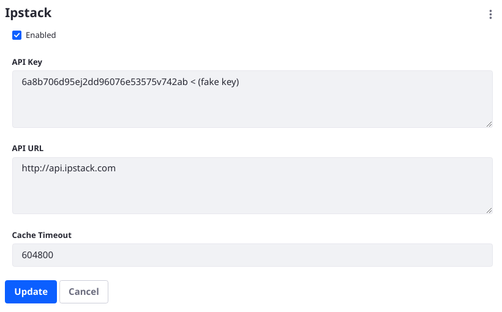
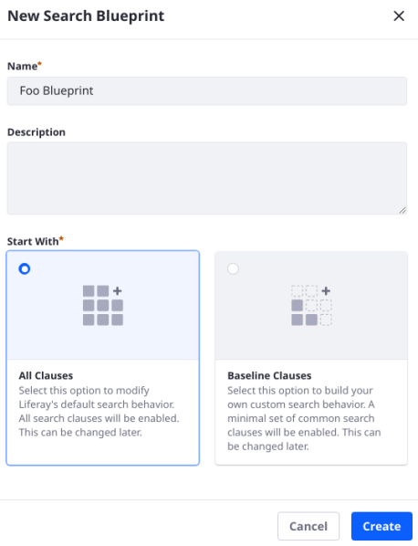
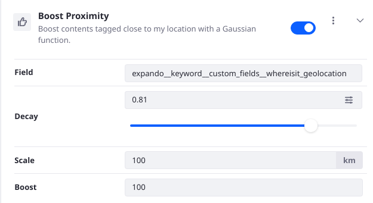

# Personalizing the Search Experience

One of the premier use cases for Search Experiences and Search Blueprints in particular is to personalize Liferay's [search results](../../search-pages-and-widgets/search-results.md). With a personalized search experience, each User sees results depending on the particular details of his or her context. There are currently Elements for making your Blueprint react to the answers of contextual questions like

* Where is the User?
* What Roles does the User have?
* What Sites is the User a member of?
* What content does the User own?
* Is the User a Guest?
* Is the User a new User?
* What [User Segment](../../../site-building/personalizing-site-experience/segmentation/creating-and-managing-user-segments.md)s is the User part of?

Without a Blueprint tailored for each User's context, the default results are scored based on a query that calculates relevance by how well the text of the searched keywords matches the [tokenized](https://www.elastic.co/guide/en/elasticsearch/reference/7.x/analysis-tokenizers.html) values of indexed documents.

Personalizing search results increases the chance that the User will find what's needed for their success. This in turn increases the chance of your site's success, by keeping Users engaged with your content. Some examples include

* Prioritizing certain results if they are near in proximity to the User's IP Address
* Prioritizing certain content if the User is new
* Hiding certain content if the User isn't authenticated

## Personalization Elements

There are several Elements that are especially useful for personalization efforts:

*Boost Proximity* is an Element that uses the [Ipstack](https://ipstack.com) service to boost search results closer to a User's location, as marked by a [geopoint](https://www.elastic.co/guide/en/elasticsearch/reference/7.x/geo-point.html) field in the document. The [example below](#building-a-blueprint-to-personalize-search-results) shows you how to set up the service and use the Boost Proximity Element.

*Boost Contents for the Current Language* is an Element that boosts search results with a `defaultLanguageId` field matching the current session's language.

*Hide Contents in a Category for Guest Users* is an Element that hides search results matching with a [certain category](../../../content-authoring-and-management/tags-and-categories/defining-categories-and-vocabularies-for-content.md) field, if the search User is unauthenticated.

*Limit Search to My Contents* is an Element that only returns search results if the document's `userId` field matches the search User.

*Limit Search to My Sites* is an Element that only returns search results scoped to a [Site that the User is a member of](../../../site-building/building-sites/site-membership/adding-members-to-sites.md).

*Boost Contents on My Sites* is an Element that boosts search results if the search User is a member of the Site the results are scoped to.

*Boost Contents in a Category for New User Accounts* is an Element that boosts search results with a [certain category](../../../content-authoring-and-management/tags-and-categories/defining-categories-and-vocabularies-for-content.md) if the search User's account was created in a certain time range.

*Boost Contents in a Category for a User Segment* is an Element that boosts search results with a [certain category](../../../content-authoring-and-management/tags-and-categories/defining-categories-and-vocabularies-for-content.md) if the user belongs to a certain [User Segment](../../../site-building/personalizing-site-experience/segmentation/creating-and-managing-user-segments.md).

<!-- TODO: Move these descriptions to the Elements Reference guide when written, and link to them. Since we don't currently have the Elements Reference guide written, we must describe them here. -->

## Building a Blueprint to Personalize Search Results

One important usage of Search Experiences' personalization features is presenting results based on the search User's location. 

To demonstrate this use case, multiple configuration exercises must be completed:

- [Configure the service that geolocates the User's IP address, <https://ipstack.com>.](#configure-the-ipstack-service)
- [Geolocate a Liferay Asset.](#configure-a-geolocated-asset)
- [Create the Blueprint with the Element that communicates with the geolocation service.](#configure-a-geolocation-aware-blueprint)

### Configure the Ipstack Service

Before configuring the Blueprint, you must obtain an [ipstack key](https://ipstack.com/) and enable the Ipstack service in Liferay.

1. Go to <https://ipstack.com> and obtain an API key.
1. In Liferay, go to System Settings &rarr; Platform &rarr; Search Experiences &rarr; Ipstack.
1. Click _Enabled_.
1. Enter the API Key.
1. Click _Save_.



### Configure a Geolocated Asset

A search document must have a [geopoint field](https://www.elastic.co/guide/en/elasticsearch/reference/7.x/geo-point.html) to work with the Ipstack service and the Boost Proximity Element. Liferay includes compatible Geolocation fields that you can add as a Custom Field to existing assets:

1. Go to Control Panel &rarr; Custom Fields.
1. Add a new Custom Field on the Blogs Entry:
   - Type: Geolocation
   - Field Name: location
1. Click _Save_.
1. Add two new blogs entries (open the Site Menu and go to Content & Data &rarr; Blogs):
   - First Blogs Entry 
     - Title: _Blog title_
     - Content: _Blog content_
     - Under Custom Fields, drag the geolocation pin somewhere approximately 100 km from your current location.
     - Publish the blog.
   - Second Blogs Entry
     - Title: _Second blog title_
     - Content: _Second blog content_
     - Under Custom Fields, drag the geolocation pin as close as possible to your current location.
     - Publish the blog.

```{tip}
Zoom in to the geolocation map in order to place the pin more precisely.
```

If you search for the word _blog_ on the search page, the Blogs Entry with the shorter title and content fields (the first one, titled _Blog title_) will appear first in the Search Results widget. Let's create a Blueprint that will boost the content that's closer to you, the search User.

### Configure a Geolocation-Aware Blueprint

Now that you have the Ipstack service configured and search documents with geopoint data, you're ready to configure a Blueprint that boosts certain results by their proximity to the search User:

1. Open the Blueprints application by clicking _Blueprints_ from Global Menu &rarr; Applications (Search Experiences).

1. Add a Blueprint by clicking the Add () button.

   

1. In the New Search Blueprint window, give the Blueprint a name (required) and a description (optional).

1. Use the [Query Builder](#using-the-query-builder) to add the Boost Proximity Element.
   - Set the field as `expando__keyword__custom_fields__location_geolocation`.
   - Set the Decay to 0.8.
   - Set the Scale to 10 km.
   - Set the Boost value to 100.

   

1. Test the Blueprint as you build and configure it. Click _Preview_.

1. To model the search experience of a User in your location, set your public IPV4 address into the search context by clicking the gear icon (): 
   - Key: `search.experiences.ip.address`
   - Value: `[My Public IPV4 Address]`

   Click _Done_.

1. Enter the keyword _blog_ and verify that the geolocated Blogs Entry that's closer to your location is returned before the more distant Blogs Entry.

   ```{note}
   The Gaussian function used to score documents by their proximity to the sending IP address might need to be adjusted. The Boost Proximity Element lets you adjust the decay, scale, and boost:

   - Decay defines the factor by which to reduce the boost value when the proximity of the asset to the User is equal to the scale.

   - Scale is the distance away from the User's IP adress location, above which the relevance of results should begin to deteriorate.

   - Boost is the numeric value to boost results that are within the defined scale.

   For example, if you specify a boost of 100 for search results geolocated to within 10 km of the User, and define a decay factor of 0.5, a result exactly 10 km away from the User will receive half of the maximum boost value, so it will be boosted by 50. At distances greater than 10 km, the Gaussian function takes over in determining the remaining scores.

   See [Elastic's Function Score Query](https://www.elastic.co/guide/en/elasticsearch/reference/7.x/query-dsl-function-score-query.html) documentation for more details.
   ```

1. Once you're finished with the Blueprint, Click _Save_.

Now you can [apply the Blueprint to a Liferay search page](./using-a-search-blueprint-on-a-search-page.md).
