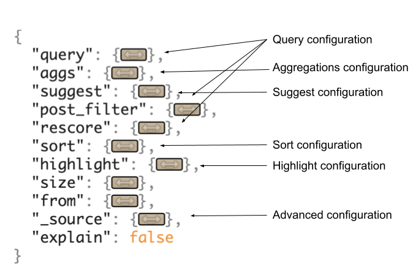

# Understanding Search Blueprints

Search Blueprints is the first feature of the Search Experiences toolset. Use Blueprints to tailor the search page experience to your users' needs, without deploying any custom code. With Blueprints you can

- Create context-aware search pages. For example, boost Web Content articles by proximity to the search user.
- Explicitly declare which fields are searched. For example, you can choose not to declare the `userName` field.
- Boost assets with a certain category for a specific period of time. For example, create a seasonal campaign to promote Liferay Commerce products by category.
- Any use case served by the [Custom Filter widget](../../search-pages-and-widgets/search-results/custom-filter-examples.md) can be satisfied with Blueprints. For example, boost certain fields that match the searched keyword.

If you need control over what should be searched or how the search should work, Search Blueprints is the feature you need.

The configurability of the default Liferay search experience has evolved over time. In the latest Liferay DXP release, out-of-the-box you can tune the search results ([Synonym Sets](../../search-administration-and-tuning/synonym-sets.md) and [Result Rankings](../../search-administration-and-tuning/result-rankings.md)), add [Custom Facets](../../search-pages-and-widgets/search-facets/custom-facet.md), and use [Custom Filters](../../search-pages-and-widgets/search-results/custom-filter-examples.md) to perform complex search customizations. These configurations have limits, though, and many search-heavy sites will require customizations of the search infrastructure's backend code. This requires deploying Java-based modules to Liferay's OSGi runtime.

Instead of building on this code-heavy feature set, Blueprints takes a different approach, for the user who needs near-complete control over the search page's query without deploying custom code. Blueprints offers a UI-based configuration experience that can satisfy almost every use case (if not in the earliest iteration of the feature, in subsequent versions where the feature set is even more robust).

## What is a Blueprint?

Simply put, Blueprints are comprised of Elements, with some additional configuration sprinkled on top.

**Blueprints**: A Search Blueprint is a design plan for Liferay's search behavior. The search experience starts at a [Search Bar](../../getting-started/searching-for-content.md#using-the-search-bar) for most users. When a search term is entered, a complex query is constructed by Liferay's search infrastructure, then sent to the search engine. You can see Liferay's complete query using the [Search Insights](../../search-pages-and-widgets/search-insights.md) widget. This query can be thought of as Liferay's default blueprint for the search page, controlling what is searched and how. 

**Elements**: Elements are visual building blocks that combine to build an entire Blueprint. Each Element is backed by a JSON fragment that defines a concrete search behavior. Elements are provided out of the box with Search Experiences, and an Element editor lets you create your own or duplicate the existing elements to use as starting points for your own needs.

To create a Blueprint, start with the use case you have in mind. What do you need to change about the default search page experience? Then look at the provided Elements and see if they can be used to start building your customization. Once you've planned the Blueprint, it's time to create it.

For more details see [Creating and Managing Blueprints](./creating-and-managing-search-blueprints.md) and [Planning a Blueprint](./planning-a-blueprint.md).

## What Can I Do in the Blueprints UI?

To produce a search solution using Blueprints, compose Elements into a Blueprint and apply it to the page. The features available for doing so include:

| Feature | Available in Blueprints? | 
|---------------------|----------|
| Use the Query Builder to build Blueprints visually | &#10004; |
| Compose Blueprints with JSON in the Liferay UI | &#10004; |
| Leverage out-of-the-box Elements to simplify Blueprint creation | &#10004; |
| Use [Elasticsearch queries](https://www.elastic.co/guide/en/elasticsearch/reference/7.16/query-dsl.html) as custom Elements | &#10004; |
| Create custom Elements from Elasticsearch queries | &#10004; |
| Create custom JSON Elements for my Blueprints | &#10004; |
| Create advanced Blueprints settings by editing the JSON directly | &#10004; |
| Choose which Liferay Entities are searchable when the Blueprint is applied | &#10004; |
| Choose whether to include clauses from Liferay's Indexer Framework and individual query clause contributors | &#10004; |
| Using JSON, configure advanced settings: Aggregations, Sorts, Highlights, etc. | &#10004; |

In addition to the functionality of the Search Blueprints UI, the search widgets were enhanced to support applying Blueprints to the search page.

## Understanding the Search Request

Blueprints lets you control the contents of Liferay's search request to Elasticsearch. Therefore it's helpful (though not necessary to get started with Blueprints) to pair your understanding of how the user's search experience works with a high level understanding of the default Liferay search query's main components.

**Search Request:** Liferay sends a search request to Elasticsearch, which can include the query body and additional parameters that help direct the response returned by Elasticsearch.

**Query:** The query body instructs the search in how to determine if matching content is found in the index. For example, what kind of query should be used when searching indexed content containing a `title` field? And if it matches the `title` field, should the score be boosted?

**Clause:** A clause is a self-contained portion of the main `bool` query. Most often one of the more nested queries is what's referred to when the word _clause_ is invoked.

The main Liferay query is a `bool` parent query that wraps a multitude of child queries. It consists of two main occur clauses: `must` and `filter`. Blueprints can affect both clauses. Filter type elements are added to the filter clause, and query type elements are added a clauses under the `must` boolean clause.

All Liferay searches are eventually translated to JSON Elasticsearch queries. Here's just a small snippet of the query generated by entering the word "test" into the Search Bar widget:

```json
{
  "from": 0,
  "size": 20,
  "query": {
    "bool": {
      "must": [
        {
          "bool": {
            "must": [
              {
                "bool": {
                  "should": [
                    {
                      "bool": {
                        "must": [
                          {
                            "match": {
                              "comments": {
                                "query": "test"
                              }
                            }
                          }
                        ],
                        "should": [
                          {
                            "match_phrase": {
                              "comments": {
                                "query": "test",
                                "slop": 50
                              }
                            }
                          },
                          {
                            "match_phrase": {
                              "comments": {
                                "query": "test",
                                "boost": 2
                            }
```

Drilling down a little bit, the following boolean query dictates that a match query must be met for the search term "test" in the content field if the clause is to contribute to the score of a matching result. In addition, if a [match phrase query](https://www.elastic.co/guide/en/elasticsearch/reference/7.16/query-dsl-match-query-phrase.html) on the content field is matched, the result's score is boosted by a value of `2`.

```json
{
  "bool": {
    "must": [
      {
        "match": {
          "content": {
            "query": "test"
          }
        }
      }
    ],
    "should": [
      {
        "match_phrase": {
          "content": {
            "query": "test",
            "slop": 50
          }
        }
      },
      {
        "match_phrase": {
          "content": {
            "query": "test",
            "boost": 2
          }
        }
      }
    ]
  }
```

These are the types of clauses you're adding with Elements.

The search request parts can be mapped to the Blueprints UI and its configuration options:


<!-- Needs to be edited to remove the suggestions part: https://docs.google.com/document/d/1TVko7kzDcb8gpa7Ph4aboyeRJ7Lr698mnR21mupG9dQ/edit# -->

## What's Next?

- [Creating and Managing Search Blueprints](./creating-and-managing-search-blueprints.md).
