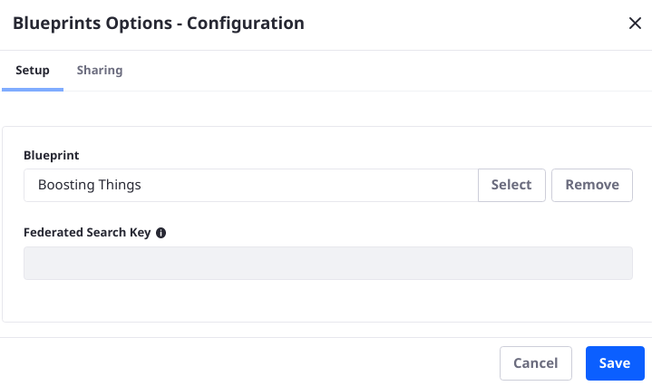
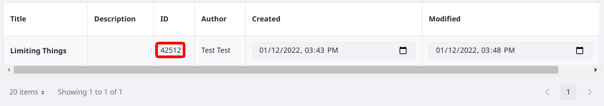

# Using a Search Blueprint on a Search Page

<!-- SME Questions:
Do we need sections on Applying Search Context Attributes, as I've stubbed out below? If so they'll need fleshing out and examples, but I need to know what we expect these use cases to look like.

Also, are there details I am missing? -->

A Blueprint must be applied to a Search Page to affect the Liferay search experience. If a Site has multiple Search Pages, follow the steps below on each page that should use a Blueprint, as each must be configured separately. You can use different Blueprints on each page, if desired.

By default, a [Search Page](../../search-pages-and-widgets/working-with-search-pages.md) does not have a [Search Blueprint](./understanding-search-blueprints.md) associated with it. To make the Search Page react to your Search Blueprint,

1. [Create a Blueprint](./creating-and-managing-search-blueprints.md).
1. Create or navigate to the [Search Page](../../search-pages-and-widgets/working-with-search-pages.md).
1. Add the Blueprint Options widget to the page. 
1. Click the widget's Options icon () and click *Configuration*.
1. To choose a Blueprint for the page, click _Select_.

   

1. Once the Blueprint is selected, click _Save_ on the Configuration screen.

Now the Blueprint's functionality is applied to the page.

Administrative Users can instead use the [Low Level Search Options](../../search-pages-and-widgets/search-results/understanding-low-level-search-options.md) widget to apply a Blueprint to a Search Page. Open the widget's configuration. In the Attributes section, add

- Key: `search.experiences.blueprint.id`
- Value: `[the Blueprint ID]`

You can find the Blueprint ID from the Blueprints application (Global Menu &rarr; Applications &rarr; Blueprints (Search Experiences).

This can be useful if you're already using the Low Level Search Options widget. If you need to set other Search Context Attributes, perhaps for testing a Blueprint, use the Low Level Search Options widget.

## Applying Additional Search Context Attributes

Blueprints are applied to the page using search context attributes, as described above. However, some Elements require parameters that aren't present in the search request by default; these must be applied as search context attributes on the search page or programmatically. See [the Elements reference for more information](./search-blueprints-elements-reference.md). Follow this example to set search context attributes into a Blueprint-driven search page:

1. [Create a Blueprint](./creating-and-managing-search-blueprints.md) with the following Element:
   - Element Name: 

<!-- So far I haven't found a reasonable use case for this -->

## Applying Search Context Attributes Programmatically

<!-- Should we say something about this? -->
