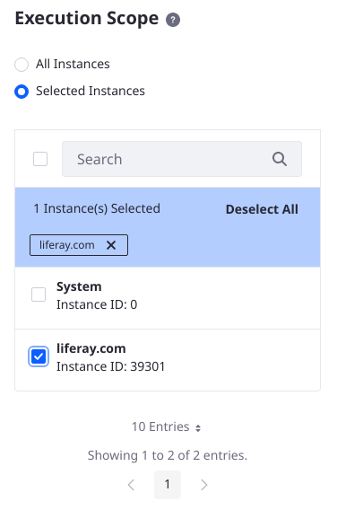
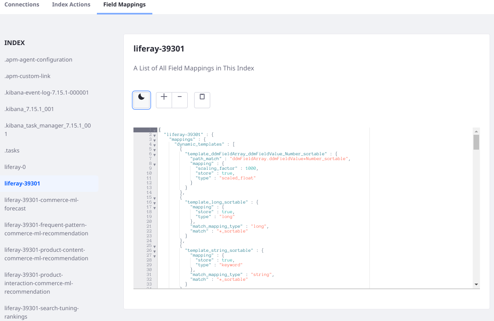

# Search Administration

In *Control Panel* &rarr; *Configuration* &rarr; *Search* there are three administrative UIs: Connections, Index Actions, and Field Mappings. Connections shows you the search engines your installation is connected to, Index Actions is an interface for re-indexing, and Field Mappings display fields mapped from Liferay to your search index. 


## Connections

Information about the search engine connection(s) is displayed here. For example,

* Search Engine Vendor: Elasticsearch
* Client Version: 7.14.1
* Active Connections: 1
* Health: Green
* Connection ID: \_REMOTE\_
* Connection Type: Read/Write
* Cluster Name: LiferayElasticsearchCluster
* Nodes: 1
* Node Name: lr-es
* Node Version: 7.15.1

## Index Actions

In Index Actions, re-index at one of these levels:

   * All indexable assets
   * An individual indexable assets
   * All spell check indexes

Beginning in Liferay 7.4, Server Administrators can also limit the scope of the re-index actions to specific [Virtual Instances](../../system-administration/configuring-liferay/virtual-instances/understanding-virtual-instances.md). To choose which instances the index actions apply to,

1. Open Global Menu &rarr; Control Panel &rarr; Search and click the Index Actions tab.
1. Use the Execution Scope tab to choose the instances to re-index.

   
   

```{note}
[Workflow Metrics](../process-automation/workflow/using-workflows/using-workflow-metrics.md) are re-indexed via the application's dedicated settings menu. In the Global Menu, click _Metrics_ in the Applications &rarr; Workflow section, then open the Settings window (). See [Re-Indexing Workflow Metrics](../process-automation/workflow/using-workflows/using-workflow-metrics.md#re-indexing-workflow-metrics) for more information.
```

## Field Mappings

The Field Mappings tab shows you all field mappings that are effective in the system, by index. Currently, you can view the mappings, copy them, zoom in or out, and view them with a dark theme.



## Related Content

* [Search Configuration Reference](../search-configuration-reference.md)
* [Portal Properties](../../installation-and-upgrades/reference/portal-properties.md)
* [Elasticsearch Connector Configuration Reference](../installing-and-upgrading-a-search-engine/elasticsearch/elasticsearch-connector-configuration-reference.md)
