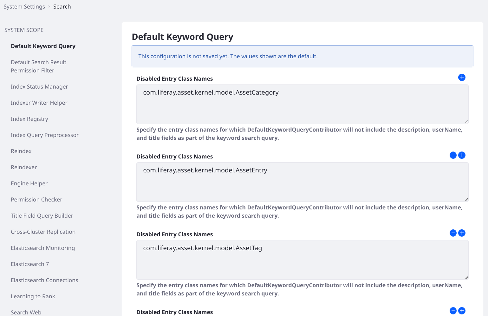

# System Scoped Search Configuration

System scoped search configurations are primarily found in [System Settings](../../system-administration/configuring-liferay/system-settings.md).

1. In the Global Menu, go to *Control Panel* &rarr; *Configuration* &rarr; *System Settings*.

1. Click the *Search* category under the Platform section.

    Alternatively, search for *search*.



## Default Keyword Query

The Default Keyword Query entry contains one setting:

**`disabledEntryClassNames`**: The `DefaultKeywordQueryContributor` code automatically adds `description`, `userName`, and `title` fields to the keyword search query. Specify the entry class names `DefaultKeywordQueryContributor` should ignore.

## Default Search Result Permission Filter

The Default Search Result Permission Filter entry allows configuration of *post-filtering permission checking* (database permission checking that occurs after the results are returned from the search index). Read [Final Permissions Checking](../search-pages-and-widgets/search-results/search-results-behavior.md#final-permissions-checking) for more information on these settings:

* **`permissionFilteredSearchResultAccurateCountThreshold`**

* **`searchQueryResultWindowLimit`**

## Index Status Manager

The Index Status Manager entry has one setting:

**`indexReadOnly`**: Enable this to suspend all indexing operations and writes to the search engine. Searches return only the documents already indexed. This is useful for speeding up large data imports, but it should be disabled and a full re-index executed once the import is finished.

## Indexer Writer Helper

The Index Writer Helper entry contains one entry:

**`indexCommitImmediately`**: When *true* (the default), each write request forces the search engine to refresh the index reader, potentially flushing transactions to disk. This may negatively impact search engine performance. The default behavior is to commit immediately for index writing on individual assets (e.g. add blog, update blog) but delay commits for bulk index writing operations (e.g.  index all users, index all form entries) until all entries have been sent to the search engine. Setting this to false changes the behavior for individual index operations, and may cause applications like Asset Publisher to exhibit a delayed response when showing newly added content. See the [Elasticsearch documentation](https://www.elastic.co/guide/en/elasticsearch/reference/7.x/near-real-time.html) for more information.

## Index Registry

Configure the buffering of index requests:

**`buffered`**: Enable (the default) or disable the buffering of indexing requests.

**`bufferedExecutionMode`**: Allow administrators to select a different `IndexerRequestBufferExecutor`, used to execute a `IndexerRequest`. One implementation of the executor is provided out of the box (_DEFAULT_). When a new `IndexerRequestBufferExecutor` implementation is deployed, one of the required properties is a `buffered.execution.mode`. This value can then be used in place of _DEFAULT_.

**`maximumBufferSize`**: If buffering is enabled, set the Maximum Buffer Size so that any additional indexing requests are executed immediately.

**`minimumBufferAvailabilityPercentage`**: When the capacity of the buffer has only the specified percent of space left, the existing requests in the buffer are executed in one batch and removed from the buffer.

## Index Query Preprocessor

This entry has one repeatable property (use array syntax if you're defining via [OSGi configuration file](../../system-administration/configuring-liferay/configuration-files-and-factories/using-configuration-files.md#creating-configuration-files)):

**`fieldNamePatterns`**: Fields with names matching the patterns set here are treated as non-analyzed keyword fields. Instead of scored full text queries, matching is performed by non-scored wildcard queries. This is a resource intensive operation that degrades search engine performance as indexes grow larger. For substring matching, relying on the [ngram tokenizer](https://www.elastic.co/guide/en/elasticsearch/reference/current/analysis-ngram-tokenizer.html) usually performs better.

## Reindex

This entry contains only one property:

**`indexingBatchSizes`**: Set the number of documents (the default value is 1000) indexed per batch for model types that support batch indexing. For models with large documents, decreasing this value may improve stability when executing a full re-index.

## Reindexer

<!-- Wordsmith and expand-->

**`nonbulkIndexingOverride`**: A value of "true" causes modified entities to always be reindexed one by one. For performance reasons, this setting is generally turned off in production.

**`synchronousExecutionOverride`**: A value of "true" causes reindexing of modified entities to always block until completed. For performance reasons, this setting is generally turned off in production.
## Engine Helper

This entry has one repeatable property (use array syntax if you're defining via
[OSGi configuration file](../../system-administration/configuring-liferay/configuration-files-and-factories/using-configuration-files.md)):

**`excludedEntryClassNames`**: Exclude an asset type from being searched in the catchall query constructed for the Search application. For example, fields of the Organization asset must be indexed to be searchable from the Users and Organizations application, but should not be searched in the Search application. Thus, Organizations are added to `excludedEntryClassNames`.

## Permission Checker

This entry has one configuration option in Liferay DXP 7.3:

**`permissionTermsLimit`**: Limits the number of permission search clauses added to the search query before this level of permission checking is aborted. Permission checking then relies solely on the final permission filtering described in the [Default Search Result Permission Filter](#default-search-result-permission-filter) section.

## Title Field Query Builder

Configure how search responds to matches on the Title field of a document.

**`exactMatchBoost`**: Give an additional boost when searched keywords exactly match the `title` field of a document.

**`maxExpansions`**: Limit the number of documents to return when matching searched keywords to the `title` field as a phrase prefix. See Elasticsearch's [Match Phrase Query documentation](https://www.elastic.co/guide/en/elasticsearch/reference/current/query-dsl-match-query-phrase.html) for more information.

## Cross-Cluster Replication

You'll only see this entry if you have deployed the Cross-Cluster Replication module, which is available with a Liferay Enterprise Search subscription. These configuration properties are covered in the dedicated [Cross-Cluster Replication](../liferay-enterprise-search/cross-cluster-replication/cross-cluster-replication.md) documentation.

## Elasticsearch Monitoring

You can use the monitoring configuration if you have deployed the Liferay Enterprise Search Monitoring module, available with a Liferay Enterprise Search subscription. These configuration properties are covered in the dedicated [Monitoring Elasticsearch](../liferay-enterprise-search/monitoring-elasticsearch.md) documentation.

## Elasticsearch 7

Configure the connection between Liferay and Elasticsearch 7. See [Configuring the Connector](../installing-and-upgrading-a-search-engine/elasticsearch/connecting-to-elasticsearch.md#configuring-the-connector) for detailed coverage of these properties.

## Elasticsearch Connections

Liferay 7.3 can connect to multiple Elasticsearch clusters. Connections are defined in the Elasticsearch Connections entry. This feature can be used in conjunction with the Low Level Search Options and Search Results widgets to show results from third-party systems using Elasticsearch clusters. It's also demonstrated in the [Cross-Cluster Replication](../liferay-enterprise-search/cross-cluster-replication/cross-cluster-replication.md) documentation.

## Learning to Rank

You can use the monitoring configuration if you have deployed the Liferay Enterprise Search Learning to Rank module, available with a Liferay Enterprise Search subscription. These configuration properties are covered in the dedicated [Learning to Rank](../liferay-enterprise-search/learning-to-rank.md) documentation.

## Search Web

This entry contains one property:

**`classicSearchPortletInFrontPage`**: Revert the default search experience from using the new Search Widgets to the classic Search Portlet that was standard in past releases. -->

<!-- Need coverage of some new 7.3 screens and the LES/DXP only screens: Similar Results Web Template Configuration Name (DXP only), Search Results Web Template (new in 7.3), X-Pack Monitoring (LES only), X-Pack Security (default now), Learning to Rank (LES only). There are also widget scoped sys settings for Similar Results Configuration and a lot of other widgets we could just briefly mention -->

<!-- ### Search Administration

In *Control Panel* &rarr; *Configuration* &rarr; *Search* there are three administrative UIs: Connections, Index Actions, and Field Mappings.

#### Connections

Information about the search engine connection(s) is displayed here. For example,

```bash
Search Engine Vendor: Elasticsearch (Embedded), Client Version: 6.5.0, Nodes: A0D6GlN (6.5.0)
``` -->

<!-- Left a screenshot out on purpose, since this is still changing -->

<!-- #### Index Actions

In Index Actions, re-index at one of these levels:

    * All indexable assets
    * An individual indexable asset
    * All spell check indexes

#### Field Mappings

The Field Mappings tab shows you all field mappings that are effective in the system, by index. Currently, you can view the mappings, copy them, zoom in or out, and view them with a dark theme.

### Portal Properties

Portal properties are system scoped as well. The [Lucene Search](https://docs.liferay.com/dxp/portal/7.3-latest/propertiesdoc/portal.properties.html#Lucene%20Search) portal properties configure low level search behavior. Review the properties and their descriptions and determine if they apply to your search requirements. -->
