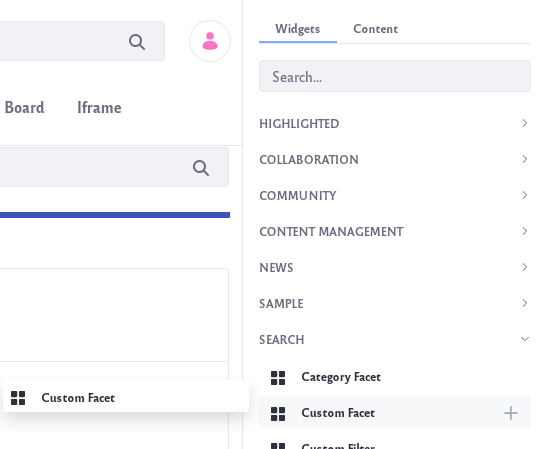
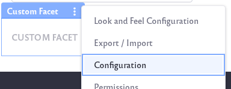

# Custom Facet

The Custom Facet is unique among the out-of-the-box search facets. Rather than group results by a single static field (like the modified date or the asset type), you use a Custom Facet to choose which field to group results by. You can create an entirely new facet with much more customization.

## Configuring the Custom Facet

1. Click the _Add_ icon () at the top of the page.

1. Locate the Custom Facet and drag it to the collection of facets on the left. The Custom Facet is found under the Search section of widgets.

   

1. Click the facet's _Options_ icon () and click *Configuration*.

   

   The Custom Facet has several configuration options which are described below.

1. When finished setting options, click the *Save* button.

**Display Settings:** Choose between *Default*, *Compact Layout*, and *Label Layout*. The Default layout shows checkboxes next to each term but the Compact layout does not. The Label layout shows small clickable labels for each term.

Advanced Configuration contains additional options: 

**Aggregation Field:** Enter the name of the indexed field to aggregate results by. This must be a non-analyzed keyword field. See below for more information.

**Custom Heading:** Enter the heading to display for this facet. If not set, the aggregated field name is displayed.

**Custom Parameter Name:** Specify a URL parameter name for selected values. If not set, the aggregated field name is used.

**Max Terms:** Set the maximum number of facet terms to display, regardless of how many matching terms are found for the facet.

**Frequency Threshold:** Set the minimum frequency required for terms to appear in the list of facet terms. For example, if the frequency threshold of a facet is set to 3, terms with two matching results don't appear in the term result list.

**Display Frequencies:** Choose whether or not to display the term frequencies.

**Federated Search Key:** Enter the key of an alternate Search this widget is participating on. If not set, this widget participates on the default search. This value is typically the name of an application-defined index.


## Finding Indexed Fields

To use the Custom Facet, you must know which non-analyzed keyword field to use in the configuration. 

```tip::
   Elasticsearch supports indexing fields in multiple ways. Some text fields can be used as keyword fields if they're nested ``raw`` `multi-fields <https://www.elastic.co/guide/en/elasticsearch/reference/7.x/multi-fields.html>`__ in the mapping, or if the field is mapped in an additional separate field mapping as ``fieldName_sortable`` (as a ``keyword``). See the example below on creating facets for Custom Fields, as it leverages the Elasticsearch multi-field concept.
```

To browse the entire list of available fields, inspect the field mappings from *Control Panel* &rarr; *Configuration* &rarr; *Search* (click the *Field Mappings* tab). Here you'll see numerous indexes. The Liferay Assets you're likely interested in are indexed into the [company index](../../search-administration-and-tuning/elasticsearch-indexes-reference.md), which is named similarly to `liferay-20101` (`20101` is the Company ID).

Alternatively, use your search engine's API to browse the mappings. In Elasticsearch you can access the field mappings from your terminal using cURL to call the [Get Mapping API](https://www.elastic.co/guide/en/elasticsearch/reference/7.x/indices-get-mapping.html):

```tip::
   `Kibana's <../../liferay-enterprise-search/monitoring-elasticsearch.md>`__ Dev Tools console is more convenient for making Elasticsearch API calls than cURL.
```

 ```bash
curl -X GET "localhost:9200/_mapping/LiferayDocumentType"?pretty
 ```

Solr uses the [ListFields API](https://lucene.apache.org/solr/guide/6_6/schema-api.html#SchemaAPI-ListFields):

```bash
curl http://localhost:8983/solr/liferay/schema/
```

Here's a snippet of output from the Elasticsearch example:

```json
"ddmStructureKey": {
  "store": true,
  "type": "keyword"
},
"ddmTemplateKey": {
  "store": true,
  "type": "keyword"
},
"defaultLanguageId": {
  "store": true,
  "type": "keyword"
},
"description": {
  "store": true,
  "term_vector": "with_positions_offsets",
  "type": "text"
},
"discussion": {
  "store": true,
  "type": "keyword"
},
```

## Accessing Custom Fields 

When you create a [Custom Field](./../../../system-administration/configuring-liferay/adding-custom-fields.md) with the setting _Searchable as Keyword_ enabled, the custom field is indexed with the backing asset (Blogs Entries, for example). After re-indexing it's also applied to existing entries. The field itself is a text field, named like `expando__keyword__custom_fields__Enabled` (if you name the field _Enabled_ in the Custom Fields UI), but it contains a nested field mapping for creating a separate `raw` keyword field. 

To use the raw field in the Custom Facet, append `.raw` to the Custom Field name in the _Aggregation Field_:

`expando__keyword__custom_fields__Enabled.raw`
 
Here's the query you can run in Kibana to inspect the text field's mapping (replace the Company Id---`20097`---in the index name parameter):

```bash 
GET /liferay-20097/_mapping/field/expando__keyword__custom_fields__Enabled
```

JSON is returned: 

```json
{
  "liferay-20097" : {
    "mappings" : {
      "expando__keyword__custom_fields__Enabled" : {
        "full_name" : "expando__keyword__custom_fields__Enabled",
        "mapping" : {
          "expando__keyword__custom_fields__Enabled" : {
            "type" : "text",
            "store" : true,
            "fields" : {
              "raw" : {
                "type" : "keyword"
              }
            },
            "analyzer" : "keyword_lowercase"
          }
        }
      }
    }
  }
}
```

To see all the raw fields, query the index for `*.raw` fields:

```bash 
GET /liferay-20097/_mapping/field/*.raw
```

Setting a custom field to searchable means that the value of the field is indexed when the entity is modified or when a re-index is triggered. Only `java.lang.String` fields can be made searchable.

## Accessing Nested DDM Fields

As documented in the [7.3 Breaking Changes document](../../../liferay-internals/reference/7-3-breaking-changes.md#dynamic-data-mapping-fields-in-elasticsearch-have-changed-to-a-nested-document), the way Liferay Dynamic Data Mapping framework indexes some fields has changed. They were previously at the root of the search engine document; now they're nested fields. This change affects Liferay 7.3 and Liferay 7.2 SP3/FP8+ (but only if the _Enable Legacy Dynamic Data Mapping Index Fields_ setting is disabled in System Settings &rarr; Dynamic Data Mapping Indexer). On the latest Fix Pack and GA release of 7.3, this change is accounted for in Liferay's Search API and no configuration updates are necessary. Therefore, if you have Custom Facet widgets that relied on fields named `ddm__text__*` or `ddm__keyword__*` that were at the root of the Elasticsearch document, continue to use these fields as usual in your Custom Facet's _Aggregation Field_ configuration, even though they're no longer at the root of the document.

To find DDM fields in existing documents in the index,

```json
GET liferay-20097/_search
{
  "query": {
    "nested": {
      "path": "ddmFieldArray",
      "query": {
        "wildcard":  { "ddmFieldArray.ddmFieldName": "ddm__keyword*" }
      }
    }
  }
}
```

Replace the Company Id---`20097`---in the index name parameter to match your instance's value.

The document returned has a `ddmFieldArray` object with nested content:

```json
 "ddmFieldArray" : [
    {
      "ddmFieldName" : "ddm__keyword__40806__Textb5mx_en_US",
      "ddmValueFieldName" : "ddmFieldValueKeyword_en_US",
      "ddmFieldValueKeyword_en_US_String_sortable" : "some text has been entered",
      "ddmFieldValueKeyword_en_US" : "some text has been entered"
    },
    {
      "ddmFieldName" : "ddm__keyword__40806__Selectjdw0_en_US",
      "ddmValueFieldName" : "ddmFieldValueKeyword_en_US",
      "ddmFieldValueKeyword_en_US_String_sortable" : "option 3",
      "ddmFieldValueKeyword_en_US" : "value 3"
    },
    {
      "ddmFieldName" : "ddm__keyword__40806__Boolean15cg_en_US",
      "ddmValueFieldName" : "ddmFieldValueKeyword_en_US",
      "ddmFieldValueKeyword_en_US" : "true",
      "ddmFieldValueKeyword_en_US_String_sortable" : "true"
    }
  ],
```

To use one of these fields in a Custom Facet, enter the `ddmFieldName` value (e.g., `ddm__keyword__40806__Testb5mx_en_US`) in the _Aggregation Field_ of the Custom Facet configuration.
