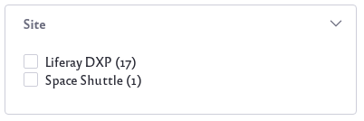
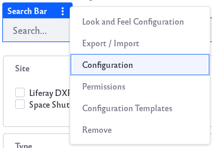
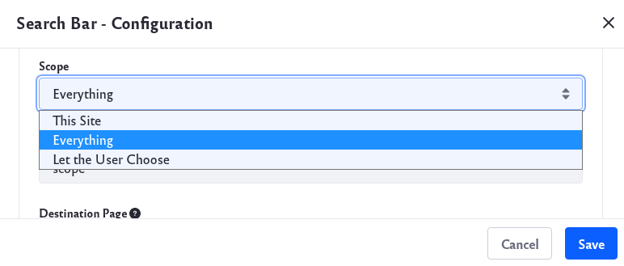
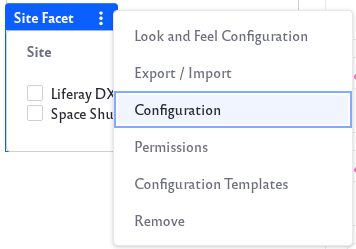

# Site Facet

The Site Facet narrows search results down to those existing in a certain Site. Each Site with content matching the searched keyword appears as a facet term.



```important::
   For the Site Facet to display multiple sites, the Search Bar must be configured to search *Everything*. If not searching for Everything, only the current Site is searched, and the Site Facet has nothing to display. When this occurs, the Site Facet is hidden on the page.

   Configuring the globally embedded page-top Search Bar to search for Everything not only configures the embedded Search Bar on all pages. It also ensures that the Search Page’s Search Bar searches Everything, because the page-top Search Bar's configuration overrides the Search Page's Search Bar configuration. The same does not apply to other Search Bar widgets in the Site. Each of these must be configured as desired.
```

If the global Search Bar is disabled, configure the Search Page's Search Bar widget to search for Everything.

To configure the search scope,

1. Click on Options icon () of the search bar and click *Configuration*.

   

1. Set the Scope option to *Everything*. 

   

   Once finished, click the *Save* button.

## Configuring the Site Facet

To configure the Site Facet, open the Options menu () of the facet and click *Configuration*.



**Display Settings:** Choose between *Default*, *Compact Layout*, and *Label Layout*. The Default layout shows checkboxes next to each term but the Compact layout does not. The Label layout shows small clickable labels for each term.

The Advanced Configuration section contains additional options: 

**Site Parameter Name:** Change the parameter name in the URL for the Facet. The default is *site*. 

**Max Terms:** Set the maximum number of facet terms to display, regardless of how many matching terms are found for the facet.

**Frequency Threshold:** Set the minimum frequency required for terms to appear in the list of facet terms. For example, if the frequency threshold of a facet is set to 3, a term with two matching results doesn't appear in the term result list.

**Display Frequencies:** Choose whether or not to display the term frequencies.

Once finished, click the *Save* button.
