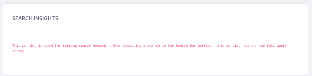
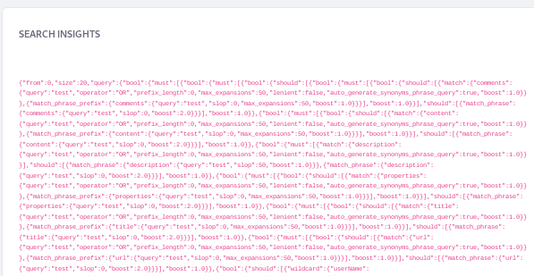

# Search Insights

> **This feature is intended for testing and development only** \
> **Works with Elasticsearch only**

The Search Insights Widget, when added to a Search Page, is for inspecting two things: 

- The query string that's constructed by the back-end search code when the User enters a keyword

- The response string returned from the search engine

```{note}
The JSON returned as a request string is pruned from several Elasticsearch query defaults for clarity. To see the full request JSON that Elasticsearch processed, adjust the [Elasticsearch server's logging](https://www.elastic.co/guide/en/elasticsearch/reference/6.x/logging.html).
```

With the _Enable Score Explanation_ option (enabled by default), the Insights widget also prints a relevance score explanation for each returned result.

When Elasticsearch processes a search query, it returns results. The concept of _Relevance_ determines how well results match the query. The Score explanation for returned search documents helps clarify seemingly odd results, letting you adjust the relevancy scoring process by _boosting_ results---making matches in certain fields count for more.

## Inspecting The Search Query String

To see the Search Insights widget in action, navigate to a Search Page in your test server and add it from the Add menu ().



Once you search for keywords that return Search Results, the Search Insights portlet displays the returned query string in all its glory. 



Some enhancements to the Search Insights interface were introduced in Liferay 7.4; you can browse the formatted JSON of the request and the response in the widget, and copy either with the click of a button.

## Explaining Search Results

To enable or disable the Explain option,

1. Open the Search Insight widget's Configuration screen.

1. There's just one boolean field enabled by default: Enable Score Explanation. De-select it to disable the explanation of each result's relevance score.

Under the hood, the Explain option in the Search Insights widget exposes an Elasticsearch API: [Explain](https://www.elastic.co/guide/en/elasticsearch/reference/7.x/search-explain.html). See the Elasticsearch documentation for more details.

Here's an abbreviated portion of the response's scoring explanation for the Search Document of the Test Test User when the searched keyword was _test_:

```json
_explanation":{  
   "value":9.461341,
   "description":"sum of:",
   "details":[  
      {  
         "value":9.461341,
         "description":"sum of:",
         "details":[  
            {  
               "value":1.0,
               "description":"emailAddress:*test*",
               "details":[  

               ]
            },
            {  
               "value":5.0,
               "description":"userName:*test*^5.0",
               "details":[  

               ]
            },
            {  
               "value":0.72928625,
               "description":"sum of:",
               "details":[  
                  ... 

            { 
               "value":1.0027686,
               "description":"sum of:",
               "details":[  
                  ...
                  {  
            {  
               "value":0.72928625,
               "description":"sum of:",
               "details":[  
                  ...
            {  
               "value":1.0,
               "description":"screenName:*test*",
               "details":[  

               ]
            }
         ]
      },
      ...
   ]
}}]}
```

Now you can see the entire query string, the response string, and how each returned Search Document was scored.
