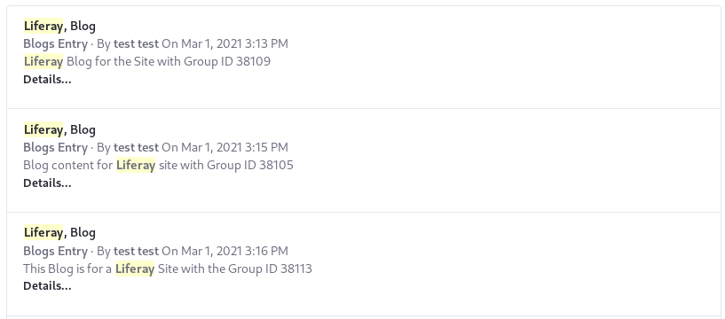

# Custom Filter Examples

The Custom Filter widget is a powerful aid to your search tuning efforts. Without deploying custom code you can exert control over the query sent to the search engine. Some common use cases are presented here to help you understand how to approach the Custom Filter widget:

- Excluding Content from Search Results, based on a field's value
- Boosting Content in Search Results, based on a field's value or presence
- Using Elasticsearch's Query String query in the Custom Filter widget 
- Filtering by Site ID to display results from multiple sites

See [Filtering Search Results](./filtering-search-results.md) for a detailed explanation of the Custom Filter widget.

## Excluding Certain Content

When used with a `must_not` Occur configuration, the Custom Filter can catch and exclude documents from the Search Results.

### Excluding Certain Documents and Media Content

Sometimes, you may want to exclude certain types of content from appearing in the Search Results. To exclude Documents and Media file entries that are only present in the system to be added to Web Content, you must first distinguish the particular files to exclude, in a way that they can be . You can tag them with something that declares their purpose (`wconly`, perhaps) or you can put them into a dedicated [Documents and Media Folder](./../../../content-authoring-and-management/documents-and-media/uploading-and-managing/creating-folders.md ). To configure a Custom Filter to exclude a Documents and Media Folder, use these settings:

**Filter Query Type:** `Match`

**Filter Field:** `folderId`

**Filter Value:** `41103`

**Occur:** `must_not`

This configuration ensures that search documents containing a `folderId` field with the value `41103` are not returned in the search results.

### Excluding Documents and Media with Certain Extensions

Perhaps you need to exclude GIF files from appearing in the search results. Configure a Custom Filter like this:

**Filter Query Type:** `Match`

**Filter Field:** `extension`

**Filter Value:** `gif`

**Occur:** `must_not`

This configuration leverages the presence of the `extension` field indexed from the Documents and Media [`DLFileEntry` model](https://github.com/liferay/liferay-portal/blob/[$LIFERAY_LEARN_PORTAL_GIT_TAG$]/modules/apps/document-library/document-library-service/src/main/java/com/liferay/document/library/internal/search/spi/model/index/contributor/DLFileEntryModelDocumentContributor.java#L158). It ensures that search documents containing an `extension` field with the value `gif` are not returned in the search results.

## Boosting Fields

Boosting certain documents based on specific fields is a common need, and it's readily accomplished with the Custom Filter widget. The boost value often needs tuning to meet your needs. Use the Search Insights widget, with _Enable Score Explanation_ enabled, to inspect how the documents are being scored and to fine-tune your boost values.

### Boosting Matches to Designated Fields

To boost a document with certain fields that match the searched keywords, configure a Custom Filter like this:

**Filter Query Type:** `Multi Match`

**Filter Field:** `title_en_US, content_en_US`

**Occur:** `Should`

**Boost:** `100`

**Custom Parameter Name:** `q`

This configuration lets you boost matching documents if the English (United States) title and content contains the keywords entered by the user in the Search Bar widget. Entering the Custom Parameter Name with the same value as the Search Bar's Keywords Parameter Name configuration means that the value passed in to the Search Bar is the value that's boosted by the Custom Filter (if it matches with documents in the search index).

Using the Multi Match query allows you to match multiple fields at once. Otherwise you'd need to configure a Custom Filter for each separate field, even if the rest of the configuration values are identical.

### Boosting by a Field's Presence

To boost any content that's tagged, regardless of what the tag value is, configure a Custom Filter like this:

**Filter Query Type:** `Exists`

**Filter Field:** `assetTagNames`

**Occur:** `should`

**Boost:** `100`

If a document matching the query is tagged, it will contain a `assetTagNames` field. The Exists query is used to match based on any value for the field. 

## Filtering by Site ID

There's no configuration that allows you to search multiple sites from one Search Page without searching all of them. To include results from the current site and all [child sites](../../../site-building/building-sites/site-hierarchies.md) you'll need to configure the Search Bar's Scope, setting it to _Everything_. After that, you'll use one parent Custom Filter to with a Bool query, to set up a filter that can collect child query clauses, each of which will be contributed by a Custom Filter widget with a term query for matching the `groupId` of a site to include in the search results. The Site's ID is the `groupId` field in the search document.

1. Create 3 sites:
   - Create at least one parent site with a child site.
   - Create at least one additional site that won't be included in the search.

   ```tip::
      To find the Group ID of a site, in the site menu navigate to Configuration > Settings. The displayed `Site ID` is the ``groupId`` you can use to filter the site.
   ```

1. Create at least one piece of content in each site (a Blogs Entry), and include the word _Liferay_ in each.

1. Set the Search Bar scope to _Everything_.

   > **Checkpoint:** Search and see that content from all the sites is returned

   

1. Configure a parent Custom Filter:

   **Filter Query Type:** `Bool`

   **Occur:** `Filter`

   **Query Name:** `SiteBoolQuery`

1. Configure a Custom Filter for each site to include in the search:

   **Filter Query Type:** `Term`

   **Filter Field:** `groupId`

   **Occur:** `should`

   **Parent Query:** `SiteBoolQuery`

   **Filter Value:** `38109`

   For the example content form the above screenshot, one more Custom Filter is needed. Configure it identically to the above with one exception: the Filter Value is `38105`.

   > **Checkpoint:** Search again and confirm that content from only the designated sites is returned. This can be further confirmed by looking at the details view if the search results are configured to _Display Results in Document Form_.

   

Importantly, the filters by `groupId` declare the `SiteBoolQuery` as the parent query. The _should_ Occur clauses in the child Term queries (for each site) act as an OR operator, so that if any of the `groupId`s are matched, its content can be displayed in the Search Results widget.

## Complex Filter with Query String

Sometimes you can avoid the need for multiple queries (as in the [Filtering by Site ID](#filtering-by-site-id) example), by using the [Query String query](https://www.elastic.co/guide/en/elasticsearch/reference/7.x/query-dsl-query-string-query.html). The below configuration demonstrates how you can use only one Custom Filter widget to limit the constrain the search to

* Match Documents and Media files with `pdf` or `jpg` extensions OR
* Match Web Content Articles

Configure the Custom Filter widget like this:

**Filter Query Type:** `Query String`

**Occur:** `Filter`

**Filter Value:** `((extension:pdf OR extension:jpg) AND entryClassName:com.liferay.document.library.kernel.model.DLFileEntry) OR entryClassName:com.liferay.journal.model.JournalArticle`

Using parentheses is recommended to ensure that your intended precedence is enforced.

Simplifying the configuration of a search page (often a complex case is handled with just one Custom Filter widget) is nice, but the Query String query is not the answer to all complexity in the custom Filter widget. Some queries cannot be mimicked using the Query String type. For example, it cannot handle Nested queries to search nested documents, Term queries to avoid analysis, or Prefix queries to search based on prefixes.

```warning::
   The Query String query should not be used if the value it's being passed is coming from the search bar (as demonstrated in `Boosting Matches to Designated Fields`_. If the Search Bar's user enters a keyword containing invalid syntax, an error is returned.
```

## Related Content

- [Filtering Search Results](./filtering-search-results.md)
- [Result Rankings](../../search-administration-and-tuning/result-rankings.md)
- [Synonym Sets](../../search-administration-and-tuning/synonym-sets.md)
