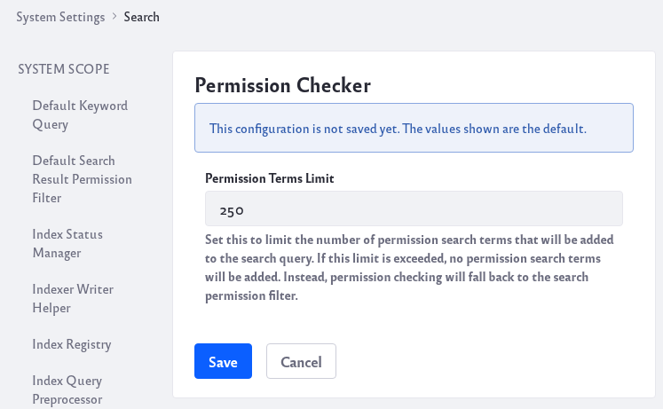
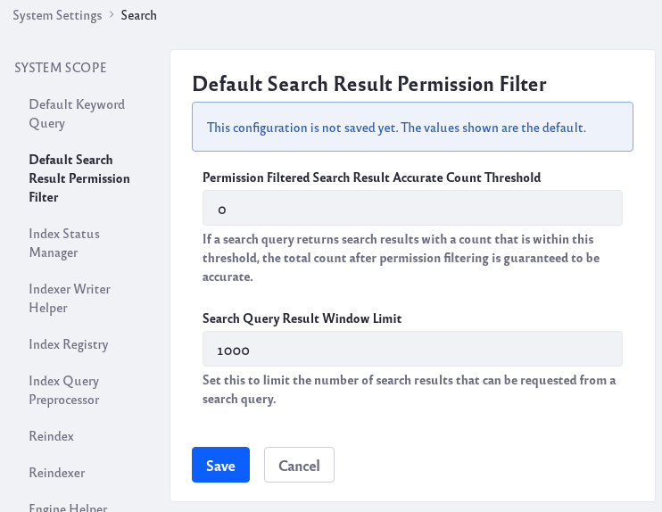
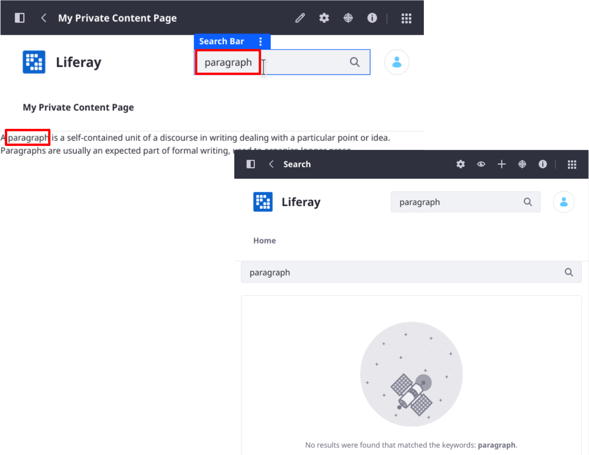
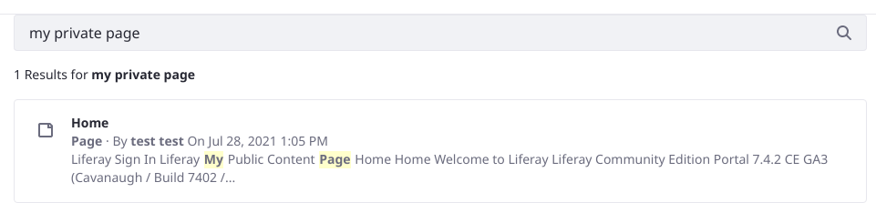
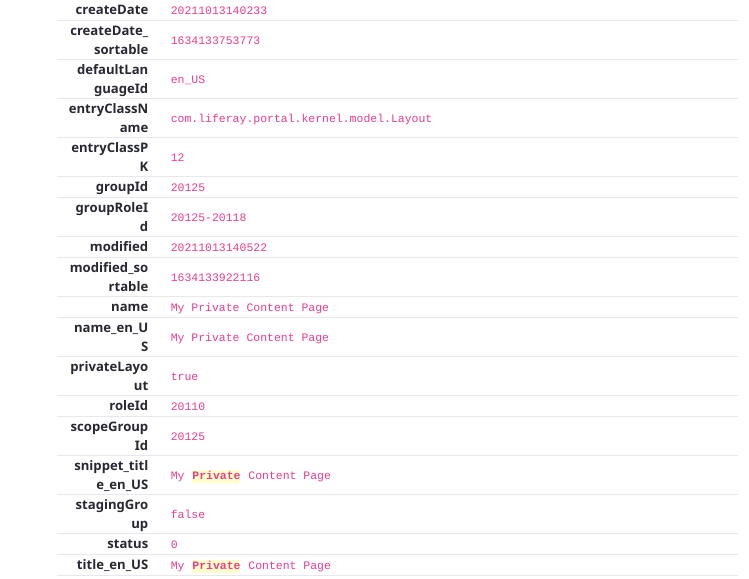

# Search Results Behavior

Previously, you [learned](./configuring-the-search-results-widget.md) how to display search results. There are additional Search Results concepts and configurations that can enhance your search results:

* [Filtering search results with facets](#filtering-results-with-facets)
* [Understanding search results relevance](#search-results-relevance)
* [The effect of permissions on search results](#permissions-and-search-results)
* [Search results in the staging environment](#search-and-staging)
* [Search results when Publications are enabled](#search-and-publications)
* [Search results summaries](#result-summaries)
* [Search results term highlighting](#highlighting)
* [Search results and content pages](#returning-pages-in-search-results)
* [Returning Objects in Search Results](#returning-objects-in-search-results)

## Filtering Results with Facets

Results are filtered using facets. Users enter a search term and see a list of results and search facets, which you can think of as buckets that group results together if they share a common characteristic.

Administrators can configure facets. Read about [Search facets](../search-facets/facets.md) to learn more.

## Search Results Relevance

The search engine uses relevance---a score calculated by the search engine---to rank results. Numerous factors contribute to the total score of a returned document, which depend on the search engine being used:

* [Elasticsearch](https://www.elastic.co/guide/en/elasticsearch/reference/7.x/index-modules-similarity.html#bm25)
* [Solr](https://lucene.apache.org/solr/guide/8_0/relevance.html)

[Result Rankings](../../search-administration-and-tuning/result-rankings.md) help you control the order of returned search results. 

## Permissions and Search Results

Users lacking [VIEW permission](../../../users-and-permissions/roles-and-permissions/understanding-roles-and-permissions.md) on an asset don't see it in the search results. A logged-in User with the Site Administrator Role likely sees more search results than a guest. 

There are two rounds of permissions checks. The first permissions check, pre-filtering, happens in the search engine's index. It's faster than checking database permissions information, but occasionally the search index can have stale permissions information. To ensure the search engine's index has correct, up-to-date permissions information, Liferay performs a second, last-second permissions check, post-filtering, on the results prior to their display.

### Initial Permissions Checking

The first round of search results permissions filtering adds filter clauses to the search query. This ensures that results return from the search engine pre-filtered, containing only results the current User can view.

This initial permission checking is configurable at Control Panel &rarr; Configuration &rarr; System Settings &rarr; Search &rarr; Permission Checker. 



**Permissions Term Limit:** Limits the number of permission search clauses added to the search query before this level of permission checking is aborted. Permission checking then relies solely on the final permission filtering described below.

The only reason to limit permissions terms is performance. Users with administrative access to lots of Sites and Organizations generate many permissions terms added to the query. Too many terms in a query can make the search engine time out.

### Final Permissions Checking

A final round of permission checking happens prior to presenting results in the UI. For example, the User searches for _liferay_, and the search engine returns all relevant forum posts. As Search Results iterates through the list of relevant forum posts, it performs one last permission check of the post to ensure the User can view the post and its categories. If a matching forum post exists in a category the User doesn't have permission to view, it's excluded from the list of search results.

This final round of permission checking is configurable at Control Panel &rarr; Configuration &rarr; System Settings &rarr; Search &rarr; Default Search Result Permission Filter. It includes two settings:



**Permission Filtered Search Result Accurate Count Threshold:** Specifies the maximum number of search results to permissions-filter before results are counted. A higher threshold increases count accuracy, but decreases performance. Since results in the currently displayed page are always checked, any value below the search results pagination delta effectively disables this behavior.

**Search Query Result Window Limit:** Sets the maximum batch size for each permission checking request. This is again impacted by pagination. For example, if there are 100 results per page, and a User wants to jump all the way to page 200 of the search results, all results between page one and 200 must be checked to ensure the User has permission. That's 20,000 results to permissions check. Doing this in one trip to and from the search engine can result in performance issues. Set the maximum batch size for each permission checking request.

## Search and Staging

With [staging](../../../site-building/publishing-tools/staging/managing-data-and-content-types-in-staging.md), content is placed first in a preview and testing environment before being published publicly (on the live Site). Content added to the search index is marked so that the search API can decipher whether an item is live or not. In the live version of the Site, only content that's marked for the live Site is searchable. In the staged version of the Site, all content live or staged is searchable.

## Search and Publications

With [Publications](../../../site-building/publishing-tools/publications.md) enabled, content is associated with a specific Publication. Content added to a Publication is marked so that the search API can decipher whether an item is in production or not. In the production version of the Site, only content that's been [published](../../../site-building/publishing-tools/publications/making-and-publishing-changes.md#publishing-your-changes) can be returned in search results. In an ongoing Publication, production content and content for that specific Publication can be returned.

## Result Summaries

A result summary includes the information from a document that the asset's developer felt is most useful to those searching for the asset. Each asset can have different fields included in the summary. For assets with text content, a common summary format includes the title and some of the content, with title displayed first. The asset type always appears on the second line, and a snippet of the content that matches the search term is on the last line. Assets without content fields, like Documents and Media documents, display the description instead.

```{note}
Users are different. Only the User's full name and the asset type (User) appear in User result summaries.
```


For assets that contain other assets (Web Content and Documents & Media folders) or whose content is not amenable to display (Dynamic Data List Records and Calendar Events), it makes more sense to display the title, asset type, and description in results summaries. 


The asset developer determines which fields are summary-enabled, but there's logic invoked at search time that determines precisely the part of the summary fields to display. For example, a `content` field can have a lot of text, but the summary doesn't show it all. Instead, it shows a relevant snippet of the field's text. If the keyword searched for is present in the summary field, that portion of the field is used in the summary. In addition, the matching keyword is highlighted in the summary.

To determine which fields to include in the result summaries, the Search Results widget takes three things into consideration:

1. Asset-specific fields to include in the Summary are defined in `ModelSummaryContributor` Java classes (Liferay's own classes and those deployed by third party developers). Older implementations of this logic were provided by `Indexer.getSummary`

1. Fields available for display in the Search Results summaries are defined by the Search Results display logic ([`SearchResultsSummaryDisplayBuilder`](https://github.com/liferay/liferay-portal/blob/[$LIFERAY_LEARN_PORTAL_GIT_TAG$]/modules/apps/portal-search/portal-search-web/src/main/java/com/liferay/portal/search/web/internal/result/display/builder/SearchResultSummaryDisplayBuilder.java) and [`SearchResultsSummaryDisplayContext`](https://github.com/liferay/liferay-portal/blob/[$LIFERAY_LEARN_PORTAL_GIT_TAG$]/modules/apps/portal-search/portal-search-web/src/main/java/com/liferay/portal/search/web/internal/result/display/context/SearchResultSummaryDisplayContext.java)).

1. The [Widget Template]( ./../../../site-building/displaying-content/additional-content-display-options/styling-widgets-with-widget-templates.md ) used by the [Search Results](./configuring-the-search-results-widget.md) widget (_List_ by default) has the final word in all things related to Search Results display, including which of the available fields are included in the summary.

## Highlighting

Search terms appearing in the summary are <mark>highlighted</mark> by default. If this is undesirable, disable it in the
[widget configuration screen](./configuring-the-search-results-widget.md#displaying-search-results). 


Highlighting is a helpful visual cue that hints at why the result is returned, but beware. A hit can score well and thus be returned near the top of the results, without having any highlights in the summary. That's because not all indexed fields appear in the summary. Consider a User named Arthur C. Clarke. He has an email address of *acc@authors.org*, which is searchable. Because results summaries for Users only contain the full name of the User, searching for Mr. Clarke by his email address returns the User, but no term is highlighted.


## Returning Pages in Search Results

In Liferay 7.2+, [page content](../../../site-building/creating-pages/using-content-pages.md) from public content pages is returned in the Search Results widget. For example, you can search for text found in a Paragraph fragment on a public page.

By contrast, in the latest Liferay 7.2 and 7.3, and all Liferay 7.4+ releases, page content on private content pages and staged pages is not indexed and thus not returned in the list of search results, regardless of the User's permission to view the page.



Although the content field is not indexed and searchable for private or staged pages, other fields are available. For example, the title field of both public and private content pages is indexed in 7.2+, so searching for keywords that match private content page titles still produces hits in the Search Results widget.



To discover which fields are indexed for content pages, enable the Search Results widget's _Display Results in Document Form_ setting. See [Inspecting Search Engine Documents](./configuring-the-search-results-widget.md#inspecting-search-engine-documents) for more details.



## Returning Objects in Search Results

Liferay 7.4 includes [Liferay Objects](../../../building-applications/objects.md), a GUI-driven application-building framework. Fields of each Object's definition can be declared searchable; Object Entries (the records submitted by the application's users) [can then be queried](../../getting-started/searching-for-content.md#searching-for-liferay-objects) and returned in the Search Results widget.


