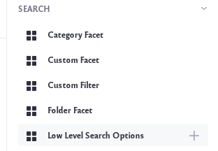
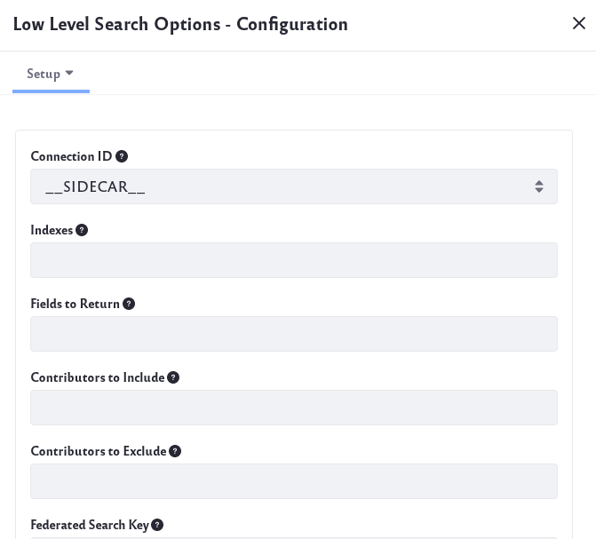
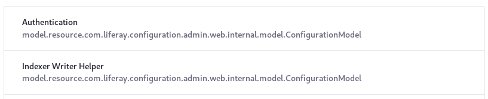
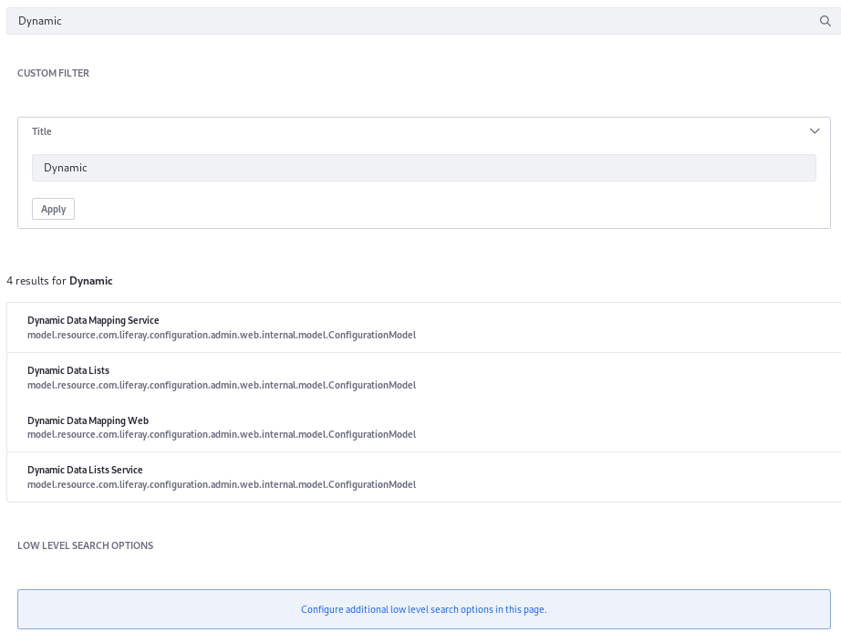
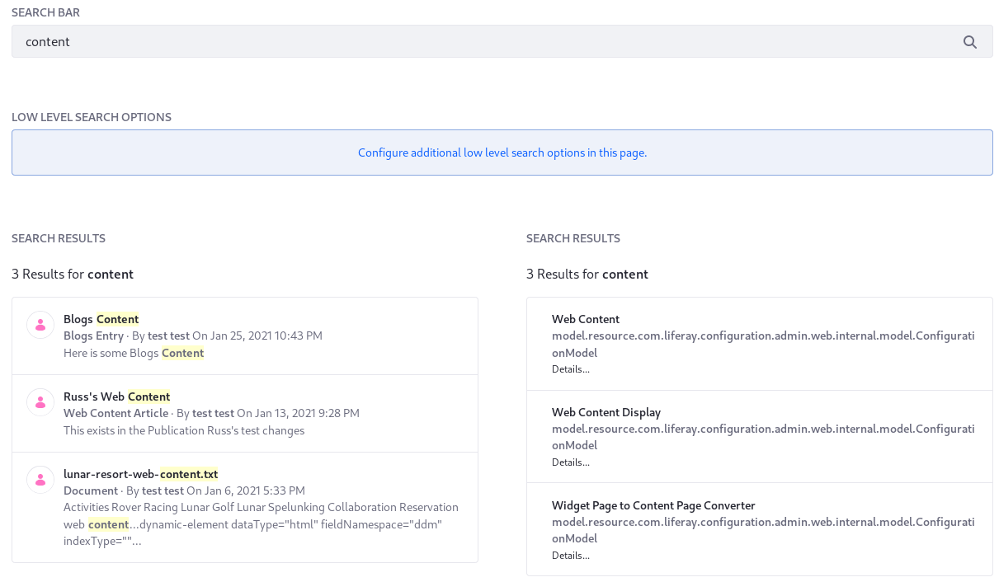

# Understanding Low Level Search Options

> Low level search works only with [Elasticsearch](../../installing-and-upgrading-a-search-engine/elasticsearch.html).

Low level search doesn't go through the Search and Indexing Framework, which is infrastructure used for searching documents in a Liferay search index.

A common use case for a low level search is to query an index other than the Liferay DXP index. By default, [Search Pages](../working-with-search-pages/search-pages.md) search the Liferay DXP index, but you can also search another index, as long as it's in the same Elasticsearch cluster.

Add the Low Level Search Options widget to a search page and configure it to direct the search to the alternate index. To search multiple indexes from the same page, you can add multiple Low Level Search Options widgets and configure each one with its own Index Name and Federated Search Key.

Searching alternate indexes is a low level operation that bypasses the Liferay DXP permission checking mechanisms, presenting whatever results the search engine returns. For this reason, only administrators can add and configure the Low Level Search Options widget.

To use the Low Level Search Options widget, add it to a Search Page:

1. Click the Add icon () on the page to open the Add Widgets menu.

   

1. Drag the Low Level Search Options widget (from the Search section) and drop it on the page.

1. Click the Options icon () and click *Configuration*.

   

The widget has different options to configure:

**[Liferay 7.3] Connection ID:** Select the Connection ID of the connection to be used to perform the search.

**Indexes:** Enter the comma-separated names of the alternative indexes to search. Usually, you shouldn't enter a Liferay company index name.

**Fields to Return:** Enter the names of the stored fields to be returned from the search engine in a comma-separated list. Leave it blank to return all stored fields.

**Contributors to Include:** Enter the IDs of registered search contributors to be included in this search in a comma-separated list of each `SearchRequestContributor`'s Fully Qualified Class Name (e.g., `com.liferay.docs.request.contributor.MySearchRequestContributor`). If not set, all registered search contributors are applied.

**Contributors to Exclude:** Enter the IDs of registered search contributors to be excluded from this search, in a comma-separated list. If not set, all registered search contributors are applied.

```note::
   These *Contributors* are components implementing the `com.liferay.portal.search.spi.searcher.SearchRequestContributor` interface (provided by the `com.liferay.portal.search.spi` artifact), which is an extension point (SPI) that intercepts search requests and adds query parts.
```

**Federated Search Key:** Enter the key of an alternate search this widget is participating in. If not set, this widget participates in the default search. This value is usually the name of an application-defined index.

## Displaying Low Level Search Results

Assets indexed into a Liferay company index (e.g, `liferay-20097`) can implement a `ModelSummaryContributor` to provide their own display logic that's used by the Search Results widget. Low level searches use different display logic since there's no summary to draw from:

* If only one field is configured, it appears as the title field (large, bold text is presented).
* If two fields are present, the first is used as the title (large, bold text) and the second is the description field.
* If more than two fields are present, the first is used as the title field (with large, bold text), and the rest are mashed up as a description field.



## Low Level Search and Permission Checking

Permissions checking is not available via low level search. If you search even a company index using low level search, important [permission checking](../search-results/search-results-behavior.md#permissions-and-search-results) is circumvented. You almost always want the benefits of permission checking, but one possible use case for intentionally bypassing the permission checks is an admin-only search page where anyone accessing the search page must have access to all results in the company index.

## Low Level Search and Relevance

Relevance scoring only makes sense within an index. Results coming from separate indexes cannot be accurately scored relative to each other. Therefore, it's best to display the results from each index in a separate Search Results widget. The example below  demonstrates this.

## Example 1: Searching an Alternate Index

1. Whether testing on the default search page or creating a new [Search Page](../working-with-search-pages/search-pages.md), include the following widgets (removing extra widgets simplifies the exercise, but is not required for it to work):

    * Low Level Search Options
    * Custom Filter
    * Search Bar
    * Search Results

1. Configure all the widgets to participate in an alternate search by clicking the Options icon () and selecting *Configuration*. For each, enter *liferay-0* in the Federated Search Key setting.

   All the search widgets expected to react appropriately to the alternate search must be configured with the Federated Search Key.

1. Make an additional configuration in the Low Level Search Options widget, adding the index name of the alternate index:

   Enter at least one index name in the *Indexes* setting. To follow this example, use *liferay-0*.

1. Configure the Custom Filter to use the search bar's default query parameter (*q*) and add a query to the search:

   Enter _q_ in the Custom Parameter Name field.

   Enter _title_ under Filter Field to add the title field to the query.

   Choose _Match_ under Filter Query Type.

   Since you’re overriding the default query to search an alternate index, there's nothing in the query by default. Any query clauses you want sent to the search engine must be added manually using [Custom Filter](./filtering-search-results.md) widget(s).

   ```important::
      Set the Custom Parameter Name to ``q`` to match the default value in the Search Bar's Keywords Parameter Name setting. The matching parameter ensures that the user's keywords, entered into the search bar, are applied to the Custom Filter widget. If a custom value is set in the Keywords Parameter Name of the Search Bar, use that instead of ``q``.
   ```
If you’re following the example here to search *liferay-0*, search for *dynamic* in the search bar. You'll see results like this:



## Example 2: Searching the Liferay Company Index and an Additional Index

To set up a [Search Page](../working-with-search-pages/search-pages.md) that displays one set of results from Liferay's company index (e.g, `liferay-20098`) and another from some alternate index of interest in [Liferay's Elasticsearch cluster](../../installing-and-upgrading-a-search-engine/elasticsearch.rst) (this example uses `liferay-0` for demonstration purposes):

1. Add these widgets to a [new page called _Low Level Search_]( ./../../../site-building/creating-pages/using-widget-pages/adding-widgets-to-a-page.md): 

   - One Low Level Search Options
   - Two [Search Bars](../../getting-started/searching-for-content.md#using-the-search-bar)
   - Two [Search Results](./configuring-the-search-results-widget.md)
   - One [Custom Filter](./filtering-search-results.md)

   ```tip::
      The 1-2-1 Columns (50/50) `page layout <./../../../site-building/creating-pages/page-settings/configuring-individual-pages.md#page-layout>`__ is convenient for this example.
   ```

1. Configure the widgets:

   |Search Widget|Widget Configuration|Explanation|
   |-------------|---------------------|-----------|
   | Low Level Search Options | **Indexes:** `liferay-0`<br />**Federated Search Key:** `liferay-0` | This sets up the search for an alternate index. In this case it's another Liferay controlled index, for demonstration purposes only. The Federated Search Key can be any memorable string. Since this example searches only for a single additional index, it's named identically to the index itself. |
   | Search Results (first) | - | Out of the box, the Search Results widget is pre-configured for the Liferay company index, so this one can be left with all the defaults. |
   | Search Results (second) | **Federated Search Key:** `liferay-0` | There are additional configurations, like controlling which fields to display. Leaving this option blank asks [Liferay to figure it out](#displaying-low-level-search-results). |
   | Search Bar (first) | - | Leave the defaults in the first Search Bar, since it's configured to search the company index out of the box. |
   | Search Bar (second) | **Invisible:** `true`<br />**Federated Search Key:** `liferay-0` | Only one Search Bar is used for user input, so this one should be invisible. Importantly, you left the default value for Keywords Parameter Name in both Search Bar widgets. This Search Bar can ingest the search terms entered by users because it shares the parameter with the visible Search Bar on the page. |
   | Custom Filter | **Filter Field:** `title_en_US`<br />**Occur:** `should`<br />**Custom Parameter Name:**`q`<br />**Invisible:** `true`<br />**Federated Search Key:** `liferay-0` | The Custom Filter widget should match the title field of the `liferay-0` index. If you want more filters, add more Custom Filter widgets to the page. |

   ```important::
      Set the Custom Parameter Name to ``q`` to match the default value in the Search Bar's Keywords Parameter Name setting. The matching parameter ensures that the user's keywords, entered into the search bar, are applied to the Custom Filter widget. If a custom value is set in the Keywords Parameter Name of the Search Bar, use that instead of ``q``.
   ```

To test out the Low Level Search page functionality,

1. Add at least one asset in the Site (e.g., Blogs Entries, Web Content Articles, etc.) and include the word _content_ in any assets you create. 

1. In the Search Bar on the Low Level Search page, enter _content_ and see that you get results from both indexes.



Now you're able to configure the out of the box search widgets to participate in searches against any Elasticsearch index in the cluster.
