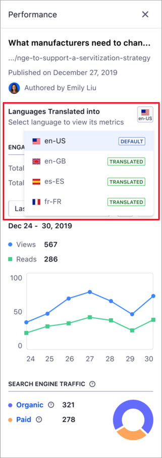

# コンテンツパフォーマンスツールを使用したコンテンツメトリクスの分析

> 対応可能：Liferay 7.3以降

[コンテンツダッシュボード](./about-the-content-dashboard.md)のコンテンツパフォーマンスツールを使用して、既読数と閲覧数、トラフィックチャンネル、サイトにユーザーを誘導するキーワードなど、コンテンツに関するメトリクスを分析できます。 コンテンツパフォーマンスサイドバーを使用して、コンテンツチームはコンテンツ戦略の実行を定期的に評価し、定量的データに基づいてこの戦略を適応させることができます。


コンテンツパフォーマンスにアクセスするには、次の条件を満たす必要があります。

  - コンテンツの表示および編集権限がある。
  - コンテンツが、 [ディスプレイページテンプレート](../../site-building/displaying-content/using-display-page-templates/displaying-content-with-display-page-templates.md)（ *ページ*（）アイコン で示される）に基づいている。
  - Liferay DXPインスタンスがアクティブに有効な[Liferay Analytics Cloudへの接続](https://learn.liferay.com/analytics-cloud/latest/en/getting-started/connecting-data-sources/connecting-liferay-dxp-to-analytics-cloud.html)があり、サイトが同期されている。

コンテンツパフォーマンスサイドバーを開くには：

1.  確認するコンテンツの横にある*アクション*メニュー（）をクリックし、*[統計情報を表示]* を選択します。
2.  または、コンテンツの上にカーソルを置き、*[統計情報を表示]*（）アイコンをクリックします。

コンテンツダッシュボードの外部からパフォーマンスメトリクスにアクセスすることもできます。 *[統計情報を表示]* ボタンは、Webコンテンツのレイアウトを編集する権限がある場合、Webコンテンツの閲覧モードで使用できます。

![[統計情報を表示]ボタンからコンテンツパフォーマンスメトリクスにアクセスします](../content-performance-panel/analyze-content-metrics-using-content-performance-panel/images/08.png)

コンテンツがさまざまな言語にローカライズされている場合、 *[Languages Translated Into]* セクションで各言語のメトリクスを表示することができます。 これを行うには、言語アイコンセレクターをクリックして、言語を選択します。

```{note}
言語選択は、ローカライズされたコンテンツでのみ使用できます。
```



コンテンツパフォーマンスサイドバーには、2つの異なる領域が含まれています。

  - [エンゲージメント](#engagement)
  - [検索エンジントラフィック](#search-engine-traffic)

## エンゲージメント

この領域には、コンテンツの閲覧数と既読数、およびこれらのメトリクスの時間経過による変化が表示されます。 閲覧数と既読数は、コンテンツパフォーマンスを理解し、コンテンツの洞察を発見するための2つの重要な値です。 ある特定のコンテンツにアクセスする訪問者が、このコンテンツを読むかどうかはわかりません。 コンテンツに訪問するだけのオーディエンス（閲覧数）とコンテンツに興味を持つオーディエンス（既読数）を区別するために、Liferayでは、記事の長さ、言語、スクロール動作などのパラメーターを考慮する特殊なアルゴリズムを使用しています。


デフォルトでは、エンゲージメント領域には、過去7日間の閲覧数と既読数とともに、コンテンツの閲覧数と既読数の総数が表示されます。 ドロップダウン時間セレクターでこの期間を変更し、戻るボタンと進むボタン（ ）を使用して時間の経過に伴う傾向を分析できます。 折れ線グラフの任意の部分にカーソルを合わせると、特定の時間の閲覧数と既読数が表示されます。

```{note}
エンゲージメントチャートで特定の期間にゼロ値が表示されている場合、その期間の情報を収集または分析できなかったことを意味します。
```

## 検索エンジントラフィック

コンテンツパフォーマンスサイドバーのこの部分では、コンテンツへのWebトラフィックを誘導しているソースに関する情報が提供されます。 ソースは次のとおりです。

  - **オーガニック** --- 検索エンジンでコンテンツを検索している人。

  - **有料** --- 有料キーワードでコンテンツを検索している人。

    

図のソースをクリックして（1）、これらのソースに関する追加のメトリクスにアクセスしたり（2）、国別に情報を絞り込んだりできます。 次の表で、これらのメトリクスについて説明します。

| ラベル               | 説明                               |
| ----------------- | -------------------------------- |
| トラフィック量           | あなたのページへの推定訪問者数。                 |
| トラフィックシェア         | コンテンツがトラフィックソースから受信するトラフィックの割合。  |
| 最上位キーワード          | オーガニック検索でトラフィックを誘導している上位5つのキーワード |
| Best Paid Keyword | 有料検索でトラフィックを誘導している上位5つのキーワード。    |

```{note}
キーワードとは、ユーザーがコンテンツを検索するために使用する1つ以上の単語です。
```


## 関連情報

  - [About the Content Dashboard](./about-the-content-dashboard.md)
  - [コンテンツダッシュボードインターフェイス](./content-dashboard-interface.md)
  - [コンテンツのカテゴリとボキャブラリの定義](../tags-and-categories/defining-categories-and-vocabularies-for-content.md)
