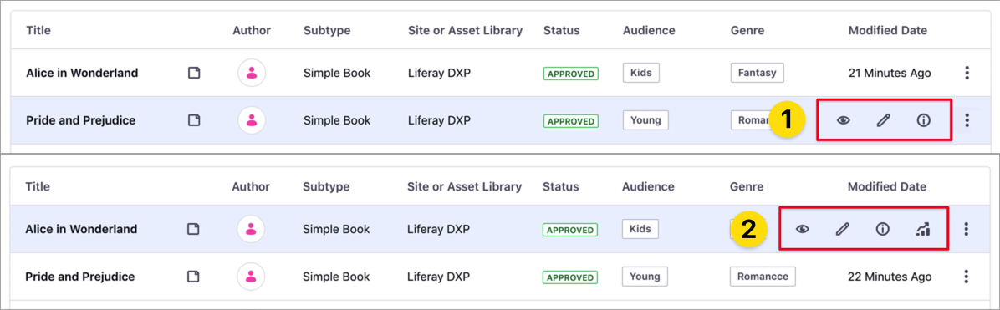

# コンテンツダッシュボードインターフェイス

> 対応可能：Liferay 7.3以降

コンテンツダッシュボードインターフェイスには、次の領域があります。

  - [コンテンツ監査ツール](#content-audit-tool)（1）
  - [コンテンツ一覧](#contents-list)（2）
  - [情報サイドバー](#information-sidebar)（3）
  - [コンテンツパフォーマンスサイドバー](#content-performance-sidebar)（4）


[コンテンツダッシュボードページを開く](#accessing-the-content-dashboard)と、ページ上部に[コンテンツ監査ツール](#content-audit-tool)（1）が表示され、ボタンに[コンテンツ一覧](#contents-list)（2）が表示されます。 コンテンツ一覧から、[情報](#information-sidebar)（3）サイドバーおよび[コンテンツパフォーマンス](#content-performance-sidebar)サイドバー（4）にアクセスできます。 これらのサイドバーは折りたたみ可能な要素であり、コンテンツ一覧の各項目の追加情報が表示されます。

情報サイドバーまたはパフォーマンスサイドバーにアクセスするには、コンテンツのアクションメニュー（）をクリックし、*[Info]* または*[統計情報を表示]* オプションを選択します。  または、記事にカーソルを合わせて、*[Info]*（）または*[統計情報を表示]*（）アイコンをクリックします。

```{important}
パフォーマンスパネルでコンテンツのメトリクスにアクセスするには、Liferay DXPインスタンスをLiferayAnalytics Cloudに接続し、サイトを同期する必要があります。 詳しくは、[Connecting Liferay DXP to Analytics Cloud](https://learn.liferay.com/analytics-cloud/latest/en/getting-started/connecting-data-sources/connecting-liferay-dxp-to-analytics-cloud.html)_を参照してください。
```

## コンテンツダッシュボードへのアクセス

1.  グローバルメニューをクリックし、*[コンテンツ]* エリアで、*[コンテンツダッシュボード]* をクリックします。

2.  グローバルメニューが無効になっている場合は、プロダクトメニューを開き、 *[サイト]* メニューの*[コンテンツ]* → *[コンテンツダッシュボード]* に移動します。

    

## コンテンツ監査ツール

このツールは、[コンテンツダッシュボード]ページの上部にあるグラフィカル領域です。 この領域のグラフは、選択したグローバルボキャブラリのカテゴリの組み合わせに対するアセットの総数を表しています。 この表は以下を考慮に入れています：

  - 全てのサイトとアセットライブラリのWebコンテンツ記事のみ。
  - アクセスできるコンテンツ。
  - [コンテンツ一覧](#contents-list)の既存の[フィルター](#filtering-and-sorting-content-in-the-contents-list)。
  - 最大2つのグローバルボキャブラリ（*x*軸と*y*軸用）。


```{tip}
[コンテンツ監査ツールに期待される表が表示されない場合は、グローバルボキャブラリのカテゴリ](../tags-and-categories/defining-categories-and-vocabularies-for-content.md)[_を確認し、コンテンツが分類されている](../tags-and-categories/organizing-content-with-categories-and-tags.md)_ことを確認してください。 
```

コンテンツ監査ツールのインターフェイスには、次のものがあります。

  - 表の凡例（1）
  - 最初のグローバルボキャブラリの*X*軸カテゴリ（2）
  - 2番目のグローバルボキャブラリの*Y*軸カテゴリ（3）
  - 棒グラフ（4）


### コンテンツ監査ツールでボキャブラリとカテゴリをカスタマイズする

デフォルトでは、棒グラフには、選択したグローバルボキャブラリの各カテゴリのアセットの総数が表示されますが、この情報はさまざまな方法で絞り込むことができます。

  - [コンテンツ一覧](#contents-list)で[フィルター](#filtering-and-sorting-content-in-the-contents-list)を使用する。
  - 表の凡例のカテゴリ名をクリックして、表のカテゴリを絞り込む。
  - ボキャブラリを変更する。

ボキャブラリを変更するには：

1.  [コンテンツ監査]領域の*アクション*メニュー（）をクリックします。

2.  デュアルリストボックスで、*[設定可能一覧]* または*[使用中]* 一覧の[ボキャブラリ]をクリックし、選択ボタン（ ）をクリックして、表示するボキャブラリを追加または削除します。

3.  *[Up]*（）と*[下へ]*（）ボタンをクリックして、表軸のボキャブラリの順番を決めます。

4.  *[保存]* をクリックします。

    

<!-- end list -->

```{note}
グローバルサイトレベルで定義された最大2つのボキャブラリを使用できます。
```

## コンテンツ一覧

デフォルトでは、この領域には、全てのサイトとアセットライブラリにわたってアクセスできるすべてのコンテンツが表示されます。 ここから、組み込みまたはカスタムのフィルターを使用してコンテンツを並べ替えたり絞り込んだりできます。 コンテンツ監査ツールの表は、設定したフィルターに基づいて動的に変化します。

コンテンツ一覧には、次の要素があります。

  - 絞り込みおよびソートのセレクター（1）
  - 絞り込みエディター（2）
  - 検索フィールド（3）
  - コンテンツ一覧（4）


コンテンツの一覧には、次のカラムがあります。

| 列                  | 説明                                                                                                              |
| ------------------ | --------------------------------------------------------------------------------------------------------------- |
| タイトル               | 記事のタイトル。\*                                                                                                    |
| 作成者                | 作成者の名前。                                                                                                         |
| サブタイプ              | 記事の[サブカテゴリ](../tags-and-categories/defining-categories-and-vocabularies-for-content.md#creating-subcategories)。 |
| サイトまたはアセットライブラリ    | Liferay DXPインスタンス内の記事の場所。                                                                                       |
| ステータス              | 記事のワークフローステータス。 ステータスが異なる複数のバージョンの記事には、すべてのステータスが表示されます。                                                        |
| *First Vocabulary* | これは、コンテンツ監査ツールの最初のボキャブラリです。                                                                                     |
| *第二ボキャブラリ*         | コンテンツ監査ツールのオプションの2番目のボキャブラリ。                                                                                    |
| 編集日時               | 最後に記事が更新された日付または時刻。                                                                                             |

（\*）*ページ*（ ）アイコンは、[ディスプレイページテンプレート](../../site-building/displaying-content/using-display-page-templates/displaying-content-with-display-page-templates.md)に基づく記事を示します。

```{note}
[First Vocabulary]カラムと[第二ボキャブラリ]カラムは、選択したボキャブラリによって異なります。
```

コンテンツ一覧の各エントリについて、*アクション*メニュー（）を使用するか、記事にカーソルを合わせて対応するオプションをクリックすると、次のオプションにアクセスできます。

  - *View*（）: 閲覧モードで表示ページを開きます。

  - *編集する*（）: コンテンツを編集モードで開きます。

  - *Info*（）: [情報サイドバー](#information-sidebar)を開きます。

  - *統計情報を表示*（）: [コンテンツパフォーマンスサイドバー](#content-performance-sidebar)を開きます。

    

<!-- end list -->

```{note}
ディスプレイページテンプレートに基づくコンテンツには、[View]、[Info]、および[メトリクス]オプションを使用できます。 コンテンツの編集権限がある場合は、[編集する]オプションを使用できます。
```

### コンテンツ一覧内のコンテンツの絞り込みとソート

コンテンツを絞り込むには：

1.  *[フィルターと並び替え]* ドロップダウンメニューをクリックします。
2.  事前定義されたフィルターの1つを選択するか、またはカスタムフィルター（3つのドットで示される）を選択して、独自の絞り込み基準を作成します。
3.  絞り込みたいコンテンツを選択します。

絞り込みエディター領域には、フィルターと結果の総数が表示されます。 1つ以上のフィルターを削除するには、フィルター名の横にある*[閉じる]*（）ボタンをクリックするか、*[クリア]* をクリックしてすべてのフィルターを削除し、コンテンツ一覧をリセットします。 定義済みのフィルターおよびカスタムフィルターに加えて、検索フィールドのキーワードを使用して、コンテンツビューでアセットを検索および絞り込みできます。


コンテンツをソートするには：

1.  *[フィルターと並び替え]* ドロップダウンメニューをクリックします。
2.  *[ソート順]* セクションで、項目の順序を選択します。

<!-- end list -->

```{note}
[コンテンツダッシュボード]ページを閉じると、デフォルトのフィルターと並べ替えオプションが再度設定されます。
```

## 情報サイドバー

このサイドバーでは、アセットの所有者、コンテンツで利用できる言語、アセットのタグとカテゴリ、レビュー日時など、コンテンツ一覧で選択したアセットのさまざまなメタデータにアクセスできます。


```{note}
コンテンツディスプレイページが関連付けられているアセットの情報サイドバーを開くことができます。 これらのアセットは、アセット名の横にあるページアイコンによってコンテンツ一覧で識別できます。
```

情報サイドバーパネルを開くには：

1.  アセットの横にあるアクションメニュー（）をクリックし、*[Info]* を選択します。

2.  または、アセットの上にカーソルを置き、*[Info]*（）アイコンをクリックします。

    

## コンテンツパフォーマンスサイドバー

このサイドバーには、既読数と閲覧数やWebトラフィックチャンネルなど、コンテンツの統計が表示されます。


次の条件が満たされると、コンテンツ一覧のアセットのコンテンツパフォーマンスサイドバーにアクセスできます。

  - コンテンツの表示および編集権限がある。
  - コンテンツが、[ディスプレイページテンプレート](../../site-building/displaying-content/using-display-page-templates/displaying-content-with-display-page-templates.md)（ *ページ*（）アイコンで示される）に基づいている。
  - Liferay DXPインスタンスに有効な[Liferay Analytics Cloudへの接続](https://learn.liferay.com/analytics-cloud/latest/en/getting-started/connecting-data-sources/connecting-liferay-dxp-to-analytics-cloud.html)があり、サイトが同期されている。

<!-- end list -->

```{note}
これらの条件が満たされると、コンテンツの[メトリクス]オプションが使用可能になります（2）。 [メトリクス]オプションが欠落している場合、1つ以上の条件が満たされていません（1）。
```



パフォーマンスサイドバーパネルを開くには：

1.  アセットの横にあるアクションメニュー（）をクリックし*[統計情報を表示]* を選択します。
2.  または、アセットの上にカーソルを置き、*[統計情報を表示]*（）アイコンをクリックします。

パフォーマンス領域を使用してコンテンツパフォーマンスを分析する方法については、[コンテンツパフォーマンスツールを使用したコンテンツメトリクスの分析](./analyze-content-metrics-using-content-performance-tool.md)を参照してください。

## 関連情報

  - [About the Content Dashboard](./about-the-content-dashboard.md)
  - [コンテンツパフォーマンスツールを使用したコンテンツメトリクスの分析](./analyze-content-metrics-using-content-performance-tool.md)
  - [コンテンツのカテゴリとボキャブラリの定義](../tags-and-categories/defining-categories-and-vocabularies-for-content.md)
