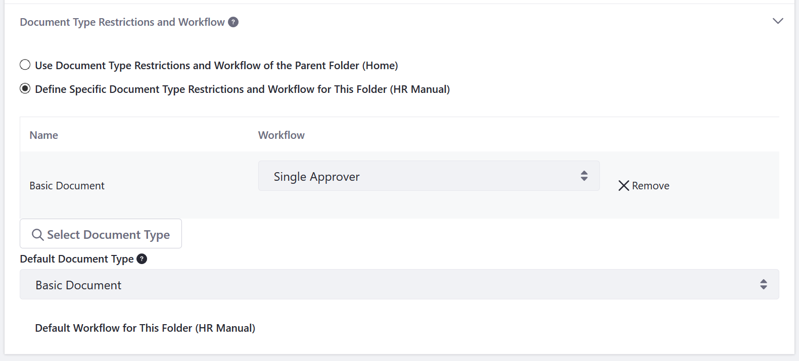

# フォルダの作成

ドキュメントとメディアアプリケーションでは、デジタルアセットを整理するためのフォルダを作成できます。 必要な権限を持つ認証されたユーザーのみがフォルダを管理できます。 詳細については、 [ドキュメントとメディアの権限リファレンス](../publishing-and-sharing/managing-document-access/documents-and-media-permissions-reference.md) および[Roles and Permissions](../../../users-and-permissions/roles-and-permissions/understanding-roles-and-permissions.md)を参照してください。

<a name="adding-a-folder" />

## フォルダを追加する

フォルダを追加する最も簡単な方法は、サイトページにデプロイされた [**Documents and Media**] ウィジェットを使用することです。

1. [**Documents and Media**] ウィジェットがデプロイされているサイトページに移動します。

2.  ウィジェットのタイトルメニューの上にマウスを置き、 **追加** アイコン（）をクリックして [**Folder**] を選択します。

1. 新規フォルダの名前を入力します。

1. オプションで、フォルダの説明を入力し、フォルダの権限を構成できます。

    

1. ［**保存**］ をクリックして新規フォルダを作成します。

5. [**保存**] をクリックします。

<a name="document-type-restrictions-and-workflow" />

## ドキュメントタイプの制限とワークフロー

フォルダを作成した後、特定のドキュメントタイプのみを許可するようにフォルダを制限したり、カスタム[ワークフロー](../../../process-automation/workflow/introduction-to-workflow.md)を追加して、フォルダのコンテンツに対して行われたすべての追加および編集の承認プロセスを決定したりできます。

1. **サイトメニュー** を開き、 [**Content & Data**] &rarr; ［**ドキュメントとメディア**］ に移動します。

1.  サイトの **サイト管理** メニューに移動します。

2. [**Content & Data**] → [**Documents and Media**] の順にクリックします。

3.  フォルダの **アクション** メニュー（）をクリックし、 [**Edit**] を選択します。

4. [**Document Type Restrictions and Workflow**] セクションを展開します。

5. [**Define Specific Document Type Restrictions and Workflow for this Folder（現在のフォルダ**）] をクリックします。

6. [**Select Document Type**] をクリックします。

1. 完了したら、 ［**保存**］ をクリックします。

7.  このフォルダに関連付けるドキュメントタイプの横にある [**Choose**] をクリックします。

8.  このフォルダに関連付けるワークフローを選択します。

    

9.  完了したら、 [**保存**] をクリックします。

## 追加情報

* [ワークフローのアクティブ化](../../../process-automation/workflow/using-workflows/activating-workflow.md)
* [ファイルのアップロード](./uploading-files.md)
* [ドキュメントの公開](../publishing-and-sharing/publishing-documents.md)
* [Enabling Xuggler and ImageMagick for previews](../../../system-administration/using-the-server-administration-panel/configuring-external-services.md)
