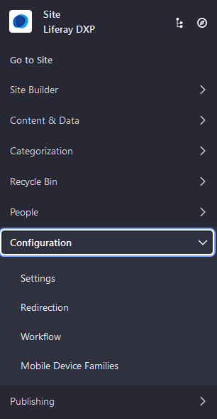

# アセットの自動タグ付けの設定

[アセットのタグ付け](../tagging-content-and-managing-tags.md)は、コンテンツを整理するための優れた方法です。 通常、コンテンツ制作者はコンテンツの作成中にタグを適用します。 コンテンツに自動的にタグを付けることもできます。 たとえば、アップロード時に画像をスキャンして、画像のコンテンツを説明するタグを適用できます。 これにより、コンテンツ制作者が手動でタグを適用しなくても、タグを活用できます。

```{note}
現在、自動タグ付けは、画像、テキストベースのドキュメント、テキストベースのWebコンテンツ、およびブログエントリーに対してのみ機能します。
```

特定のアセットタイプの自動タグ付けの設定については、別途説明します。

  - [Auto Tagging Images](./auto-tagging-images.md)
  - [Auto Tagging Assets](./auto-tagging-assets.md)

自動タグ付けはデフォルトで有効になっています。 次の3つのレベルで設定できます。

  - **グローバル（システム）:** 自動タグ付けを任意のレベルで機能させるには、グローバルに有効にする必要があります。 すべてのポータルインスタンスにデフォルトの自動タグ設定を設定することもできます。

  - **インスタンス:** グローバルに有効にすると、ポータルインスタンスごとに自動タグ付けもデフォルトで有効になります。 ただし、インスタンスごとにグローバル自動タグ設定を上書きできます。

  - **サイト:** インスタンスに対して有効にすると、そのインスタンスのすべてのサイトに対してデフォルトで自動タグ付けも有効になります。 特定のサイトで無効にすることができます。

## グローバル設定

自動タグ付けをグローバルに設定するには、次の手順に従います。

1.  *[コントロールパネル]* → *[システム設定]* に移動します。

2.  *[コンテンツとデータ]* セクションの*[アセット]* をクリックします。

    ![システム設定で[アセット]に移動します。](./configuring-asset-auto-tagging/images/01.png)

3.  [システムスコープ]の下の*[アセットの自動タグ付け]* をクリックします。

4.  チェックボックスをオンにすると、アセットの自動タグ付けが有効になります。

    

5.  **[Maximum Number of Tags]**の値を入力します。 デフォルト値の`0`は、制限がないことを意味します。

6.  完了したら、*[保存]* をクリックします。

すべてのインスタンスにデフォルトの自動タグ付けを設定するには、*[仮想インスタンススコープ]* の下の*[アセットの自動タグ付け]* を選択します。 使用可能な設定は、システムスコープの設定とまったく同じです。

## インスタンスレベルの設定

グローバルに有効にすると、各インスタンスの自動タグ付けもデフォルトで有効になります。 ただし、インスタンスごとに無効化または設定することはできます。

自動タグ付けをインスタンスレベルで設定するには、次の手順に従います。

1.  *[コントロールパネル]* → *[Instance Settings]* に移動します。

2.  *[アセット]* をクリックします。

3.  [仮想インスタンススコープ]の下の*[アセットの自動タグ付け]* をクリックします。

    

4.  ここでの設定はグローバル設定と同じですが、現在のインスタンスにのみ適用されます。

5.  完了したら、*[保存]* をクリックします。

自動タグ付けがインスタンスレベルで有効になりました。

## サイトレベルの設定

1.  *メニュー*（）を開き、サイト名をクリックして、 *[設定]* → *[Settings]* に移動します。

    .

2.  *[一般]* タブで、*[アセットの自動タグ付け]* セクションを展開します。 トグルを使用して、サイトの自動タグ付けを有効または無効にします。

    

3.  *[保存]* をクリックして変更を保存します。

## 追加情報

  - [コンテンツのタグ付け](../tagging-content-and-managing-tags.md)
