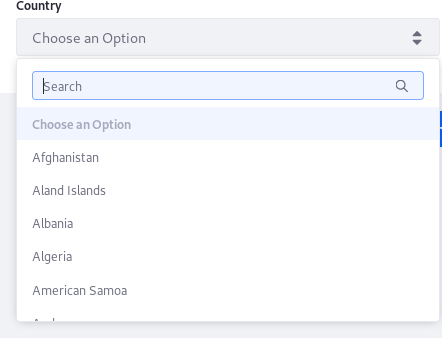

# データプロバイダーを使用したフォームオプションの入力

[リストから選択]フィールドには、多くのオプションを含めることができます。 これらのオプションは、Liferay DXPに登録されているJSON Web サービスや、その他のサードパーティーのREST Webサービスを使用して、自動的に提供することができます。 データプロバイダーの一般的な説明については、[Data Providers Overview](./data-providers-overview.md)を参照してください。 この記事では、JSON Web サービスの呼び出し方法、データプロバイダーの設定方法、フォームへのデータプロバイダーの追加方法について説明します。

## 前提条件

例として、フォームで個人情報を収集する際に、ユーザーの「国」の選択フィールドに入力する場合を考えます。

以下を含む[フォームを作成](../creating-and-managing-forms/creating-forms.md)します。

  - **国**：単一選択フィールド。

次に、`get-countries` JSON Web サービスを使用します（2つありますが、どちらか一方を使用してください）。

1.  <http://localhost:8080/api/jsonws>に移動します。

2.  「get-countries」と検索します。

    

3.  *[Invoke]* をクリックします。

これで、国のリストが使用可能になりました。

### ローカルネットワーク上のデータへのアクセスを有効にする

デフォルトでは、ユーザーはデータプロバイダーがローカルネットワーク上のURLを使用するように設定することはできません。 このデフォルト設定は本番環境におけるセキュリティにとっては適切ですが、テストがしずらくなります。

データプロバイダーからローカルネットワークへのアクセスを有効にするには：

1.  *[コントロールパネル]* → *[設定]* → *[システム設定]* に移動します。

2.  [Content & Data]の下にある*[データプロバイダー]* をクリックします。

3.  *[ローカルネットワークへのアクセス]* チェックボックスにチェックを入れます。

    

4.  完了したら、*[保存]* をクリックします。

## 基本データプロバイダーの追加

*Countries of the World*データプロバイダーを追加するには：

1.  *プロダクトメニュー*（）を開き、*[サイト管理]* メニューのコンパスアイコン（）をクリックします。

2.  フォームを作成するサイトを選択します。

3.  *[Content & Data]* → *[Forms]* の順にクリックします。

4.  *[データプロバイダー]* タブをクリックします。

    ![[データプロバイダー]タブに移動します。](./using-the-rest-data-provider-to-populate-form-options/images/03.png)

5.  追加ボタン（）をクリックします。

6.  次のように入力します：

      - **名前**: Countries of the World
      - **URL**: `http://localhost:8080/api/jsonws/country/get-countries/`
      - **ユーザー名**: `adminuser@liferay.com`
      - **パスワード**: adminuserpass
      - **タイムアウト**: 1000
      - **Outputs Label**: Country Name
      - **Outputs Path**: `$..nameCurrentValue`
      - **Outputs Type**: List

    

7.  完了したら、*[保存]* をクリックします。

<!-- end list -->

```{note}
`nameCurrentValue` の前の `$..` は、JSONデータストラクチャーをナビゲートし、出力へのパスを指定するJsonPath構文です。 詳しくは [JsonPath](https://github.com/json-path/JsonPath) と [こちら](http://goessner.net/articles/JsonPath/) を参照してください。
```

## 入力をフィルターとして使う

上記の例では、*[リストから選択]フィールド*に入力するための出力のみを使用しています。 多くの場合、RESTプロバイダーからの応答をフィルタリングしてから[リストから選択]フィールドに表示する必要があります。 そのためには、データプロバイダーの*[Input]* フィールドが必要です。

例えば、世界の国々に地域（アメリカ、ヨーロッパ、オセアニアなど）のフィルターを適用するとします。

1.  次のように入力します：

      - **名前**: `restcountries`
      - **URL**: `https://restcountries.eu/rest/v2/region/{region}?fields=name`（別のRESTプロバイダーを使用）
      - **Input Label**: Region
      - **パラメーター**: Region
      - **Input Type**: Text
      - **Outputs Label**: Countries of the World with Regions
      - **Outputs Path**: `*$..name*`
      - **Output Type**: List

    これらの値の詳細は、 [データプロバイダーのドキュメンテーション](./data-providers-overview.md)を参照してください。

## データプロバイダーへの権限付与

フォームに入力する前にユーザーの認証が必要かどうかによって、ユーザーはデータプロバイダーに追加の権限を付与する必要があります。 例えば、ゲストがフォームに記入する場合、ゲストには*表示*権限が必要で、その権限がないと、データプロバイダーが提供するオプションを確認できません。

データプロバイダーの権限を設定するには：

1.  *[サイト管理]* → *[Content & Data]* → *[フォーム]* に移動します。

2.  [データプロバイダー]タブをクリックします。

3.  アクションボタン（）をクリックし、データプロバイダーの横にある*[権限設定]* をクリックします。

    

4.  必要な権限を付与します。

5.  完了したら、*[保存]* をクリックします。

## 選択フィールドでのデータプロバイダーを使用する

データプロバイダーを設定したら、それを使用して[リストから選択]フィールドを入力します。

1.  *[Content & Data]* → *[フォーム]* の順にクリックします。

2.  *[リストから選択]* フィールドをフォームにドラッグします。

3.  [Create List]ドロップダウンメニューから*[From Data Provider]* を選択します。

4.  [データプロバイダーを選択]ドロップダウンメニューから*[Countries of the World]* を選択します。

5.  [Choose an Output Parameter]ドロップダウンメニューから*[Country Name]* を選択します。

    ![[リストから選択]フィールドのデータプロバイダーの値を設定します。](./using-the-rest-data-provider-to-populate-form-options/images/05.png)

6.  完了したら、*[フォームを保存]* をクリックします。

データプロバイダーが選択フィールドの入力に使用されるようになりました。



## データプロバイダーのエラーのトラブルシューティング

データプロバイダーの障害によるエラーを発見するには、これらのサービスに対して[ログレベルを設定](../../../system-administration/using-the-server-administration-panel/configuring-logging.md)します。

1.  *[コントロールパネル]* → *[設定]* → *[サーバ管理]* に移動します。
2.  *[Log Levels]* タブをクリックします。
3.  [カテゴリ]フィールドで`com.liferay.dynamic.data.mapping.data.provider.web.internal.DDMDataProviderPortlet`を検索します。
4.  [レベル]フィールドで*[WARN]* を選択します。
5.  完了したら、*[保存]* をクリックします。

データプロバイダーでエラーが発生した場合、コンソールが警告メッセージを送信するようになりました。

## 追加情報

  - [Using the Autofill Rule](../form-rules/using-the-autofill-rule.md)
