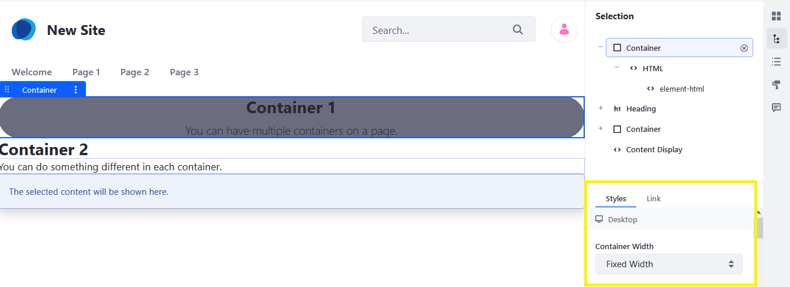
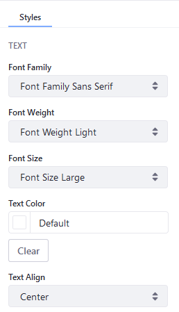

# フラグメントのスタイルリファレンス

このリファレンスには、利用可能なすべてのフラグメントスタイルが記載されています。 [スタイル]メニューにアクセスするには、*[サイト管理]* メニュー → *[サイトビルダー]* → *[Pages]* に移動します。 目的のページの横にある*[編集する]* をクリックして、*選択*（）アイコンをクリックします。

## コンテナの幅

[コンテナフラグメント](./using-fragments.md#using-the-container-fragment)を使用する場合、特にブラウザウィンドウのサイズが変更された場合に、コンテナフラグメントの幅が静的であるかどうかを判断するようにコンテナの幅を設定できます。



| 設定  | 説明                                                       |
| --- | -------------------------------------------------------- |
| 可変  | ブラウザウィンドウのサイズが変更されると、コンテナの幅が変わります。左右のマージンは設定できます（以下を参照）。 |
| 固定幅 | 左右のマージンは固定サイズです。                                         |

```{tip}
スタイルの多くはCSSクラスに対応しています。 CSSの知識がある方は、以下の多くのフィールドに見覚えがあるでしょう。
```

次のスタイルの多くにはトークンが定義されています。詳細は、[Creating a Style Book](../../site-appearance/using-a-style-book-to-standardize-site-appearance.md)および[Style Book Tokens](../../site-appearance/developer-guide/style-book-token-definitions.md)を参照してください。

## マージン

次の設定を使用して、フラグメントのマージンを設定します。

| フィールド | 説明              |
| ----- | --------------- |
| 上マージン | 要素の上マージンを設定します。 |
| 下マージン | 要素の下マージンを設定します。 |
| 左マージン | 要素の左マージンを設定します。 |
| 右マージン | 要素の右マージンを設定します。 |

## パッディング

要素のパディングは、そのコンテンツとその枠線の間のスペースです。

| フィールド  | 説明                     |
| ------ | ---------------------- |
| 上パディング | 要素の上パディング（スペース）を設定します。 |
| 下パディング | 要素の下パッディングを設定します。      |
| 左パディング | 要素の左パッディングを設定します。      |
| 右パディング | 要素の右パッディングを設定します。      |

## サイズ

要素の寸法を設定します。

| フィールド  | 説明                     |
| ------ | ---------------------- |
| 幅      | これは要素の幅です。             |
| 高さ     | これは要素の高さです。            |
| 幅の最小値  | スケーリングする場合、これは最小幅です。   |
| 幅の最大値  | スケーリングする場合、これは最大幅です。   |
| 高さの最小値 | スケーリングする場合、これは高さの最小です。 |
| 高さの最大値 | スケーリングする場合、これは高さの最大です。 |

### オーバーフロー

オーバーフロープロパティは、コンテンツが要素のボックスをオーバーフローした場合の動作を指定します。

このプロパティは、要素のコンテンツが大きすぎて指定した領域に収まらない場合に、コンテンツをクリップするか、スクロールバーを追加するかを指定します。

| フィールド | 説明                                                 |
| ----- | -------------------------------------------------- |
| デフォルト | デフォルトは*[閲覧可能]* です（下記参照）。                            |
| 閲覧可能  | オーバーフローはクリップされません。 要素のボックスの外側にレンダリングされます。          |
| 非表示   | オーバーフローはクリップされ、残りのコンテンツは表示されません。                   |
| スクロール | オーバーフローはクリップされますが、残りのコンテンツを表示するためにスクロールバーが追加されます。  |
| 自動    | オーバーフローがクリップされた場合は、残りのコンテンツを表示するためにスクロールバーが追加されます。 |

## テキスト



| フィールド     | 説明                                                                  |
| --------- | ------------------------------------------------------------------- |
| フォントファミリー | 要素のフォントを指定します。                                                      |
| フォントの太さ   | テキスト内の太字または細字の表示方法を設定します。                                           |
| フォントサイズ   | フォントのサイズを設定します。                                                     |
| テキストの色    | テキストの色を選択します。                                                       |
| テキストの配置   | 要素内のテキストの水平方向の配置を指定します。 *[左]*、 *[右]*、 *[中央揃え]*、または*[両端揃え]* から選択します 。 |

## 背景

| フィールド | 説明                                                                                                       |
| ----- | -------------------------------------------------------------------------------------------------------- |
| 背景色   | パレットから背景色を選択します。                                                                                         |
| 画像ソース | *[手動選択]* に設定すると、ユーザーは背景画像をアップロードできます。 *[コンテンツのマッピング]* に設定すると、ユーザーはWebコンテンツ、ドキュメントとメディア、またはブログアセットから選択できます。 |

## 枠線

| フィールド | 説明                          |
| ----- | --------------------------- |
| 枠線の幅  | 要素の4つの枠線の幅を設定します。           |
| 枠線の角丸 | 要素の角の半径を定義し、丸みを帯びた角を追加できます。 |
| 線の色   | 要素の4つの枠線の色を設定します。           |

## 効果

| フィールド | 説明                               |
| ----- | -------------------------------- |
| 不透明度  | 透明度レベルを設定します。 100がデフォルトで、0は透明です。 |
| 影     | ボックスの周りに影を追加します。小、中、大の影から選択できます。 |

## 追加情報

  - [Configuring Fragment Styles](./configuring-fragment-styles.md)
  - [Content Pages Overview](./content-pages-overview.md)
  - [フラグメントの使用](./using-fragments.md)
  - [新しいスタイルブックの作成](../../site-appearance/using-a-style-book-to-standardize-site-appearance.md)
  - [Style Book Tokens](../../site-appearance/developer-guide/style-book-token-definitions.md)
