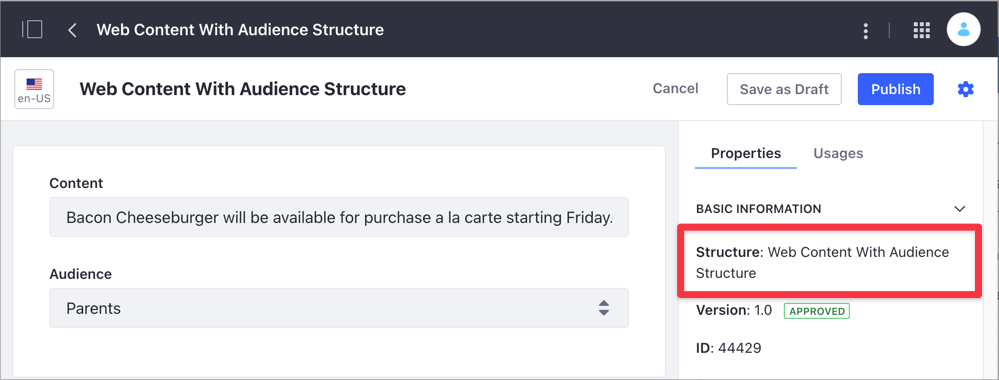
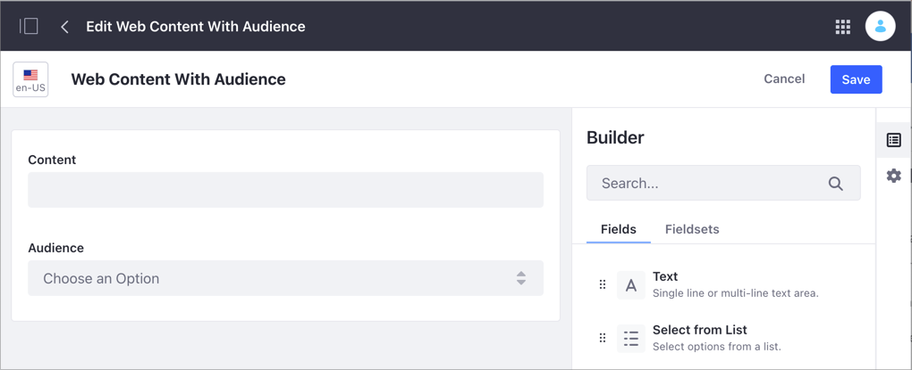
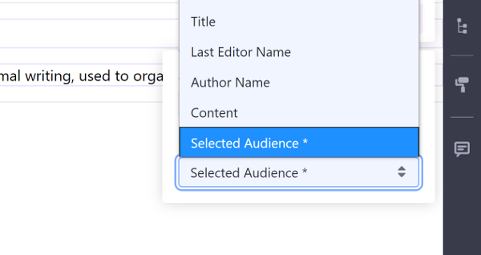

# Webコンテンツテンプレートのフラグメントへのマッピング

デフォルトでは、単一の値（日付、小数、画像、数値、テキスト、およびテキストボックス）を保持するWeb コンテンツストラクチャーのフィールドをフラグメントにマップできます。 選択フィールドの値、ラジオボタンの値、HTMLなどの複数値フィールドは、最初にWebコンテンツテンプレートを使用してレンダリングする必要があります。その後、テンプレートをフラグメントにマップできます。

以下の手順は、Webコンテンツテンプレートをフラグメントにマップする方法を示しています。

1.  マッピングしたいフィールドを含むWebコンテンツ記事と同じストラクチャーを使用する[Webコンテンツテンプレートを作成](../../../content-authoring-and-management/web-content/web_content_templates.rst)します。 例えば、以下のWebコンテンツ記事は、ストラクチャー*Web Content with Audience*を使用しています。

    

    例の*Web Content with Audience*ストラクチャーには、デフォルトでマッピング可能な[コンテンツ]フィールド（テキストボックス） と、別のWebコンテンツ テンプレートをマッピングする必要がある[オーディエンス]フィールド （選択フィールド）が含まれています。

    

2.  スクリプトウィンドウの左側にある*[Fields]* 見出しの下にある名前をクリックして、テンプレート内の[ストラクチャー]フィールドをレンダリングし、変数を追加します。

    ![[Fields]見出しの下にある名前をクリックして、テンプレートの[ストラクチャー]フィールドをレンダリングします。](./mapping-web-content-templates-to-fragments/images/03.png)

3.  フラグメントがサポートされているページ（コンテンツページ、ディスプレイページテンプレートなど）で、 [フラグメント](./building-content-pages.md#adding-elements-to-a-content-page)を追加し、[マッピング可能な要素](./building-content-pages.md#mapping-content)をクリックして、そのコンテキストメニューを表示します。

4.  マッピングダイアログの*マップ*ボタン()をクリックし、追加ボタン（）をクリックして、マッピングしたい値が含まれているWebコンテンツ記事を選択します。

    

5.  Webコンテンツを選択したら、セレクターのマッピングオプションのリストから作成したWebコンテンツテンプレートを選択します。 テンプレートの名前の横には、標準のフィールドではなくテンプレートであることを示す `*` が表示されます。

    

6.  *[Publish]* をクリックして変更を保存します。 Webコンテンツのテンプレートがフラグメントにマップされます。

    

<!-- end list -->

```{note}
複数のストラクチャーフィールドの値（上記のようにデフォルトでは含まれていないもの）を個々のフラグメントにマッピングできるようにする場合は、フィールドごとにそのストラクチャーを使用して1つのフィールドのみをレンダリングする個別のWebコンテンツテンプレートを作成する必要があります。 1つのテンプレートですべてのフィールドをレンダリングする場合、テンプレートを選択すると、それらのすべての値がフラグメントにマップされます。
```
